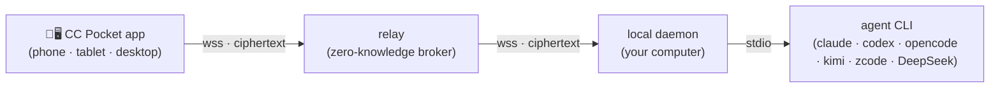

# CC Pocket

[](https://github.com/heypandax/cc-pocket/actions/workflows/ci.yml) [](https://github.com/heypandax/cc-pocket/releases/latest) [](LICENSE)

**English** | [简体中文](README.zh-CN.md)

**Your coding agents stay on your computer. You stay in control from anywhere.**

CC Pocket is an open-source, local-first control plane for command-line coding agents. The agent keeps running on your own machine, against your own checkout; from a phone, a tablet or another computer you watch it work, answer the permission prompts that block it, continue the same session, and read what it changed. Traffic is end-to-end encrypted and passes through a **zero-knowledge relay** that only ever forwards ciphertext — no CC Pocket account, no content logging. Clean-room Kotlin, MIT.

**v1.8.0** drives six agent backends — Claude Code, OpenAI Codex, OpenCode, Kimi Code (Preview), ZCode and DeepSeek. They are not equivalent: see [the capability matrix](#agent-support) before you pick one.

**🌐 [Website](https://heypandax.github.io/cc-pocket/)** · **📖 [User manual](https://pocket.ark-nexus.cc/manual/en/)** · **💬 [Support, no sign-in](https://pocket.ark-nexus.cc/support/)** · **📦 [Latest release](https://github.com/heypandax/cc-pocket/releases/latest)**

<p align="center"><a href="https://heypandax.github.io/cc-pocket/"></a></p>

<sub>Real product UI with scripted demo data — regenerate with `bash marketing/site/generate-assets.sh`. Provenance: [`site/assets/product/manifest.json`](site/assets/product/manifest.json).</sub>

## Quick start

**1 · Get the app** — [App Store](https://apps.apple.com/cn/app/cc-pocket-%E9%9A%8F%E8%BA%AB%E7%BC%96%E7%A8%8B%E9%81%A5%E6%8E%A7/id6778773969) (iPhone · iPad) · [TestFlight beta](https://testflight.apple.com/join/8z26MWWr) · [Android APK](https://github.com/heypandax/cc-pocket/releases/latest/download/cc-pocket-android.apk). Prefer a computer? See the [Desktop app](#platforms--distribution).

**2 · Install the daemon** on the machine that runs your agent CLI — any supported one, not Claude specifically:

```bash
curl -fsSL https://raw.githubusercontent.com/heypandax/cc-pocket/main/scripts/install.sh | bash   # macOS · Linux
irm https://raw.githubusercontent.com/heypandax/cc-pocket/main/scripts/install.ps1 | iex          # Windows
```

**3 · Pair** — run `cc-pocket-daemon pair`, then scan the QR it prints (or type the 6-digit code) in the app. You are connected end-to-end.

Package managers, mirrors, updates and per-platform notes: [Install details](#install-details).

## The four jobs

|  | Job | What you get |
|---|---|---|
| **01** | **Watch** | Streaming output, tool events with timing, sub-agent cards and background-task state, across devices. Filter projects, sessions and usage by agent. |
| **02** | **Approve** | A permission request reaches your phone the moment the agent raises one. Allow or deny in seconds; no answer times out to a safe deny. |
| **03** | **Continue** | Take a running session over *in place* instead of forking it, start a new task straight from the phone or the desktop app, and get missed output backfilled after a reconnect. |
| **04** | **Inspect** | Changed files with line-level diffs, file preview, context and usage. Images in your own prompts stay visible in replay. |

Capability differs by backend — the matrix below is the source of truth.

## Agent support

Public capability claims for **v1.8.0**, audited against commit [`6162816a`](https://github.com/heypandax/cc-pocket/commit/6162816a) on `main`. Machine-readable copy: [`site/public-capabilities.json`](site/public-capabilities.json).

| Agent | Core session | Approval & mode | Changes & diff | Usage |
|---|---|---|---|---|
| Claude Code | ✓ Yes | ✓ Yes | ✓ Yes | ✓ Yes |
| OpenAI Codex | ✓ Yes | ✓ Yes | ✓ Yes | ✓ Yes |
| OpenCode | ✓ Yes | ✕ No — always Full access | ✕ No | ✓ Yes |
| Kimi Code `Preview` | ✓ Yes | ✓ Yes | ✕ No | ✓ Yes · new in v1.8.0 |
| ZCode | ✓ Yes | ✓ Yes | ✕ No | ✓ Yes · new in v1.8.0 |
| DeepSeek Harness `narrow v1` | ✓ Yes | ✓ Yes | ✕ No | ✕ No |

- **Core session** means discover, replay, create, resume, send and receive text, and live streaming. Every backend does all of it.
- **OpenCode has no enforceable interactive approval.** `opencode run` has no approval protocol, so those sessions run at **Full access** and the app says so up front instead of offering modes it cannot enforce.
- **Kimi Code is Preview.** DeepSeek is supported, but narrow: approvals and multiple-choice questions are bridged to the app, but the sandbox mode is fixed at launch (changing it relaunches the session), and there is no Changed-files/diff view, no usage accounting and no model switching.
- **DeepSeek Harness has no timeout of its own.** Left alone, an unanswered approval or question blocks its turn indefinitely — it does not deny. CC Pocket puts the request on the daemon's normal approval window instead: an approval that expires is answered *reject*, and a question that expires is answered *skipped*, so an unanswered request ends the wait rather than hanging it. DeepSeek also has no "always allow" — every request is a one-off decision.
- Boundaries follow the release. Full detail: [Features](https://heypandax.github.io/cc-pocket/features.html) and the [User manual](https://pocket.ark-nexus.cc/manual/en/).

## Architecture & trust boundary



The **daemon** runs on your computer, drives the agent CLI as a subprocess and dials *out* to the relay — no inbound ports to open. The **relay** pairs your devices and routes opaque encrypted frames; it holds no message content and no private keys. The app and the daemon run an end-to-end session (P-256 ECDH + HKDF + AES-256-GCM, an X3DH/Noise-style handshake), so plaintext never leaves the two trusted endpoints. On the same network the app connects to the daemon directly for lower latency; the relay stays as the from-anywhere fallback. Pairings expire and can be revoked.

Honest limits: the agent still executes with your own operating-system permissions — end-to-end encryption is not a sandbox. OpenCode sessions have no enforceable interactive approval. The custom Noise-style channel has not had an independent third-party audit. Threat model: [`docs/SECURITY.md`](docs/SECURITY.md). Report vulnerabilities privately via [GitHub security advisories](https://github.com/heypandax/cc-pocket/security/advisories/new).

## Platforms & distribution

| Surface | Official packages |
|---|---|
| **Phone / tablet app** | iOS · iPadOS ([App Store](https://apps.apple.com/cn/app/cc-pocket-%E9%9A%8F%E8%BA%AB%E7%BC%96%E7%A8%8B%E9%81%A5%E6%8E%A7/id6778773969), [TestFlight](https://testflight.apple.com/join/8z26MWWr)) · Android [APK](https://github.com/heypandax/cc-pocket/releases/latest/download/cc-pocket-android.apk) |
| **Desktop app** | macOS [Apple Silicon](https://github.com/heypandax/cc-pocket/releases/latest/download/cc-pocket-desktop-macos-arm64.dmg) · [Intel](https://github.com/heypandax/cc-pocket/releases/latest/download/cc-pocket-desktop-macos-x86_64.dmg) (signed `.dmg`) · Windows x86_64 [`.msi`](https://github.com/heypandax/cc-pocket/releases/latest/download/cc-pocket-desktop-windows-x86_64.msi). **No official Linux desktop package — [build from source](#build-from-source).** |
| **Local daemon** | macOS Apple Silicon · macOS Intel · Linux x86_64 · Linux arm64 · Windows x86_64 |
| **HarmonyOS** | Signed HAP, **Preview** — limited capability |
| **Relay** | Hosted zero-knowledge relay by default; [self-hosting](https://heypandax.github.io/cc-pocket/guides/self-hosting.html) supported |

The desktop app and the local daemon are **different packages**: the app is a client, the daemon is what actually runs the agent.

## Install details

<details>
<summary><b>macOS</b> — signed &amp; notarized</summary>

```bash
curl -fsSL https://raw.githubusercontent.com/heypandax/cc-pocket/main/scripts/install.sh | bash
cc-pocket-daemon pair
```

Verifies the download against the release's `SHA256SUMS`, installs under `~/.local` (one directory per version), and registers the launchd service so it runs on login and reconnects itself. Homebrew: `brew install --cask heypandax/tap/cc-pocket` (use the full name; an unrelated cask is also called `cc-pocket`).
</details>

<details>
<summary><b>Linux</b> — x86_64 / arm64 daemon</summary>

```bash
curl -fsSL https://raw.githubusercontent.com/heypandax/cc-pocket/main/scripts/install.sh | bash
cc-pocket-daemon pair
```

Pulls a self-contained tarball (bundled JRE, no system Java), installs under `~/.local` and registers a `systemd --user` service. Voice transcription uses `ffmpeg` instead of macOS's `afconvert`. There is no official Linux **desktop app** package — build it from source.
</details>

<details>
<summary><b>Windows</b> — x86_64</summary>

```powershell
irm https://raw.githubusercontent.com/heypandax/cc-pocket/main/scripts/install.ps1 | iex
```

One command: installs, registers a logon Scheduled Task, and drops straight into pairing. [Scoop](https://scoop.sh): `scoop bucket add heypandax https://github.com/heypandax/scoop-bucket` then `scoop install cc-pocket-daemon`.
</details>

<details>
<summary><b>Mainland China mirror</b></summary>

GitHub downloads crawl there, so the installer and release artifacts are mirrored on the relay: `curl -fsSL https://pocket.ark-nexus.cc/dl/install.sh | bash` (Windows: `irm https://pocket.ark-nexus.cc/dl/install.ps1 | iex`). Same script, checksum-verified, with automatic fallback to GitHub. The daemon's self-update uses the mirror too.
</details>

<details>
<summary><b>Updating</b></summary>

`cc-pocket-daemon version` reports what is running, how it was installed, and the single command that updates *this* install — offline, and whether or not the daemon is up. The app shows the same under **Settings ▸ Versions**.

A daemon installed by the one-liner keeps itself current: it checks daily and applies the update in the background. Turn that off with `cc-pocket-daemon config --auto-update off` and you get a phone notification instead. Homebrew, Scoop and Windows installs never self-apply — update them through their own package manager (`brew upgrade --cask heypandax/tap/cc-pocket`, `scoop update cc-pocket-daemon`). The desktop app states it plainly when an update check fails, rather than showing "up to date".
</details>

### Works with third-party gateways

If you route Claude Code through an LLM gateway or API relay (`ANTHROPIC_BASE_URL`), the official Remote Control [is disabled as of v2.1.196](https://code.claude.com/docs/en/remote-control) — it requires talking to `api.anthropic.com` directly. CC Pocket drives the CLI over stdio on your machine, so the endpoint does not matter. The daemon detects a gateway `ANTHROPIC_BASE_URL` and the model picker leads with one-tap presets for common vendor ids (DeepSeek, GLM, Kimi, Qwen, MiniMax) alongside a free-form custom id field. Which model an id actually reaches is decided by your gateway.

## Build from source

| Module | What | Stack |
|---|---|---|
| `:protocol` | Shared wire protocol (`pocket/*` frames) — single source of truth | Kotlin Multiplatform + kotlinx.serialization |
| `:daemon` | Runs on your computer; drives the agent CLI as a subprocess, dials out to the relay | Kotlin/JVM + Ktor |
| `:relay` | Cloud broker: device-key pairing, ciphertext routing, multi-tenant, rate-limited | Kotlin/JVM + Ktor + SQLite |
| `:mobile` | The CC Pocket app | Compose Multiplatform — Android · iOS · desktop |

Requires **JDK 17** (any distribution — the Gradle toolchain downloads one if yours differs), the **Android SDK** (`ANDROID_HOME` or `local.properties`; the Android modules are configured even for JVM-only tasks), and at least one installed, logged-in agent CLI. To build the mobile app, copy the committed Firebase placeholder once (a real Firebase project is only needed for push/analytics):

```bash
cp mobile/composeApp/google-services.json.template mobile/composeApp/google-services.json
```

Local single-machine (no relay), for development:

```bash
./gradlew :protocol:check                         # protocol contract test
./gradlew :daemon:run --args="run"                # daemon — local WebSocket on 127.0.0.1:8765
./gradlew :daemon:run --args="test-client"        # drive it against a real agent CLI
```

Through the relay (off-LAN), the real product path:

```bash
./gradlew :daemon:installDist
daemon/build/install/cc-pocket-daemon/bin/cc-pocket-daemon run --relay wss://<your-relay>
daemon/build/install/cc-pocket-daemon/bin/cc-pocket-daemon pair    # in another terminal
```

Build the app: Android via `./gradlew :mobile:composeApp:assembleDebug`; iOS via `iosApp/iosApp.xcodeproj` (Xcode — first copy `iosApp/iosApp/GoogleService-Info.plist.template` to `GoogleService-Info.plist` next to it). Desktop (including Linux) via `./gradlew :mobile:composeApp:packageDistributionForCurrentOS`. On-device iOS install: [`docs/ios-device.md`](docs/ios-device.md).

## Docs

- [Website](https://heypandax.github.io/cc-pocket/) · [Full feature list](https://heypandax.github.io/cc-pocket/features.html)
- [User manual](https://pocket.ark-nexus.cc/manual/en/) · [Smart support, no sign-in](https://pocket.ark-nexus.cc/support/)
- Security model & threat analysis — [`docs/SECURITY.md`](docs/SECURITY.md)
- Run / operate the daemon — [`docs/RUN.md`](docs/RUN.md) · User guide (中文) — [`docs/USAGE.md`](docs/USAGE.md)
- Relay deployment (Caddy + Cloudflare + systemd) — [`deploy/README.md`](deploy/README.md)
- Product media pipeline — [`marketing/site/README.md`](marketing/site/README.md)
- Design deliverables — [`docs/design/`](docs/design/) · Provenance / clean-room statement — [`docs/ANTIPLAGIARISM.md`](docs/ANTIPLAGIARISM.md)

## Contributing

Issues and PRs welcome — [`CONTRIBUTING.md`](CONTRIBUTING.md) covers build prerequisites, test entry points, and which scripts are maintainer-only. Please report security issues privately via [GitHub security advisories](https://github.com/heypandax/cc-pocket/security/advisories/new).

## License

MIT — see [`LICENSE`](LICENSE).
