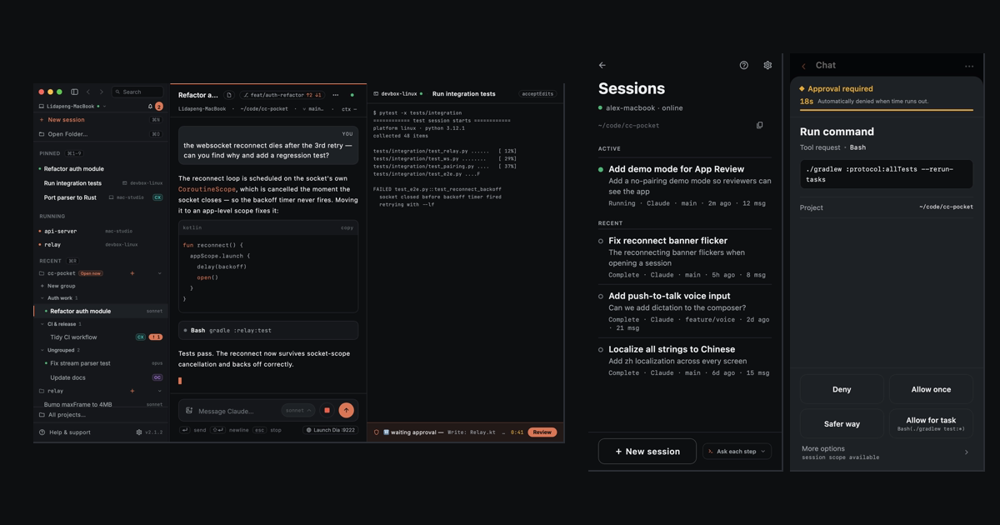
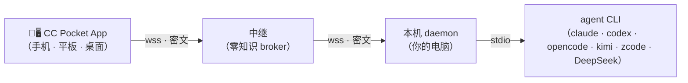

# CC Pocket

[](https://github.com/heypandax/cc-pocket/actions/workflows/ci.yml) [](https://github.com/heypandax/cc-pocket/releases/latest) [](LICENSE)

[English](README.md) | **简体中文**

**agent 留在你的电脑上，人在哪儿都能掌控全程。**

CC Pocket 是一个开源的本地优先控制面，用来遥控命令行编码 agent。agent 始终跑在你自己的机器、你自己的代码上；你用手机、平板或另一台电脑看它干活、批掉挡路的授权、接着原来的会话往下走、再翻一遍它改了什么。链路端到端加密，只经过一个**零知识中继**转发密文——不需要 CC Pocket 账号，也不记录任何内容。Kotlin 从零写起，MIT 开源。

**v1.9.4** 支持六个 agent 后端：Claude Code、OpenAI Codex、OpenCode、Kimi Code（Preview）、ZCode 和 DeepSeek。它们的能力**并不等价**，选之前先看[能力矩阵](#agent-支持)。

**🌐 [官网](https://heypandax.github.io/cc-pocket/)** · **📖 [用户手册](https://pocket.ark-nexus.cc/manual/zh/)** · **💬 [帮助与客服（免登录）](https://pocket.ark-nexus.cc/support/)** · **📦 [最新 Release](https://github.com/heypandax/cc-pocket/releases/latest)**

<p align="center"><a href="https://heypandax.github.io/cc-pocket/"></a></p>

<sub>真实产品界面，演示数据由脚本生成——重跑 `bash marketing/site/generate-assets.sh` 即可重现。出处见 [`site/assets/product/manifest.json`](site/assets/product/manifest.json)。</sub>

## 三步上手

**1 · 装 App** —— [App Store](https://apps.apple.com/cn/app/cc-pocket-%E9%9A%8F%E8%BA%AB%E7%BC%96%E7%A8%8B%E9%81%A5%E6%8E%A7/id6778773969)（iPhone · iPad）· [TestFlight 测试版](https://testflight.apple.com/join/8z26MWWr) · [Android APK](https://github.com/heypandax/cc-pocket/releases/latest/download/cc-pocket-android.apk)。想用电脑？见[桌面 App](#平台与分发)。

**2 · 在跑 agent 的那台电脑上装 daemon** —— 任一受支持的 CLI 都行，不是非要 Claude：

```bash
curl -fsSL https://raw.githubusercontent.com/heypandax/cc-pocket/main/scripts/install.sh | bash   # macOS · Linux
irm https://raw.githubusercontent.com/heypandax/cc-pocket/main/scripts/install.ps1 | iex          # Windows
```

**3 · 配对** —— 跑 `cc-pocket-daemon pair`，用 App 扫终端里打出的二维码（或敲那 6 位码）。连上了，端到端加密。

包管理器、国内镜像、升级和各平台细节：见[安装细节](#安装细节)。

## 四件事

|  | 任务 | 你能拿到什么 |
|---|---|---|
| **01** | **查看** | 跨设备看流式输出、带耗时的工具事件、子 agent 卡片和后台任务状态。项目、会话、用量都能按 agent 筛。 |
| **02** | **授权** | agent 一请求授权，手机立刻收到。几秒钟允许或拒绝；没顾上，超时也会自动拒绝。 |
| **03** | **继续** | **原地**接管正在跑的会话，不无故分叉；手机和桌面 App 都能直接起新任务；断线重连后补齐漏掉的输出。 |
| **04** | **检查** | 改动文件、行级 diff、文件预览、上下文与用量。自己发的提示词里的图片，回放时还在。 |

能力按后端不同，下面这张矩阵是准。

## Agent 支持

**v1.9.4** 的公开能力已对照 `main` 分支的 [`e9ee816f`](https://github.com/heypandax/cc-pocket/commit/e9ee816f) 提交核验。机器可读版本：[`site/public-capabilities.json`](site/public-capabilities.json)。

| Agent | 核心会话 | 审批与模式 | 改动与 diff | 用量 |
|---|---|---|---|---|
| Claude Code | ✓ 支持 | ✓ 支持 | ✓ 支持 | ✓ 支持 |
| OpenAI Codex | ✓ 支持 | ✓ 支持 | ✓ 支持 | ✓ 支持 |
| OpenCode | ✓ 支持 | ✕ 不支持 —— 恒为 Full access | ✕ 不支持 | ✓ 支持 |
| Kimi Code `Preview` | ✓ 支持 | ✓ 支持 | ✕ 不支持 | ✓ 支持 · v1.8.0 新增 |
| ZCode | ✓ 支持 | ✓ 支持 | ✕ 不支持 | ✓ 支持 · v1.8.0 新增 |
| DeepSeek Harness `有限 v1` | ✓ 支持 | ✓ 支持 | ✕ 不支持 | ✕ 不支持 |

- **核心会话**指：发现、回放、新建、恢复、收发文本、实时流式。六个后端全都做得到。
- **OpenCode 没有可执法的交互审批。** `opencode run` 本身就没有审批协议，所以这类会话恒为 **Full access**——App 会直接说明，而不是摆出一排它根本管不住的模式。
- **Kimi Code 是 Preview。** DeepSeek 已支持，但很窄：审批与选择题已桥接到 App，但 sandbox 模式在启动时定死（改模式会重启会话）；另外没有改动文件与 diff、没有用量统计、不支持切换模型。
- **DeepSeek Harness 自己没有超时。** 放着不管，一条没人回答的审批或提问会让这一回合**一直挂着**——它不会自动拒绝。CC Pocket 把这类请求接到 daemon 统一的审批时限上：审批超时按**拒绝**回，提问超时按**跳过**回，让「没人回答」有个结果而不是永远等下去。DeepSeek 也没有「总是允许」——每次都是一次性决定。
- 能力边界跟随正式 Release。完整说明见[能力页](https://heypandax.github.io/cc-pocket/features.html)与[用户手册](https://pocket.ark-nexus.cc/manual/zh/)。

## 架构与信任边界



**daemon** 跑在你的电脑上，把 agent CLI 当子进程驱动，并主动**向外**连中继——不用开任何入站端口。**中继**只做两件事：帮设备配对、转发不透明的加密帧；它不持有消息内容，也不持有私钥。App 与 daemon 之间跑一条端到端会话（P-256 ECDH + HKDF + AES-256-GCM，X3DH/Noise 式握手），明文自始至终只在这两个可信端点上。同一局域网内 App 会直连 daemon，延迟更低；中继是「人在外面」时的兜底。配对可设有效期，也可随时吊销。

**必须说清的限制**：agent 仍以你本机操作系统用户的权限执行——端到端加密不等于沙箱。OpenCode 会话没有可执法的交互审批。项目自定义的 Noise 式通道也还没做过独立第三方审计。威胁模型见 [`docs/SECURITY.md`](docs/SECURITY.md)。安全问题请走 [GitHub security advisories](https://github.com/heypandax/cc-pocket/security/advisories/new) 私下报告。

## 平台与分发

| 组成 | 正式分发 |
|---|---|
| **手机 / 平板 App** | iOS · iPadOS（[App Store](https://apps.apple.com/cn/app/cc-pocket-%E9%9A%8F%E8%BA%AB%E7%BC%96%E7%A8%8B%E9%81%A5%E6%8E%A7/id6778773969)、[TestFlight](https://testflight.apple.com/join/8z26MWWr)）· Android [APK](https://github.com/heypandax/cc-pocket/releases/latest/download/cc-pocket-android.apk) |
| **桌面 App** | macOS [Apple 芯片](https://github.com/heypandax/cc-pocket/releases/latest/download/cc-pocket-desktop-macos-arm64.dmg) · [Intel](https://github.com/heypandax/cc-pocket/releases/latest/download/cc-pocket-desktop-macos-x86_64.dmg)（已签名 `.dmg`）· Windows x86_64 [`.msi`](https://github.com/heypandax/cc-pocket/releases/latest/download/cc-pocket-desktop-windows-x86_64.msi)。**Linux 没有正式桌面安装包——只能[从源码构建](#从源码构建)。** |
| **本机 daemon** | macOS Apple 芯片 · macOS Intel · Linux x86_64 · Linux arm64 · Windows x86_64 |
| **鸿蒙** | 签名 HAP，**Preview**——能力受限 |
| **中继** | 默认走托管的零知识中继，也支持[自托管](https://heypandax.github.io/cc-pocket/guides/self-hosting.html) |

桌面 App 和本机 daemon 是**两个不同的安装包**：前者是客户端，后者才是真正跑 agent 的那一端。

## 安装细节

<details>
<summary><b>macOS</b> —— 已签名公证</summary>

```bash
curl -fsSL https://raw.githubusercontent.com/heypandax/cc-pocket/main/scripts/install.sh | bash
cc-pocket-daemon pair
```

下载会对着 Release 的 `SHA256SUMS` 校验，装进 `~/.local`（一个版本一个目录），并注册 launchd 服务：开机自启、断线自己重连。想用 Homebrew：`brew install --cask heypandax/tap/cc-pocket`（必须写全名，另有一个不相干的 cask 也叫 `cc-pocket`）。
</details>

<details>
<summary><b>Linux</b> —— x86_64 / arm64 daemon</summary>

```bash
curl -fsSL https://raw.githubusercontent.com/heypandax/cc-pocket/main/scripts/install.sh | bash
cc-pocket-daemon pair
```

拉一个自带 JRE 的独立包（不依赖系统 Java），装进 `~/.local`，注册 `systemd --user` 服务。语音转写用 `ffmpeg`，不是 macOS 的 `afconvert`。Linux **桌面 App** 没有正式安装包，只能自己从源码构建。
</details>

<details>
<summary><b>Windows</b> —— x86_64</summary>

```powershell
irm https://raw.githubusercontent.com/heypandax/cc-pocket/main/scripts/install.ps1 | iex
```

一条命令搞定：装好、注册登录时的计划任务、直接进入配对。想用 [Scoop](https://scoop.sh)：`scoop bucket add heypandax https://github.com/heypandax/scoop-bucket`，再 `scoop install cc-pocket-daemon`。
</details>

<details>
<summary><b>国内镜像</b></summary>

GitHub 在国内下载很慢，所以安装脚本和 Release 产物都在中继机上做了镜像：`curl -fsSL https://pocket.ark-nexus.cc/dl/install.sh | bash`（Windows：`irm https://pocket.ark-nexus.cc/dl/install.ps1 | iex`）。同一个脚本、同样校验 checksum，失败会自动回落到 GitHub。daemon 自升级也走这个镜像。
</details>

<details>
<summary><b>升级</b></summary>

`cc-pocket-daemon version` 会告诉你：现在跑的是哪个版本、当初怎么装的、以及升级**这一份**安装该用哪条命令——离线可用，daemon 没起来也能问。App 里在**设置 ▸ 版本**看到的是同一份信息。

用一键脚本装的 daemon 会自己保持最新：每天检查，后台装好。不想要就 `cc-pocket-daemon config --auto-update off`，改成只给手机推一条通知。Homebrew、Scoop 和 Windows 装的永远不会自升级，走各自的包管理器：`brew upgrade --cask heypandax/tap/cc-pocket`、`scoop update cc-pocket-daemon`。桌面 App 检查更新失败时会明说失败，不会装作「已是最新」。
</details>

### 走第三方网关也能用

如果你把 Claude Code 接在 LLM 网关或 API 中转上（`ANTHROPIC_BASE_URL`），官方 Remote Control [从 v2.1.196 起会被禁用](https://code.claude.com/docs/en/remote-control)——它要求直连 `api.anthropic.com`。CC Pocket 是在你本机用 stdio 驱动 CLI，端点是什么无所谓。daemon 会识别出网关型 `ANTHROPIC_BASE_URL`，模型选择器把常见厂商 id（DeepSeek、GLM、Kimi、Qwen、MiniMax）做成一键预设，旁边还留了自定义 id 输入框。某个 id 最终打到哪个模型，由你的网关决定。

## 从源码构建

| 模块 | 做什么 | 技术栈 |
|---|---|---|
| `:protocol` | 共享 wire 协议（`pocket/*` 帧）——唯一事实源 | Kotlin Multiplatform + kotlinx.serialization |
| `:daemon` | 跑在你电脑上，把 agent CLI 当子进程驱动，主动外连中继 | Kotlin/JVM + Ktor |
| `:relay` | 云端 broker：设备密钥配对、密文路由、多租户、限流 | Kotlin/JVM + Ktor + SQLite |
| `:mobile` | CC Pocket App 本体 | Compose Multiplatform —— Android · iOS · 桌面 |

需要 **JDK 17**（任意发行版——版本对不上时 Gradle toolchain 会自己下）、**Android SDK**（`ANDROID_HOME` 或 `local.properties`；纯 JVM 任务也需要 Android 模块的配置），以及至少一个装好并登录的 agent CLI。要构建移动端，先把提交在仓库里的 Firebase 占位文件复制一份（真的 Firebase 项目只有推送 / 统计才需要）：

```bash
cp mobile/composeApp/google-services.json.template mobile/composeApp/google-services.json
```

本机单机跑（不走中继，开发用）：

```bash
./gradlew :protocol:check                         # 协议契约测试
./gradlew :daemon:run --args="run"                # daemon —— 本地 WebSocket 127.0.0.1:8765
./gradlew :daemon:run --args="test-client"        # 拿真实 agent CLI 驱一遍
```

走中继（离开局域网，真实产品路径）：

```bash
./gradlew :daemon:installDist
daemon/build/install/cc-pocket-daemon/bin/cc-pocket-daemon run --relay wss://<你的中继>
daemon/build/install/cc-pocket-daemon/bin/cc-pocket-daemon pair    # 另开一个终端
```

构建 App：Android 用 `./gradlew :mobile:composeApp:assembleDebug`；iOS 用 `iosApp/iosApp.xcodeproj`（Xcode——先把 `iosApp/iosApp/GoogleService-Info.plist.template` 复制成同目录的 `GoogleService-Info.plist`）；桌面端（含 Linux）用 `./gradlew :mobile:composeApp:packageDistributionForCurrentOS`。iOS 真机安装见 [`docs/ios-device.md`](docs/ios-device.md)。

## 文档

- [官网](https://heypandax.github.io/cc-pocket/) · [完整能力列表](https://heypandax.github.io/cc-pocket/features.html)
- [用户手册](https://pocket.ark-nexus.cc/manual/zh/) · [帮助与客服（免登录）](https://pocket.ark-nexus.cc/support/)
- 安全模型与威胁分析 —— [`docs/SECURITY.md`](docs/SECURITY.md)
- 运行 / 运维 daemon —— [`docs/RUN.md`](docs/RUN.md) · 中文使用文档 —— [`docs/USAGE.md`](docs/USAGE.md)
- 中继部署（Caddy + Cloudflare + systemd）—— [`deploy/README.md`](deploy/README.md)
- 产品素材管线 —— [`marketing/site/README.md`](marketing/site/README.md)
- 设计交付归档 —— [`docs/design/`](docs/design/) · 出处 / 独立实现声明 —— [`docs/ANTIPLAGIARISM.md`](docs/ANTIPLAGIARISM.md)

## 参与贡献

欢迎提 issue 和 PR —— [`CONTRIBUTING.md`](CONTRIBUTING.md) 写了构建前置、测试入口，以及哪些脚本只给维护者用。安全问题请走 [GitHub security advisories](https://github.com/heypandax/cc-pocket/security/advisories/new) 私下报告。

## 许可证

MIT —— 见 [`LICENSE`](LICENSE)。
