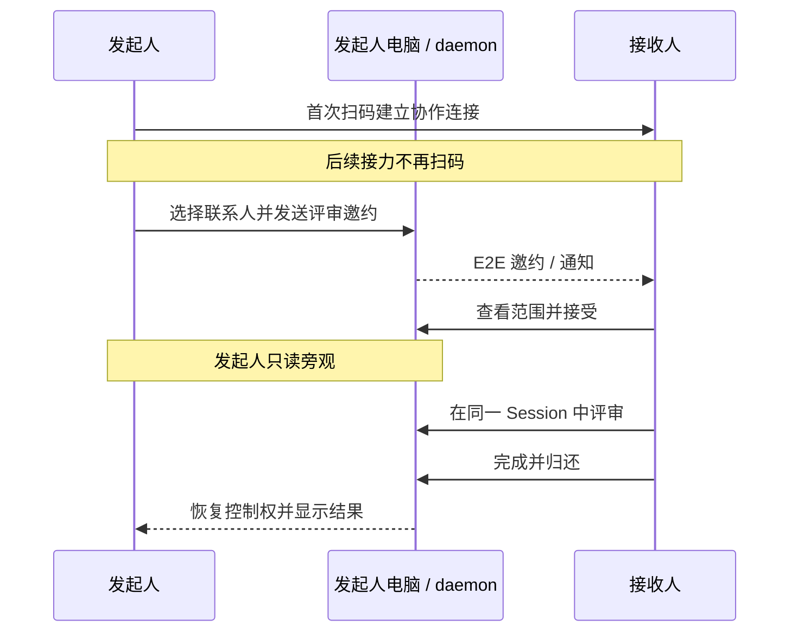
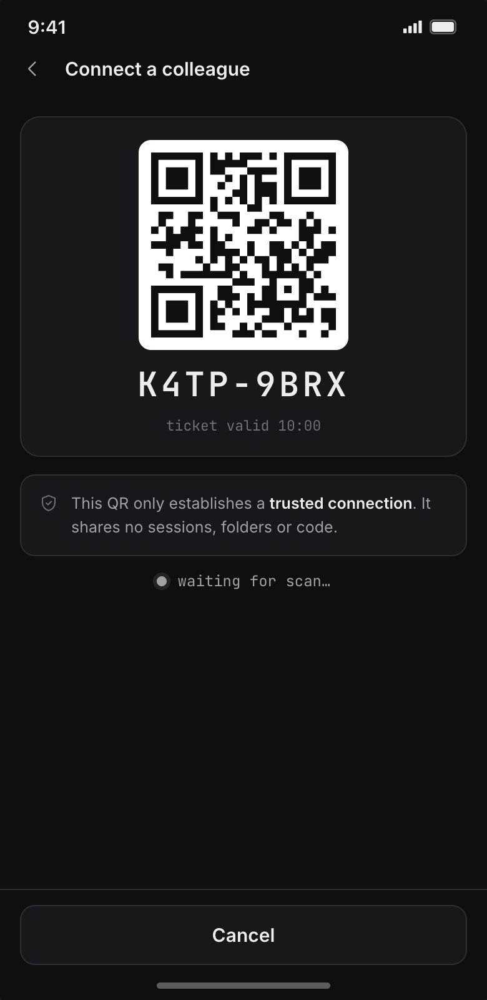
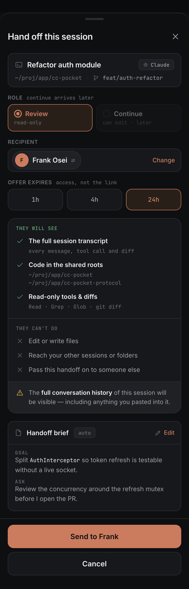
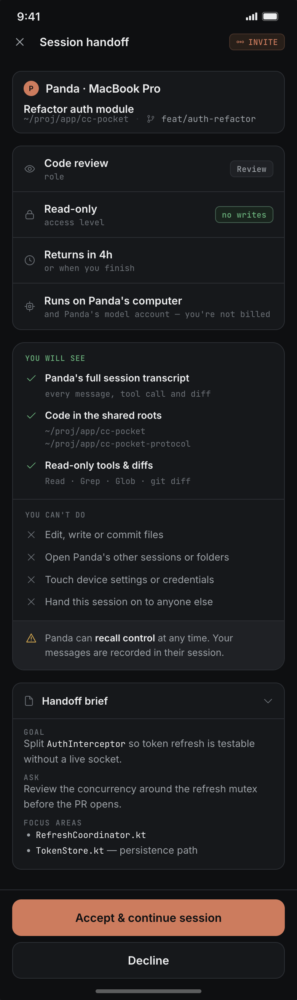
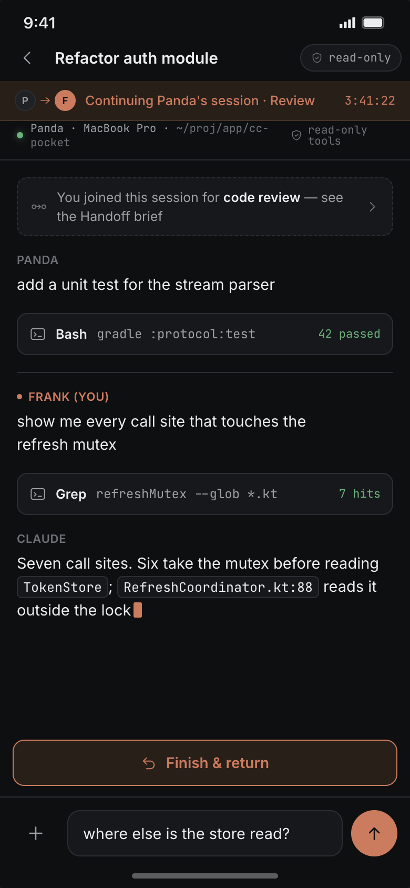
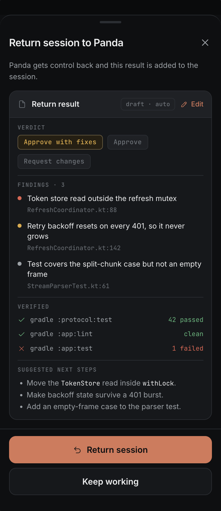
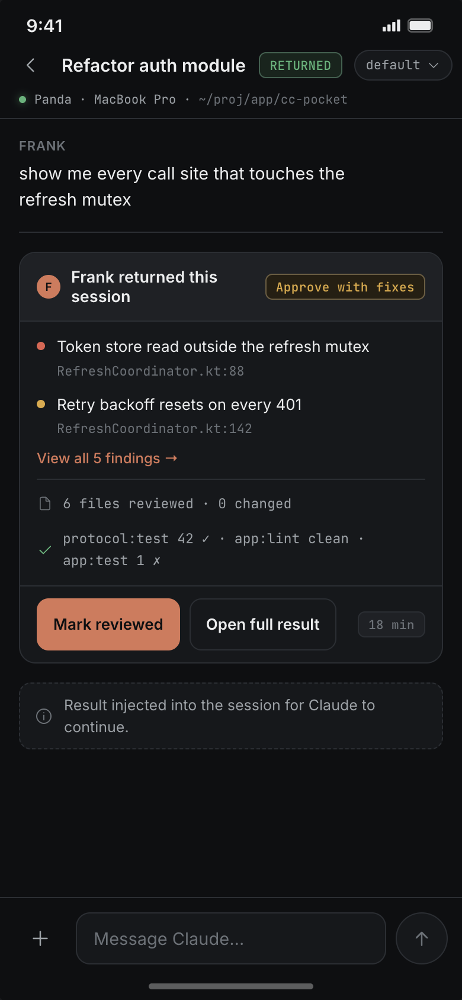

# CC Pocket 协作接力使用说明

> 状态：**现有运行时上下文交接能力的使用说明**
>
> 并列能力：[`design/REVIEW-REQUEST.md`](./design/REVIEW-REQUEST.md) —— 不共享原 Session，由接收者使用自己电脑上的 Agent 和上下文评审 MR / 文档
>
> 适用版本：当前已有的 `Session Handoff` 实现（2026-08-02）
>
> 首发能力：把正在进行的 Session 临时交给熟悉的同事做代码评审
>
> 截图来自 Claude Design，用于说明交互流程；具体文字和数据以实际 App 为准

## 1. 协作接力是什么

协作接力不是把 Agent、账号或整个电脑长期分享给别人，而是把**当前 Session 的控制权临时交给一位指定同事**：

1. 发起人选择当前 Session 和一位已连接的协作联系人；
2. 对方先查看共享范围，再决定接受或拒绝；
3. 接受后，对方在发起人的电脑、代码目录和同一个 Session 中继续与 Agent 对话；
4. 发起人暂时不能输入，但可以实时旁观并随时收回控制权；
5. 对方完成评审后归还，发起人从原 Session 继续处理。

整个过程不会创建新的代码副本或并行 Session。同一时间只有一个人可以操作 Agent。



## 2. 当前版本能做什么

当前只开放 **Review（评审）**：

- 对方可以查看当前 Session 的完整对话、工具记录、diff 和共享目录内的代码；
- `Read`、`Grep`、`Glob` 等文件读取能力可用；
- `Edit`、`Write`、`NotebookEdit`、`apply_patch` 等文件写入工具会被 daemon 拒绝；
- shell 命令必须由接收人逐条确认，并留下记录；
- 发起人可以旁观，也可以随时收回控制权；
- 对方归还后，发起人确认结果并继续原任务。

需要特别理解：**“文件只读”不等于操作系统沙箱。** 接收人批准的 shell 命令仍可能修改文件、访问网络或执行其他程序，因此只应与认识并信任的同事建立连接。

当前还不支持：

- 允许同事直接编辑代码的 `Continue` 模式；
- 多人同时操作同一个 Session；
- 自动 fork、独立 worktree 或自动合并；
- Agent 自动生成完整接力说明；
- 自动从评审过程提取完整 findings、验证结果和下一步。

## 3. 使用前准备

### 发起人

- 电脑已安装并运行最新 daemon；
- 手机或桌面端 CC Pocket 已与这台电脑配对；
- 要接力的 Session 已经产生可恢复的 Session ID；
- 当前 Agent 回合已经结束；
- 没有尚未处理的权限审批、Agent 提问或不适合中断的任务。

### 接收人

- 安装最新版 CC Pocket App；
- 不需要安装 daemon，也不需要在自己的电脑上准备代码；
- 建议允许 CC Pocket 发送通知，否则需要打开 App 才能看到邀约。

### 建议先整理上下文

当前版本尚未接入 Agent 自动生成 Handoff Brief。发起接力前，可以先在当前 Session 发送：

```text
请在不修改文件的情况下，用简短列表总结：
1. 当前目标；2. 已完成；3. 希望同事评审什么；
4. 重点文件；5. 已执行的验证和仍存在的风险。
```

这段总结会保留在 Session 历史里，接收人接受接力后能够直接看到。

## 4. 第一次：建立协作连接

二维码只用于首次确认身份。连接建立后，后续发起接力直接选择联系人，不需要反复扫码。

### 4.1 发起人展示连接二维码

有两种入口：

1. **设置 → 共享 → 协作联系人 → 右上角二维码图标**；
2. 在 Session 中发起接力，进入接收人选择页后点 **连接新同事…**。

屏幕会显示二维码、短码、安全指纹和有效时间。这个二维码只建立 E2E 协作连接，**不会共享任何 Session、目录或代码**。



### 4.2 接收人扫码并核对指纹

接收人在 CC Pocket 中打开扫码/粘贴入口：

- 尚未配对自己电脑时：直接使用启动页的扫码器；
- 已经配对电脑时：进入 **设置 → 共享 → 加入共享文件夹**。当前版本的文件夹邀请与协作连接共用这个扫码器。

扫码后不要直接确认，先通过当面或语音通话核对双方显示的安全指纹。指纹一致后点 **确认连接**。

指纹是**双向**的：邀请方的二维码页和接收方的确认页显示同一组词，两侧都要看。只有一侧能读的值没有可比
对象，也就检测不到任何东西。任一侧发现不一致，就不要确认，重新发起一次邀请。

连接有方向：A 展示二维码、B 扫码，表示 A 可以向 B 发送接力。如果希望双方都能从各自电脑发起接力，需要各自建立对应方向的连接。

### 4.3 什么时候需要重新扫码

只有以下情况需要重新扫码：

- 第一次建立连接；
- 任一方解除连接后重新添加；
- 对方更换了身份密钥；
- 双方主动希望重新核对身份。

一次接力邀约过期不会删除联系人连接，下一次仍可直接选择对方。

## 5. 发起一次接力

1. 打开要交接的 Session；
2. 等当前 Agent 回合结束，并处理完悬而未决的审批或提问；
3. 点会话右上角 **⋯ → 交给同事接力**；
4. 选择 **Review（评审）**；
5. 从协作联系人中选择接收人；
6. 选择邀约有效期：`1 小时`、`4 小时`或`24 小时`；
7. 检查共享范围，确认没有不应让对方看到的会话内容；
8. 点 **发送给对方**。



发送后，Source Session 进入 **等待中**：

- 输入框被锁定；
- 发起人仍可滚动查看历史；
- 对方会收到不含正文的通知，并在 App 内读取加密邀约；
- 发起人不想继续等待时，可以点 **收回** 取消本次接力。

每个 Session 同时只能存在一个未结束的接力。如果发起失败，优先检查 Agent 是否仍在运行、是否还有审批/提问，以及该 Session 是否已经有一条等待中或接管中的接力。

## 6. 接收并开始评审

接收人收到通知后：

1. 打开 **接力邀约**；
2. 点 **查看**；
3. 核对发起人、项目、共享目录、完整会话历史、权限和有效期；
4. 不愿接手时点 **拒绝**；
5. 确认后点 **接受并接续会话**。



接受成功后，App 会自动打开来源 Session。代码和 Agent 仍运行在发起人的电脑上，模型费用也使用发起人的账号。

如果接受按钮长时间停在“接受中”，或提示已经过期、已撤回、已被其他设备接下，以 daemon 返回的状态为准，不要假设已经获得控制权。

## 7. 接力过程中双方能做什么

### 接收人

- 是当前唯一可以向 Agent 发送消息的人；
- 可以让 Agent 阅读代码、搜索引用、查看 diff 和分析问题；
- 不能通过文件工具直接编辑或提交代码；
- Agent 请求运行 shell 命令时，需要逐条检查并确认；
- 完成后点 **完成并归还**。



### 发起人

- 可以实时旁观对话、流式输出和工具过程；
- 不能同时向 Session 输入，避免两个人争夺上下文；
- 发现异常时可以点 **收回控制权**；
- 若 Agent 正在执行，daemon 会先尝试中断当前回合，再在稳定边界恢复控制权。

接续产生的消息和工具过程会留在原 Session 中。命令确认也会留下审批记录，便于事后回看；这些记录用于追溯，不替代技术权限边界。

## 8. 完成并归还

接收人完成评审后：

1. 先在对话中发一条完整结论，写清问题、文件位置、验证结果和建议；
2. 点 **完成并归还**；
3. 选择结论：**通过**、**通过但需修复**或**需要修改**；
4. 点 **归还会话**。



> 上图是结构化 Return Result 的目标设计。当前实现只要求选择总体结论，不会自动生成图中的 findings 和验证列表；因此应先把完整评审意见发在 Session 对话中。

归还后：

- 接收人的输入权限立即失效；
- 发起人恢复控制权；
- Session 显示已归还结果；
- 发起人查看评审内容后点 **标记已审阅**，本次接力进入已完成状态；
- 发起人可直接在同一个 Session 中让 Agent 根据评审继续修复。



> 上图中的详细 findings 同样属于目标设计。当前应以接力期间的真实 Session 对话和归还时选择的总体结论为准。

## 9. 联系人与历史记录

### 管理联系人

进入 **设置 → 共享 → 协作联系人**，可以：

- 搜索已连接联系人；
- 查看连接方向和安全指纹；
- 查看与该联系人的历史接力；
- 解除连接。

解除后，对方不能再通过该连接收到新接力，已有历史不会被删除。

> **协作联系人 ≠ 评审联系人。** 这里列出的是**接力**联系人，收件方是某个人的 App；评审请求的收件方是
> 同事的 daemon，走 Review Center 里另一条链接（**评审中心 → 评审联系人**）。两者刻意不互通：接力联系人
> 不会出现在评审收件人选择器里，评审联系人也不会出现在这一页、不能被选为接力收件人。要和某人用评审，
> 就和他单独建一条评审链接——一次扫码、一次指纹核对。

### 查看某个 Session 的接力记录

打开 Session 信息页中的 **接力记录**，可以看到等待中、接管中、已归还、已完成、已拒绝、已过期和已收回等状态。

## 10. 安全边界

发起前请确认以下事实：

- 接收人会看到当前 Session 的**完整历史**，包括粘贴过的日志、密钥片段或业务信息；
- 联系人连接本身不授予任何 Session 或目录权限；
- 每次接力都会创建独立的临时授权，并绑定联系人、Session、范围和有效期；
- 接收人不能仅凭联系人连接浏览其他 Session 或文件夹；
- relay 只转发 E2E 密文，不读取接力正文；
- 接收人批准的 shell 命令仍以发起人电脑的系统用户运行，可能产生写入或网络副作用；
- 发起人应全程保留收回控制权的能力，并在归还后检查 diff、测试和 Git 状态。

## 11. 常见问题

| 现象 | 处理方式 |
|---|---|
| 找不到“交给同事接力” | 更新 App 和 daemon；确认打开的是可恢复 Session，而不是仍未建立 Session ID 的临时会话 |
| 发起时提示不能交接 | 等 Agent 回合结束，处理权限审批/提问，并确认当前 Session 没有另一条活动接力 |
| 没有可选联系人 | 点“连接新同事…”，完成一次二维码建联与安全指纹核对 |
| 对方没收到邀约 | 确认连接未解除、邀约未过期、通知已开启；让对方重新打开 App，前台会重新拉取待处理邀约 |
| 接受失败 | 邀约可能已过期、被收回、被拒绝或被另一设备先接受；返回邀约列表查看最新状态 |
| 发起人输入框一直锁定 | 等待中或接管中属于正常现象；不再等待时点“收回控制权” |
| 接收人不能改文件 | 当前只支持 Review；文件写入工具会被拒绝，不是故障 |
| 接收人需要跑测试 | Agent 会发起 shell 审批；接收人检查完整命令后逐条允许，不要建立长期放行规则 |
| 接力二维码过期 | 接力本身不需要二维码；若过期的是首次连接票据，由发起人重新生成连接二维码 |

## 12. 一句话记忆

> 首次扫码只建立联系人；每次接力单独授权；接受后对方独占同一个 Session；完成后归还，发起人原地继续。
