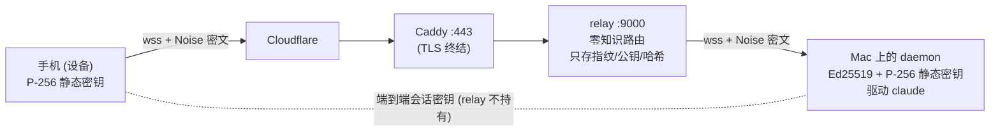

# cc-pocket 安全与信任模型

cc-pocket 让你的手机在任意网络下驱动你电脑上的 `claude`，流量经一台公网中转服务器（relay）转发。本文说明：中转服务器**看不到你的对话内容**（零知识）、首次配对这一步目前还依赖它未被攻破、它如何防攻击，以及你如何亲自验证这些。

> 适用范围：当前部署 `wss://pocket.ark-nexus.cc`（中转）。relay 完全开源、可自托管（见文末）。

## 一句话信任模型

> daemon（你的电脑）与设备（你的手机）之间是**端到端加密**的；relay 只转发密文、按账户路由，**进程内存里也读不到** prompt、代码或任何会话密钥。即使运营 relay 的人也不是特权窃听者。
>
> 这一点在**配对完成之后**成立。**首次配对这一步目前依赖 relay 未被攻破**：配对用的票据和双方公钥都经过 relay，被攻破的 relay 有机会在配对时替换密钥（见下文「配对」）。配对之后可以用指纹核对来发现这种情况。



## 身份与配对（无登录、无 PII）

- **租户 = daemon 自生成的 Ed25519 静态密钥**。account id = 该公钥的指纹（`base32(sha256(pubkey))`）。「注册」=跑起 daemon，没有邮箱 / 密码 / 后台账号。
- **设备 = 手机自生成的 P-256 静态密钥**，存在设备本地。
- **配对**把设备绑定到某个 daemon。当前的流程是：
  1. `pairlet pair` 让已鉴权的 daemon 向 relay 申请一张一次性**配对票据**。票据（256 位随机数，120 秒内有效）和一个 6 位配对码都由 relay 生成。终端里的二维码只编码这个 6 位码（`ccpocket://pair?code=…`）。
  2. 手机扫码或手输 6 位码，向 relay 查询得到 account id、daemon 的 P-256 公钥和票据，再用票据兑换：登记自己的公钥、领取设备凭据。
  3. relay 把设备公钥转发给 daemon。daemon 收到时就把它写入全权限设备名单，前提是本机刚为这次配对武装过票据且未过期（约 130 秒）。首次握手把票据当作 PSK 混入密钥派生。

票据由 relay 生成，daemon 公钥和设备公钥也都由 relay 转交，所以**在首次配对这一步，relay 处于能够替换密钥的位置**：被攻破或恶意的 relay 可以在你执行配对的那几分钟里冒充电脑或手机，或者额外植入一台设备。配对的安全因此依赖 relay 未被攻破。（App 也能解析手工拼出的完整链接 `?relay&acct&dpk&ticket`，但 daemon 不生成它；即使用它，daemon 收到的设备公钥仍然只来自 relay。）

配对之外的时间里，relay 无法读取或伪造会话：之后每次握手都用两端已经钉住的静态公钥互相认证。后续版本会让配对本身不再依赖对 relay 的信任。

### 配对之后如何核对

每个公钥有一个短指纹（SHA-256 后取 80 位，显示为 5 组 4 个十六进制字符，例如 `7132-8382-2950-2dfe-119b`）。

1. 在电脑上运行 `pairlet devices`：列出所有全权限设备及其指纹，顶部是这台电脑自己的指纹。`pairlet pair` 配对成功时也会直接显示新设备的指纹。
2. 在你的每台手机上打开「设置 → 帮助与关于」（桌面 App 为「设置 → 关于」），找到「本机指纹」，确认 `pairlet devices` 里有完全一致的一行（五组都要一致）。
3. 列表里对不上任何一台你自己设备的行，用 `pairlet devices revoke <设备编号或指纹前缀>` 吊销：它立即断开，并且需要重新配对才能回来。
4. 再对比 App 上的「电脑指纹」与 `pairlet devices` 顶部的指纹。不一致说明这台手机钉住的不是你的电脑：在手机上删除这个绑定，吊销对应的行，然后重新配对。

只核对开头一两组不够：relay 事先知道双方公钥，凑出前几位相同的公钥并不难。核对能发现替换，但不能阻止它发生；需要 daemon 与 App 都是包含此功能的版本。

## 加密套件

端到端通道在 `protocol` 模块（`e2e/`），daemon 与手机共用同一份多平台实现（cryptography-kotlin：JVM 用 JDK，iOS 用 CryptoKit）。

| 环节 | 算法 |
| --- | --- |
| 密钥协商 | **P-256 ECDH**（4 次 DH：`es ‖ ss ‖ ee ‖ se`，X3DH / Noise-KK 风格） |
| 密钥派生 | **HKDF-SHA256**（salt = 握手转录，绑定双方静态+临时公钥） |
| 报文加密 | **AES-256-GCM**，每方向独立密钥，64-bit 递增计数器做 nonce（拒绝重放/乱序） |
| daemon→relay 鉴权 | **Ed25519** 签名挑战 |

- **互相认证**：`ss`（静态×静态）+ `se`/`es`（静态×临时）双向绑定两端身份。
- **前向保密**：每会话新临时密钥；静态私钥日后泄露也无法解历史会话。
- **首次配对**：把票据当 Noise PSK 混入 HKDF。票据由 relay 生成，所以这一步挡不住 relay 本身替换公钥（见上文「配对」）；它只保证不知道票据的第三方完不成首次握手。

> 为什么是 P-256 而非 X25519：本项目 Kotlin 2.1.21，能消费的 cryptography-kotlin 版本只暴露 P-256；握手构造与曲线无关，P-256 + AES-GCM 是 iOS/Android/JVM 都原生支持的标准强套件。

## relay 存什么 / 看什么（威胁对照）

**持久化（SQLite，只存哈希、公钥、指纹——绝无内容、绝无私钥）：** account id、daemon Ed25519 公钥、设备 P-256 公钥（不透明 blob）、`sha256(凭据)`、`sha256(票据)`、时间戳、`revoked`。

**日志：** 仅连接生命周期、鉴权成败码、限流、字节计数——**绝不记录帧内容**。

| 攻击 | 缓解 |
| --- | --- |
| daemon 冒充 | Ed25519 签名挑战；account id == 公钥指纹；TOFU 钉公钥；nonce 单用 30s、绑 socket、入签名转录 |
| 设备劫持 | 高熵 `deviceId.secret`，库里只存 `sha256(secret)` 常量时间比对；可吊销 + 强制断连 |
| 配对码爆破 | 6 位码只为交互式配对签发，TTL 120s、单次使用；查询按 IP 限流（IPv6 按 /64 合并）并有全站失败预算。票据本身 256-bit、单用、TTL 120s、原子认领；只有已鉴权 daemon 能 mint；redeem 限流+退避锁定 |
| 密钥交换 MITM | **配对这一步当前未防护**：relay 生成票据、转交双方公钥，被攻破的 relay 能在配对时替换密钥。缓解：武装的票据约 130 秒后失效；`pairlet pair` 显示新设备指纹；`pairlet devices` 与 App 的指纹核对、吊销。根治在后续版本。配对之后的握手用已钉住的静态公钥认证，relay 插不进来 |
| 重放 | 服务器 nonce 单用；GCM 计数器严格递增 |
| DoS / 资源耗尽 | 每 IP/每 account 限流锁定；连接/设备数上限；4 MiB 帧上限（`RelayServer.MAX_FRAME`）；ping/timeout；有界缓冲 |
| **运营者偷看** | 二进制数据面绝不解码；只过 Noise 密文；库里只有哈希/公钥；日志只有元数据 |

**接受的残余元数据泄露（v1 不混淆，明示）：** account↔device 路由图、在线时序、密文大小/时序、源 IP。

## 自证零知识

抓一帧数据面看是密文（本机即可，无需公网）：

```bash
JAVA_HOME=/opt/homebrew/opt/openjdk@17 bash scripts/relay-smoke.sh        # 本地 relay
JAVA_HOME=/opt/homebrew/opt/openjdk@17 bash scripts/relay-smoke-prod.sh   # 经 Cloudflare 的线上 relay
```

单元测试也确定性地证明了「relay 只见密文 / 两端密钥不一致即失败」：

```bash
./gradlew :protocol:jvmTest --tests "dev.ccpocket.protocol.e2e.*"
# relay_sees_only_ciphertext / mismatched_psk_breaks_the_channel / wrong_peer_static_breaks_the_channel
```

这些测试证明的是握手本身：两端持有的静态公钥或 PSK 不一致时建不起通道。它们不证明首次配对时两端拿到的就是对方的真实公钥，这一步见上文「配对之后如何核对」。

## 自托管 relay

relay 无任何密钥托管，搬到你自己的机器即可（一条 systemd + 一段 Caddyfile，见 `deploy/`）：

```bash
./gradlew :relay:installDist      # 产物 relay/build/install/cc-pocket-relay
# 拷到服务器，systemd 跑 `cc-pocket-relay --host 127.0.0.1 --port 9000 --db <path>`，Caddy 反代 + 自动 TLS
```

daemon 改用你的域名：`cc-pocket-daemon run --relay wss://<你的域名>`。

## 已知限制 / 后续硬化

- **设备私钥存储**：移动端 v1 用 NSUserDefaults / SharedPreferences（应用私有但非硬件级）。生产应迁到 iOS Keychain / Android Keystore（接口 `SecureStore` 已就位，换实现即可）。
- **配对录入**：支持相机扫码（App 内置 qrkit 扫码器）、手输 6 位码、粘贴 `ccpocket://` 链接。旧版无配对、无加密的明文局域网模式（`run --local` 与 App 的局域网直连地址）已移除。
- **首次配对依赖 relay**：见上文「配对」。daemon 用「最近 mint 的票据」关联刚公告的设备，公告本身也来自 relay。
- **非主人凭据**：飞书等桥接凭据同样经 relay 生成的票据兑换，因此同样依赖 relay 未被攻破，但权限受限（只能在指定目录开会话，危险操作仍需主人在手机上批准）。远程执行链接额外混入只在邀请里传递的秘密，relay 单凭票据完不成首次握手。
- **未经独立审计**：Noise 风格通道为本项目自实现（基于 cryptography-kotlin 原语）。欢迎审计。
- **客户端遥测**：App 接入 Firebase（Analytics/Crashlytics），仅上报枚举级事件元数据（如 AppLaunch / Paired / Connected）与崩溃信息，**不含 prompt、代码或会话内容**；它直连 Google、**不经 relay**，与「relay 零知识」是两回事（源码 `telemetry/` 可关闭或替换）。
- **元数据**：见上「残余泄露」。

## 报告漏洞（Reporting a Vulnerability）

**首选渠道：GitHub 私密漏洞报告** —— [Security → Report a vulnerability](https://github.com/heypandax/cc-pocket/security/advisories/new)，内容仅维护者可见。请不要在公开 issue 中披露未修复的漏洞。

- **响应**：尽力 72 小时内确认收到；确认属实后给出修复计划，修复发布后公开致谢（可要求匿名）。
- **支持版本**：只修复**最新 release**——daemon 自带自更新、App 走商店更新，请先升级到最新版再复现。
- **重点审计面**：端到端通道（`protocol/e2e`）、relay 鉴权 / 配对 / 限流、daemon 权限桥（见上文威胁对照表）。

*English:* please report vulnerabilities privately via GitHub's [private vulnerability reporting](https://github.com/heypandax/cc-pocket/security/advisories/new) instead of a public issue. Best-effort acknowledgement within 72 hours; fixes target the latest release only.
