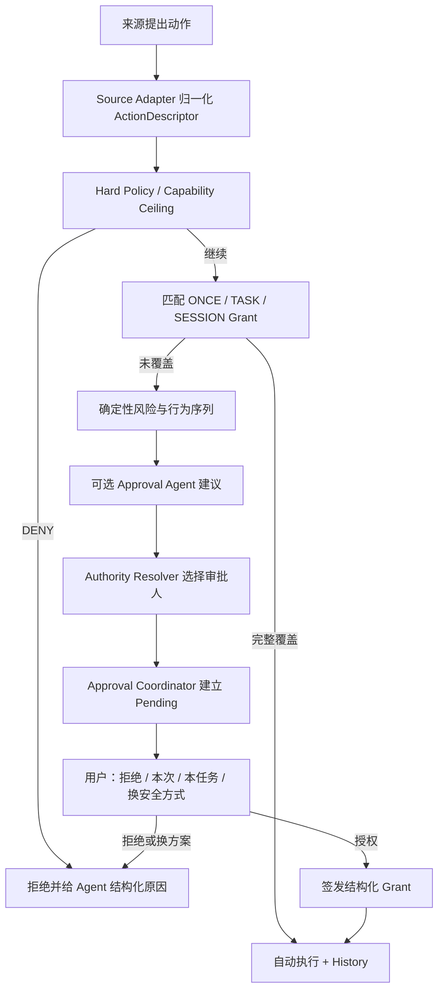

# cc-pocket 统一审批系统设计

> **桥接全自动补充（2026-08-12，issue #233）**：机主自己的 bridge turn，以及机主已经阅读并批准的单次
> 请求，按既有授权语义获得一回合 full-auto。飞书群另增必须由机主精确执行
> `/full-auto confirm [purpose]` 才能建立的 `FeishuTrustMode.FULL_AUTO`；该模式仍逐请求先过 Guardian，只有
> 明确低风险且符合用途的请求才获得一回合 `BridgeGrant.REVIEWER_FULL_AUTO`。旧 `TRUSTED`／`REVIEWED`
> 记录及其 `AUTO_TRUSTED`／`REVIEWER_APPROVED` 封闭工具白名单原样保留，升级绝不静默扩权。
>
> 这里的 full-auto 是高风险、显式 opt-in，不是沙箱或“只在项目内”的安全保证：Bash（包括分类器 `ASK`）、
> MCP、网络、`Task` 和未知工具可不经逐工具卡片运行。已知 Bash `DENY` 只是一层 best-effort
> defense-in-depth；workdir 检查只覆盖 daemon 能识别路径字段的结构化工具，不能约束 shell、MCP 或未知工具的
> 实际副作用。对 `REVIEWER_FULL_AUTO`，已知 specific-file 工具的不可解析目标与 canonical
> `executesForTheOwner` 目标仍询问；这个 hold 不覆盖 Bash、MCP、`Task` 或未知 schema。
> `ExitPlanMode`、`AskUserQuestion` 等人类决策工具仍必须询问。完整边界见【§19】。
>
> 状态：**最终方案，作为后续实现与评审的唯一依据**（2026-08-02）。
> **M1／M2／M3／M5 已实现并随 merge `f134f44` 合入 `feat/session-handoff-collaborator`**（同日），
> 落地明细与偏差见文末【§18 落地状态】；M4 未开工。
>
> 本文是审批领域的主设计。`SMART-APPROVAL.md` 作为风险评估与审批升级的子设计保留；
> `SESSION-HANDOFF.md` 继续负责接力领域，但其中涉及审批路由的部分以本文为准。

## 0. 设计结论

cc-pocket 不应继续把审批理解成“Agent 每调用一次工具，手机弹一次 Allow / Deny”。新的产品模型是：

1. 用户先选择一个易懂的执行档位；
2. Agent 在任务开始时提出本任务所需的能力包；
3. 用户通常只确认一次任务授权；
4. daemon 在授权范围内自动执行并持续留痕；
5. 只有越界、高风险、不可逆或无法判断的动作才再次打断用户；
6. Agent 可以解释、推荐、合并审批和主动换用更安全的做法，但不能给自己扩权。

真正的安全边界始终在 daemon：硬策略、结构化 Grant、审批人身份和资源范围由 daemon 判断。Agent
参与的是意图表达、风险分析和交互优化，不是最终授权事实源。

产品体验目标：

> 普通编码任务一次授权后顺畅完成；危险动作仍然在正确的人面前停住。

首版实现重点不是让 Agent 替用户决定，而是同时做到：**一次授权覆盖一个明确任务、等待时及时触达、
自动执行现场可见、越界后再找人**。

---

## 1. 目标、原则与非目标

### 1.1 目标

- 盘清并统一 Agent 工具、Bridge、Shell、文件导出、定时任务和 Handoff 的审批路径；
- 显著降低同一任务中的重复审批；
- 让审批卡解释“将产生什么结果”，而不只是展示原始工具名和参数；
- 支持 owner、guest、handoff recipient 等不同审批人，且由 daemon 校验；
- 让 Agent 自主参与计划能力、提出建议、请求增量权限和在拒绝后改走安全路径；
- 保持 relay 零知识、daemon/App 独立升级和旧客户端兼容；
- 形成统一、可查询但不过度收集敏感内容的审批历史。

### 1.2 核心原则

1. **先授权任务，后执行动作**：优先用任务级能力包减少打断，而不是扩大永久“始终允许”。
2. **能力与审批分离**：文件能写到哪里、是否允许网络，与“什么时候需要问人”是不同维度。
3. **来源只改变上限，不改变事实**：owner、bridge、guest、handoff 的信任不同，但都不能绕过 daemon
   的范围校验。
4. **Agent 可建议，不可自授**：模型结论不能创建超出用户既有授权的新能力。
5. **低风险少打断，高风险找对人**：不是所有 ASK 都找当前 Controller，也不是所有动作都找 owner。
6. **一次点击的持续时间必须可见**：本次、本任务、本 Session、持久规则不能混成一个按钮。
7. **未知不等于安全**：规则无法判断、模型超时或后端能力不足时，回退到更强审批或拒绝。
8. **拒绝也是工作流输入**：Agent 应知道是用户拒绝、策略拒绝、超时还是要求换安全方案。

### 1.3 非目标

- 不在 v1 构建企业 IAM、组织级审批后台或不可篡改审计系统；
- 不把 LLM 风险判断描述成恶意软件检测或形式化证明；
- 不承诺 shell 的路径、网络和副作用在没有 OS 沙箱时可以被完全静态识别；
- 不为 OpenCode 虚构其不存在的交互审批能力；
- 不把 pairing、Handoff 接受、Agent 提问全部塞进同一个安全审批协议。

---

## 2. 当前审批场景盘点

当前代码已有一个统一外观 `PermissionAsk / PermissionVerdict`，但底层由四套 Pending Gate 和多套
信任逻辑分别管理。首先按真实语义分类。

### 2.1 执行安全审批

| 场景 | 当前触发点 | 当前审批人 | 现有免审/记忆 | 主要边界与问题 |
|---|---|---|---|---|
| Owner Session 的 Agent 工具 | Claude `can_use_tool`、Codex `requestApproval` → `PermissionBridge` | 能驱动该 Session 的 owner 设备 | mode、session allowRules | Bash、写文件、MCP、网络等共用一张卡；rule 粒度不一致 |
| Bash / Command 工具 | `PermissionBridge` | owner、guest 或 handoff recipient，取决于 Session 来源 | Bash 前两个 token 的 remembered rule；某些 mode 自动放行 | 同一命令的参数、副作用和来源没有进入结构化 Grant |
| 文件写入 / Codex patch | `PermissionBridge` | 当前 Session 审批人 | `Edit` / `Write` 工具族 remembered rule；`ACCEPT_EDITS` 可免审 | “允许 Edit”覆盖面大；diff 只在 Session 卡片里完整展示 |
| Read / Glob / Grep / MCP / Web 工具 | `PermissionBridge` | 当前 Session 审批人 | backend mode 或 tool-family rule | 文件范围只对受限来源额外约束；未知工具默认 ASK 是正确的 |
| 手机 Quick Terminal | `ShellService` | owner 设备 | 独立于 Agent 的 shell allowRules；BYPASS 免审 | 与 Agent Bash 是两套记忆，同一命令可能重复审批 |
| 非 changed-set 文件导出到手机 | `FileExportService` | owner 设备 | changed file 直接读；其他文件逐个确认；BYPASS 免审 | 只允许当前 workdir 内文件，one-off；这是独立 Pending Gate |
| 通用 headless Bridge 的工具请求 | Bridge Session 的 `PermissionBridge` | owner；bridge 结构上不能收/回 verdict | `BridgeCommandPolicy`、bridge allowedCommands、tier | 默认安全但割裂；Bridge 看不到 ask，依赖 push 和 owner inbox |
| 飞书请求级审批 | `BridgeRequestApprovalGate` | owner | 每个请求 one-off | owner 批准 prompt 后得到 `OWNER_APPROVED`，该 turn 不再逐工具询问 |
| 飞书旧信任模式 | `FeishuTrust` + `AUTO_TRUSTED` / `REVIEWER_APPROVED` | owner 预先授权；`REVIEWED` 还逐请求过 Guardian | 旧记录保持封闭工具白名单，越界工具仍找 owner | 升级不能把既有 `TRUSTED/REVIEWED` 静默变成 full-auto |
| 飞书显式全自动 | `FeishuTrustMode.FULL_AUTO` + `REVIEWER_FULL_AUTO` | owner 精确确认模式；Guardian 逐请求只放明确低风险 | 通过后仅本 turn 跳过普通工具卡 | 高风险 opt-in；不是 shell、网络或未知工具的沙箱 |
| 飞书 owner 专属会话 | `ownerBypassSession` 资格 + `OWNER_BYPASS` Grant | 无逐动作审批 | owner 身份消息形成一回合 full-auto | 取消先撤销 turn Grant；仍经过结构化路径检查、best-effort Bash DENY 和人类决策门 |
| Guest Folder Share | `GuestCaps / GuestGuard / PermissionBridge` | guest 自己 | share tier 上限；guest Session allowRules | owner 只在发 Share 时给能力上限，运行时 guest 自批 |
| Session Handoff | `CollaboratorGuard / HandoffGuard / PermissionBridge` | 当前 recipient 自批；未来高风险可转 owner | REVIEW 写工具硬拒绝；Bash 当前逐次 ASK 目标 | Controller 与 Approver 混在 lease gate；Bash neverRemember 需 daemon 强制 |
| 定时任务 | `SchedulerService` 以 headless sink 打开普通 Session | 若运行中出现 ask，则 push owner | Schedule 保存 mode；能免审的动作直接执行 | 创建时没有任务能力合同，运行后才逐步弹卡；无人值守体验不稳定 |
| OpenCode Session | `opencode run --auto` | 无交互审批通道 | 实际等价 Full Auto | owner UI 有警告；guest/bridge/handoff 被禁止使用，这是必要限制 |

### 2.2 当前被混进 `PermissionAsk`、但不是安全审批的场景

| 场景 | 正确语义 | 当前问题 |
|---|---|---|
| `AskUserQuestion` | Agent 向用户收集任务信息 | answers 复用 `PermissionVerdict`；不能进入“审批历史”或套用 allow rule |
| `ExitPlanMode` | 用户确认方案/任务方向 | 它是任务决策，不等同于授权某个具体副作用；当前通过 neverRemember 修补 |

这两类可以出现在统一的“需要你处理”入口，但协议、超时和结果语义应与安全审批分开。

### 2.3 关系授权与高影响确认

以下行为需要明确同意，但也不应作为工具审批处理：

- 开启 `BYPASS_PERMISSIONS` / Full Control；
- 创建或调整 Bridge、Folder Share 的目录和 tier；
- pairing、首次 Collaborator Link 和安全指纹确认；
- Handoff 的发送、接受、拒绝、Return、Recall；
- 创建定时任务，特别是重复任务；
- 撤销设备、Bridge、Share 或协作者关系；
- 切换会影响运行中 Session 的账号或 API preset。

这些属于 `ConsentFlow`：它们创建或改变长期关系、能力上限或未来执行，不应复用执行中短 TTL 的
`SecurityApproval`。

### 2.4 当前实现分布

当前四个实际 Pending Gate：

- `agent/PermissionBridge.kt`：Agent tool、Plan、AskUserQuestion；
- `agent/BridgeRequestApprovalGate.kt`：飞书请求级审批；
- `shell/ShellService.kt`：手机 Quick Terminal；
- `disk/FileExportService.kt`：普通项目文件导出。

它们都构造 `PermissionAsk`，但各自保存 pending、timeout 和 remembered rule。`RequestRouter` 收到
`PermissionVerdict` 后按“Shell 是否认识 askId → Export 是否认识 → Conversation 是否认识”的顺序试投。
Account-wide inbox 再临时汇总这些 pending rows。

### 2.5 当前方案的主要问题

1. **同一概念多套实现**：pending、超时、撤回、重连恢复、历史和幂等需要在四处维护。
2. **审批语义混用**：安全授权、Plan 确认、Agent 提问共用一套 frame 和按钮。
3. **“始终允许”太粗**：Bash 前两个 token、Edit 工具族不能表达 cwd、参数、来源、任务和有效期。
4. **记忆彼此割裂**：Quick Terminal 与 Agent Bash 的同类授权无法复用。
5. **缺少任务边界**：用户只能在“一次”和“Session 内始终”之间选择，最实用的“仅本任务”不存在。
6. **模式揉在一起**：Claude 的 mode、Codex 的 approvalPolicy × sandbox、OpenCode 的 `--auto` 被压在
   同一 `PermissionMode` 枚举中，UI 名称相似但安全含义不同。
7. **审批人是隐含推导**：owner、guest、recipient、bridge 依赖 origin、pathScope 或 controller lease
   间接决定，难以支持“recipient 执行、owner 批高风险”。
8. **卡片解释不足**：主要展示 raw command/tool；缺少任务目的、实际影响、命中的策略、推荐选择。
9. **无人值守不够顺畅**：Schedule 或 Bridge 运行到中间才发现要审批，Agent 和用户都无法提前预期。
10. **旧模式要么太烦、要么太宽**：逐步 ASK 打断多，Full Auto 又缺少可见的时间和资源边界。

---

## 3. Agent 如何自主参与审批

### 3.1 四个参与者

| 参与者 | 职责 | 是否能授予权限 |
|---|---|---|
| Executor Agent | 完成用户任务，提出计划、工具调用和增量能力请求 | 否 |
| Approval Agent | 独立分析意图、动作序列和风险，生成建议与解释 | 否 |
| Approval Coordinator | daemon 内执行硬策略、匹配 Grant、决定审批人和状态机 | 是，限于已有策略/Grant |
| Human Authority | 创建任务 Grant、持久 Policy 或批准单次越界 | 是 |

Approval Agent 可以使用模型，但必须与 Executor Agent 的会话隔离；Executor 的 Prompt、工具输入和文件
内容均视为不可信数据，不能通过 Prompt Injection 让 Approval Agent 修改规则。

### 3.2 Task Contract：便捷性的核心

Agent 在任务开始或 Plan 完成时，生成结构化 `TaskContractProposal`：

```text
目标：修复 relay 重连测试
预计需要：
  - 读取：当前项目
  - 编辑：daemon/、protocol/
  - 命令：./gradlew :daemon:test、./gradlew :protocol:test
  - 网络：不需要
  - Git：只读，不 push
有效期：本任务结束，最长 2 小时
```

daemon 将 proposal 与当前执行档位、来源上限和硬策略求交集，形成真正可批准的
`TaskGrantDraft`。用户看到的是能力差异，而不是一串未来工具调用。

用户批准后：

- Grant 范围内动作自动执行并记录；
- Agent 改变计划或需要新能力时，只请求 Grant delta；
- 任务结束、Return、Recall、超时、Session 关闭或来源撤销时立即失效；
- Agent 不能在 proposal 中写一句“允许全部”来突破来源 ceiling。

### 3.3 Agent 可自主完成的事情

- 把一系列预期动作整理成一个可读的任务授权包；
- 解释为什么需要某项能力、会影响什么、是否可撤销；
- 对当前请求给出 `ALLOW_ONCE / ALLOW_TASK / DENY / RETRY_SAFER` 建议；
- 发现用户常重复批准相同能力时，建议创建 Policy，但不能自动保存；
- 在动作被拒绝后，选择只读工具、限定路径、去掉网络、缩小 diff 或拆成更小步骤再申请；
- 在存在独立并行工作且 backend 仍可调度时，继续执行不依赖被阻塞动作、且已有 Grant 覆盖的安全工作；
  普通串行 tool request 仍会阻塞当前 Agent，不能用 UI 文案虚构“审批期间继续”；
- 将多个同一任务、同一审批人、相近风险的请求合成 Bundle，让用户逐项勾选。

### 3.4 Agent 永远不能做的事情

- 覆盖 daemon 的 HARD_DENY、pathScope、来源 ceiling 或 Handoff 状态；
- 仅凭“我认为安全”把原本需要用户授权的能力变成自动放行；
- 批准自己提出的越界请求；
- 创建永久 Policy、延长 Grant 或切换 Full Control；
- 把 `UNKNOWN` 风险降成 LOW；
- 隐藏审批、历史、执行结果或真实资源范围；
- 在 Approval Agent 不可用时静默退化为自动允许。

### 3.5 “换种安全方式”

审批卡除 Allow / Deny 外增加一个重要动作：

> 换种安全方式

它向 Executor Agent 返回结构化结果 `RETRY_SAFER`，并附带约束，例如：

- 不要联网；
- 只读，不改文件；
- 只运行测试，不运行安装脚本；
- 不访问 workspace 外；
- 生成 patch 给我看，不直接应用。

这比单纯 Deny 更便捷：用户表达边界，Agent 自动重新规划，而不是双方来回解释。

---

## 4. 新的领域划分

### 4.1 三类“需要你处理”

#### A. SecurityApproval

控制一个具体副作用是否执行：命令、文件修改、网络访问、导出、外部系统操作、权限扩大。

特点：daemon 权威、短期 pending、有明确资源与审批人、超时安全失败。

#### B. TaskDecision

Agent 的问题、方案选择和 Plan 确认。

特点：没有“始终允许”，不进入安全风险统计，超时表示“没有回答”而不是“危险动作被拒绝”。

#### C. ConsentFlow

创建或改变长期信任、未来执行与关系：Full Control、Bridge/Share/Collaborator、Handoff、Schedule。

特点：通常需要更完整预览、二次确认或生物识别；结果进入配置历史，而不是短期 Approval Queue。

App 可以把三类内容汇总进一个 `Needs You` 入口，但必须用不同卡片、动作和状态文案。

### 4.2 统一 SecurityApproval 模型

建议 daemon 内部领域对象：

```text
SecurityApprovalRequest
  id / createdAt / expiresAt / status
  source              Owner | Schedule | Bridge | Guest | Handoff
  requester           transport device / bridge / scheduler / agent process
  context             machine / project / session / turn / task / handoff
  action              normalized ActionDescriptor
  hardPolicy          ALLOW | DENY | CONTINUE
  matchedGrantIds
  risk                level / reasons / assessorVersion
  authority           allowed device/role set
  options              ONCE / TASK / SESSION / RETRY_SAFER / DENY
  recommendation
```

`ActionDescriptor` 不以 tool name 作为全部语义，而是归一化成：

```text
effect       READ | WRITE | EXECUTE | NETWORK | EXPORT | EXTERNAL_MUTATION | SCOPE_CHANGE
resources    canonical paths / project root / URL host / remote / external object
operation    executable + argv summary / tool + normalized parameters
diff         optional capped diff summary
reversible   yes / partial / no / unknown
sensitivity  normal / credentials / system / unknown
```

原始 tool input 仅保留在请求生命周期内；协议和 History 使用裁剪、脱敏后的展示字段。

---

## 5. Grant 与 Policy

### 5.1 Grant 生命周期

| 类型 | 适用场景 | 到期条件 | UI |
|---|---|---|---|
| ONCE | 单个特殊动作 | 使用一次或 ask 终态 | “允许本次” |
| TASK | 当前目标的一组能力，默认推荐 | task 完成、2h 上限、Return/Recall/Session close | “允许本任务” |
| SESSION | 用户明确希望整个 Session 复用 | Session close / mode change / revoke | 收进更多选项 |
| SAVED_POLICY | 稳定个人习惯 | 用户主动删除、来源/项目变化 | 只能在 Policy 管理页创建或确认 |

不再在主卡片上使用含糊的“始终允许”。若用户从卡片创建长期 Policy，必须进入单独确认页，显示项目、
来源、动作范围和撤销入口。

### 5.2 结构化 Grant

Grant 至少绑定：

- source kind 与 requester identity；
- owner project / canonical roots；
- sessionId、taskId 或 handoffId；
- effect types；
- tool / executable / subcommand matcher；
- 网络 host allow-list；
- 生效时间、到期时间、使用次数；
- 创建它的 approvalId 和 human actorDeviceId；
- 来源 ceiling 与 risk ceiling。

Bash Grant 不再只保存前两个字符串 token。建议匹配：

```text
executable = ./gradlew
task patterns = :daemon:test | :protocol:test
cwd = current project
shell metacharacters = denied
network = ask
lifetime = task
```

必须诚实承认：构建脚本、package scripts 和被调用程序本身仍可能执行任意逻辑。对于 owner 自己的可信
项目，可以把这种风险纳入 Task Grant；对于 Bridge、Guest、Handoff 等外部来源，应使用更严格 ceiling。

### 5.3 Policy 与 Grant 的区别

- Policy 是用户长期偏好，例如“我的 cc-pocket 项目中，owner Session 运行 Gradle test 可自动执行”；
- Grant 是某次 task/session 中 Policy 匹配后生成的限时能力；
- Policy 不直接发送给 Agent，也不能由 Agent 修改；
- source、project、command 或 risk 任一变化都应导致 Policy 不匹配，而不是模糊继承。

### 5.4 “本任务”的 daemon 生命周期

Task Grant 不能依赖 Agent 单方面声明“任务还没结束”，否则 Agent 可以借此无限延长授权。首版定义：

- 每个顶层用户 `SendPrompt.promptId` 创建一个 taskId；
- 同一 prompt 引发的自动 continuation、sub-agent 和 background job 继承该 taskId；
- TurnDone 到达且没有 background work、pending approval 或 continuation grace 时，task 进入完成态；
- 用户后续发送的新 prompt 默认创建新 task；需要继续上个任务时，也必须重新确认仍然缺少的 Grant delta；
- task TTL 最长 2 小时，用户可随时在 Session 顶部结束任务并撤销全部 Task Grant；
- Agent 可以建议提前完成、daemon 可以提前回收，但 Agent 不能延长 TTL 或把新 prompt 并入旧 task；
- Handoff Return/Recall、source credential 撤销、Session close 和 daemon 安全重建立即终止 task；
- 重复 Schedule 保存的是用户批准过的 `TaskGrantTemplate`，每次 fire 都生成新的 taskId 和限时 Grant，
  不能让一次 schedule consent 产生永不过期的 live Grant。

---

## 6. 决策流水线



严格顺序：

1. **Capability firewall**：credential 能不能请求这种动作；
2. **Hard policy**：pathScope、危险红线、Handoff write wall、后端不可控能力；
3. **Active Grant**：是否已被本次/任务/Session 授权；
4. **Saved Policy**：是否可以生成新的短期 Grant；
5. **Deterministic risk**：路径、网络、命令与动作序列；
6. **Approval Agent**：只给建议和解释；
7. **Authority Resolver**：找当前动作真正的审批人；
8. **Human decision**：签发 Grant 或拒绝；
9. **Backend response**：以对应 backend 的协议执行/拒绝；
10. **History**：记录决定、匹配范围和结果。

任何前置层 DENY 后，后续层都不能恢复为 ALLOW。

---

## 7. 执行档位：对用户简单，对内部正交

### 7.1 用户看到的四档

| 档位 | 默认行为 | 适合 |
|---|---|---|
| Guided / 监督 | 读取自动；编辑、命令、网络按步骤确认 | 新项目、敏感任务 |
| Balanced / 平衡（推荐） | 先确认 Task Contract；项目内常规编辑/测试自动；网络和高风险再问 | 日常编码 |
| Project Auto / 项目自治 | 项目范围内读写和已声明命令自动；外部路径、凭证、网络、push 再问 | 熟悉项目的长任务 |
| Full Control / 完全控制 | owner 本机 Session 在明确时限内尽量不打断 | 仅 owner，强提示和自动到期 |

默认推荐 Balanced，而不是 DEFAULT/ACCEPT_EDITS 这种 backend 术语。

用户可以为项目保存“首选执行档位”，但它只是 daemon 本地的启动偏好，不是权限本身：

- 以 canonical project identity 绑定，只由 owner 修改；
- 新 Session 用它预选 Profile 和 Task Contract draft，不直接签发 Grant；
- 项目路径、来源或 backend 变化时重新校验；
- 提高到 Project Auto / Full Control 属于 `ConsentFlow`，必须明确确认；
- 无论保存什么偏好，都不能突破 source ceiling、hard policy 或 Task Grant 范围。

### 7.2 daemon 内部正交轴

```text
ExecutionProfile
  filesystem   READ_ONLY | WORKSPACE_WRITE | FULL
  shell        ASK | TASK_GRANT | ALLOW
  network      DENY | ASK | ALLOW_LIST | ALLOW
  external     DENY | ASK | ALLOW_LIST
  approval     STEP | TASK | EXCEPTION_ONLY
  assessor     OFF | ADVISORY | ENFORCED_ROUTING
  maxGrantTtl
```

Profile 先受来源 ceiling 限制，再映射到 backend：

- Claude：选择合适的 native permission mode，但 daemon 的 outer policy 仍生效；
- Codex：映射 `approvalPolicy × sandbox`，daemon 仍管理 Task Grant、来源与网络/外部动作；
- OpenCode：因为没有交互审批协议，只允许 owner 的 Project Auto / Full Control；受限来源继续禁用。

### 7.3 来源 ceiling

| 来源 | 最大档位 | 默认审批人 | 特殊规则 |
|---|---|---|---|
| Owner interactive | Full Control | 当前 owner 设备；高风险可要求生物识别 | 可创建 Saved Policy |
| Schedule | Project Auto | owner | 创建时必须确认 Task Contract；不允许隐式 Full Control |
| Generic Bridge / Feishu | 默认 Project Auto；仅显式 `FULL_AUTO` 可形成单 turn full-auto | owner | bridge 永远不能回 verdict；旧 `AUTO_TRUSTED/REVIEWER_APPROVED` 保持封闭上限；`FULL_AUTO` 必须机主确认且逐请求经 Guardian |
| Guest Folder Share | share tier 对应上限，永不 Full | guest；owner 可配置高风险升级 | roots、expiry 与 clean-room 固定 |
| Handoff REVIEW | Guided/Balanced 的只读变体 | recipient；HIGH/UNKNOWN 转 owner | 结构化写硬拒绝；shell 不能 remember |
| Handoff CONTINUE（后续） | Project Auto 以下 | recipient；外部/高风险 owner | 只在 allowedRoots 写入 |

来源 ceiling 由 daemon 的 credential / Handoff Grant 得出，客户端和 Agent 都不能声明更高档位。

issue #233 明确保留 Bridge 的 `OWNER_APPROVED = 本 turn full-auto`：机主已经阅读并批准了这一条外部请求，
因此普通工具不再二次逐步询问。它不是跨 turn 的 standing rule，也不由客户端或外部 bridge 自报；turn 结束、
发送失败、取消、报错或会话关闭即撤销。daemon 仍先执行可判定的结构化路径检查和 Bash `DENY` 筛查，但必须
诚实说明后者只是 best-effort，前者也不覆盖 shell、MCP、网络和未知工具。未来若改成结构化 Task Grant，必须作为
新的收紧迁移单独设计，不能把尚未存在的约束写成当前保障。

### 7.4 Backend 可观测性是前提

Approval Coordinator 只能治理 daemon 能观察并拦截的动作。如果 backend 在 native mode 中静默执行
某类工具，Task Grant 既不能批准它，也不能拒绝它。因此每个 backend 必须维护能力矩阵：

| Backend | 可拦截审批 | 可依赖的强边界 | 新方案要求 |
|---|---|---|---|
| Claude | `can_use_tool` / stdio permission prompt | Claude native mode、clean-room、daemon 收到请求后的 policy | Managed Profile 使用能上报所需副作用的 mode；不可见动作不得宣称由 Grant 管理 |
| Codex | command/file `requestApproval` | Codex sandbox + approvalPolicy | 尽量使用可观察的 approvalPolicy，由 Coordinator 对 Task Grant 内请求快速自动回答；sandbox 独立设置 |
| OpenCode | 当前没有 | 仅进程自身 `--auto` 与外部 OS 隔离（当前没有专用沙箱） | 只允许 owner auto profile；不进入 Managed Approval |

实现前必须为每个 `backend × mode × tool family` 建立 probe/test，确认动作究竟会：上报请求、被 sandbox
拒绝，还是静默执行。任何“不确定”都不能标记成“受统一审批保护”。

类似地，shell 的 network/path 副作用在没有 OS 沙箱时只能做命令级判断。动态脚本、构建脚本和未知
可执行文件应视为 `effect=UNKNOWN` 或按来源升级审批，不能因为 Task Contract 写了“network=DENY”就
宣称获得了技术隔离。

---

## 8. 审批人与路由

必须拆开：

```text
ControllerAuthority：谁能给 Session 发 prompt、cancel、回答任务问题
ApprovalAuthority：谁能批准某个 SecurityApproval
ConsentAuthority：谁能改变长期关系、模式或 Policy
```

推荐规则：

- owner Session：owner devices；若多个设备在线，第一份合法终态 verdict 生效；
- Bridge：owner devices，bridge credential 结构上不能看见或回答审批；
- Guest：正常动作由 guest 自批；越过 share ceiling 直接拒绝，不弹 owner 卡；可选的高风险升级由 owner 批；
- Handoff：recipient 控制 Session，普通 Task Grant 由 recipient 使用；HIGH/UNKNOWN、网络外发、凭证、
  owner 环境持久化动作转 owner；
- Schedule：owner；无人响应时任务保持安全失败，下一次运行不能继承未完成 approval；
- Full Control、Saved Policy、扩大 Share/Bridge roots：只能 owner ConsentAuthority。

daemon 在 pending request 中保存允许回答的 device/role set。`ResolveApproval` 不携带可信 actor；
RequestRouter 使用 transport-derived deviceId 校验。

---

## 9. 用户体验

### 9.1 默认路径：一次任务授权

用户发送任务后，Agent 若只需要当前 Profile 已覆盖的低风险能力，直接开始。需要额外能力时显示：

```text
完成“修复 relay 重连测试”需要

✓ 编辑 daemon/ 和 protocol/
✓ 运行 2 个 Gradle 测试任务
— 不访问网络
— 不执行 Git push

[拒绝] [调整范围] [允许本任务]
```

“调整范围”允许取消某项、缩小目录、禁止网络或只生成 patch。调整后的约束作为 Grant 写入 daemon，
同时反馈给 Agent 重新规划。

### 9.2 单动作审批卡

卡片按重要性展示：

1. **结果**：例如“将推送当前分支到 origin”；
2. **目的**：Agent 为什么需要它；
3. **影响范围**：project/path/host/remote；
4. **风险**：确定性命中、Approval Agent 建议和 UNKNOWN；
5. **已授权差异**：只突出比 Task Grant 多出来的部分；
6. **选择**：拒绝、允许本次、允许本任务、换种安全方式。

原始 command、diff 和 tool input 放在可展开详情，不占据第一认知层。

### 9.3 不再默认展示“始终允许”

主卡片最多展示：

- 拒绝；
- 允许本次；
- 允许本任务（推荐）；
- 换种安全方式。

Session Grant 放在“更多”中。Saved Policy 首版不上线；后续上线时只能从 Policy 管理入口创建，并再次
显示完整 matcher、适用项目/来源和撤销入口。

### 9.4 Needs You 统一入口

一个入口汇总多机器上的：

- Security Approvals；
- Agent Questions / Plan Decisions；
- Handoff / Consent waiting；
- 最近已处理结果。

默认排序：即将超时 → HIGH/UNKNOWN → 当前任务阻塞 → 普通问题。相同 task 的低/中风险项可以 Bundle，
但用户必须能逐项取消；不可逆、高风险和不同审批人的请求不得混成“一键全批”。

单个 Session 内也必须使用 ask 队列，不能继续用一个 `pendingAsk` 覆盖前一个请求：

- Coordinator 和 App 均按 requestId 保存有序列表，重复帧幂等去重；
- 当前卡显示“第 n / 共 m 个”，处理或撤回后再展示下一项；
- 重连以 daemon snapshot 为准，移除已经终态或失效的本地卡；
- 队列解决同一 Session 不覆盖、不丢失；Bundle 解决同 task、同 authority 请求的可审阅批量处理，
  二者不能用“一键全部允许”相互替代。

### 9.5 通知、提醒与高风险确认

- 桌面审批到达时触发系统通知、Dock/托盘角标和可选提示音；窗口已聚焦且正在展示该卡时不重复通知；
- 点击桌面通知 deep-link 到具体 request，进入后仍以 daemon 最新 snapshot 校验 pending 状态；
- 手机使用独立的审批通知 category/channel，声音与震动可单独配置，不影响 turn-complete 通知；
- Push 只带 machine、project、类别和 opaque deep link，不带 command、prompt、文件名、diff 或 secret；
- 首次推送后，若请求在无人关注状态下存活超过软超时窗口的一半，可补发一次非 urgent 提醒；每个 request
  最多一次，受现有 coalesce 限制；
- v1 系统通知只提供“查看”，不在锁屏直接 Allow/Deny；App 打开、解密并刷新 snapshot 后才能决策；
- HIGH、Saved Policy、Full Control 和 scope 扩大应触发生物识别（若用户开启 App Lock）；
- 后续若增加通知快捷 Deny，可以在状态复核后直接完成；Allow-once 仍需解锁、刷新 snapshot 且只限 LOW，
  高风险永不支持通知直批。

### 9.6 自动执行现场留痕与收紧

一个原本需要 ASK、后来因 Task/Session Grant 命中而自动执行的动作，必须同时进入 History，并在会话流
插入轻量 chip：

```text
自动执行 · ./gradlew :daemon:test
依据：本任务授权                     [查看] [收紧后续授权]
```

- chip 展示裁剪、脱敏后的动作摘要、授权依据与时间；详情页展示 `ActionDescriptor` 和 matchedGrantId；
- 每个自动决定都有记录，但 UI 可以将短时间内同 Grant 的连续动作折叠成一组，避免刷屏；
- “收紧后续授权”撤销对应 Grant，或在当前 task 增加更窄的约束；Coordinator 确认后，同类后续动作回到
  ASK 或被拒绝；
- 收紧只影响尚未开始的动作，不能承诺撤销已完成的网络发送、push、发布、删除或其他副作用；
- baseline read、纯 UI 行为等原本就不需要授权的动作不生成 chip；Full Control 下的重要副作用仍进入 History，
  但其展示策略可以单独折叠。

### 9.7 超时文案

必须区分：

- `USER_DENIED`：用户明确拒绝；
- `POLICY_DENIED`：daemon 策略拒绝；
- `NO_RESPONSE`：无人响应；
- `ASSESSMENT_UNKNOWN`：风险无法可靠判断；
- `WITHDRAWN`：Agent 取消或请求已失效；
- `RETRY_SAFER`：用户要求 Agent 换方案。

Agent 收到真实原因，不能把超时描述成用户反对方案。

---

## 10. 状态机

```text
CREATED
  → POLICY_CHECKING
  → ASSESSING             风险引擎运行；Deny 可用，Allow 暂不可用
  → WAITING_APPROVER      authority 已固定
  → ALLOWED_ONCE
  → GRANT_ISSUED
  → DENIED
  → RETRY_SAFER
  → TIMED_OUT
  → WITHDRAWN
  → CANCELLED_RESTART
```

约束：

- 每个 request 只有一次终态转换，重复 verdict 幂等返回原结果；
- Agent 取消、turn 结束或 action 消失时立即 WITHDRAWN；
- daemon 重启不恢复“等待执行”的 pending action，统一终止为 CANCELLED_RESTART；
- Task/Session Grant 可按策略持久化，但必须重新校验 session/task/source 是否仍有效；
- 风险更新晚于终态时丢弃，不复活请求、不重置过期时间；
- ENFORCED_ROUTING 下，ASSESSING 阶段任何 ALLOW verdict 都被 daemon 拒绝；
- approval timeout 与 Agent question timeout 分开配置。

SecurityApproval 使用“无人关注软超时 + 绝对硬上限”，而不是把现有 `watched` 直接解释成无限等待：

1. 请求创建时保留当前无人响应预算（默认 600s；Bridge 仍保留 120s 下限）；
2. App 确实在前台展示该 request 时，通过已经认证且仍 attach 于该 Session 的交互连接发送短期
   `AttentionLease` heartbeat；建议 30s 心跳、60s lease；
3. lease 有效期间暂停消耗无人响应预算；App 后台、切走卡片、断联或 lease 到期后继续消耗剩余预算；
4. `watched/isWatching` 只能辅助决定是否推送，不能单独暂停 timeout；headless sink 永远不能创建 lease；
5. 无论 lease 如何续期，请求都不得超过 `createdAt + absoluteDeadline`，首版上限 24h，并受 Session close、
   turn cancel 和 daemon restart 的更早终态约束；
6. heartbeat 只延长阅读时间，不改变 authority、risk、Grant 或请求内容；晚到 heartbeat 和 verdict 都不能
   复活终态请求。
7. **（issue #201）「等待我手动处理」档**：用户可在 App 设置里关掉自动拒绝。它不是把等待改成无限，而是把
   单个窗口换成一条**有界的续约链**——每段租约 24h（即等于第 5 条的 absoluteDeadline，续约会重置该基准，
   所以「任何一段租约都不超过 absoluteDeadline」这条不变量原样成立），最多续 6 次，合计 7 天硬底；每次续约
   重发同一张卡（同 `(convoId, askId)`，客户端原地刷新并重新触发推送），续约耗尽仍走原有的 `AskWithdrawn`
   ＋诚实 deny。因此第 13 节依赖的「未决 ask 必然终结」性质不变，`hasPendingAsk()` 对 idle-reaper 与账号切换
   守卫仍然有界，只是界从 10 分钟放大到 7 天。**覆盖面仅限 owner 自己的会话**：bridge（`origin != null`）、
   guest（`pathScope != null`）与文件导出一律保留原超时——批准人不是会话主人时，一张不过期的卡就是常驻的
   立足点。续约不改变 authority、risk 与 Grant（与第 6 条同义）。

TaskDecision 可以采用独立的回答时限和续租策略，不能因为与 SecurityApproval 同屏就共享授权状态机。

---

## 11. daemon 架构

### 11.1 核心组件

```text
approval/
  ApprovalCoordinator.kt     pending 队列、状态机、attention lease、timeout、幂等、重连 snapshot
  ApprovalPolicyEngine.kt    hard policy、profile、source ceiling、Grant 匹配
  ApprovalAuthority.kt       controller/approver/consent 权限解析
  ApprovalRiskEngine.kt      确定性风险、动作序列、Approval Agent adapter
  ApprovalGrantStore.kt      ONCE/TASK/SESSION Grant
  ApprovalPolicyStore.kt     SAVED_POLICY
  ApprovalHistoryStore.kt    决策与结果历史
  ApprovalReminder.kt        首次触达、二次提醒、去重与通知脱敏
  ApprovalProjection.kt      V2 与 legacy PermissionAsk 的投影
```

来源 Adapter：

- `AgentPermissionAdapter`：替代 `PermissionBridge` 自己保存 pending；
- `BridgeRequestAdapter`：请求级 Task Contract / approval；
- `QuickShellAdapter`；
- `FileExportAdapter`；
- `HandoffApprovalAdapter`；
- `ScheduleApprovalAdapter`。

Adapter 负责把 backend/source 请求转为 `ActionDescriptor`，Coordinator 负责所有决策生命周期。服务不再
用 askId 前缀和逐个 pending-map membership 猜 verdict 属于谁。

### 11.2 Backend 回执

Coordinator 的终态通过 Adapter 翻译：

- Claude：`control_response allow/deny`；
- Codex：JSON-RPC approval result；
- Quick Shell：是否启动进程；
- Export：是否读取并发送文件；
- Bridge Request：是否把 prompt 交给 Agent 以及使用什么 turn grant；
- Handoff：仅对绑定 Session 和当前 Handoff Grant 生效。

### 11.3 History

记录所有人工审批和 Grant/Profile 覆盖的自动决定：

- requestId、source、project/session/task/handoff；
- daemon 可信的 requester 与 human actor；
- action summary、路径/host、risk/reason codes；
- 命中的 hard policy、Grant、Saved Policy；
- recommendation、最终选择、Grant 生命周期；
- authorization basis、matchedGrantId、是否已经向会话流投递留痕；
- backend 是否实际开始、完成、取消、超时；
- History 是否完整。

不记录完整 stdout、文件正文、secret、模型思维过程或不必要的原始 command。必要 command preview 先
redact，原始内容只保留稳定 hash 用于关联。

---

## 12. 协议设计与混版兼容

### 12.1 新协议

建议新增：

```text
ListAttention
AttentionSnapshot(items)

SecurityApprovalRequested(request)
SecurityApprovalUpdated(requestId, status, risk?, authority?, expiresAt)
ResolveSecurityApproval(requestId, decision, grantDraftId?, constraints?)
ApprovalAttentionHeartbeat(requestId, visible)

TaskDecisionRequested(decision)
ResolveTaskDecision(decisionId, answers / choice / response)

TaskGrantProposed(draft)
TaskGrantUpdated(grant)
RevokeGrant(grantId)

AuthorizedActionRecorded(eventId, sessionId, taskId, actionSummary,
                         authorizationBasis, matchedGrantId?, decidedAt)
```

所有新 enum tolerant decode 到 UNKNOWN；新增字段尾追 optional/default。

`AuthorizedActionRecorded` 是“无需弹卡但发生了授权决定”的审计事件，不复用
`SecurityApprovalUpdated`，因为后者必须对应一个真实 pending request。事件内容只使用与 History 相同的
裁剪/脱敏摘要；App 收到重复 eventId 必须幂等。daemon 只向声明对应 capability 的客户端发送新 frame。

### 12.2 旧客户端

增加 `ClientCaps.supportsApprovalV2`：

- 新 App：收 V2 request/update/snapshot、attention lease 和授权动作记录；
- 旧 App：daemon 将内部 SecurityApproval 投影成 legacy `PermissionAsk`；
- legacy `PermissionVerdict` 仍由 Coordinator 按 requestId 解析，但不能突破 authority 或 Grant 规则；
- TaskDecision 的 AskUserQuestion 保留 legacy 投影，直到旧 App 淘汰；
- 不向同一个新客户端同时发送 V1/V2 两张卡；
- mixed-version 多设备按各 sink caps 投影，同一 daemon pending 仍只有一个。

禁止向已经发布的 legacy `PermissionMode` 枚举追加 `GUARDED` 等新值：旧 peer 对未知枚举会硬失败。
新的用户档位通过 V2 `ExecutionProfile` 的 optional/tolerant 字段表达，未知值回退到安全默认档；daemon
再映射到各 backend 的 native mode。

M1 在 legacy 协议下也要先将 App 的单值 `pendingAsk` 改成 requestId 队列；这不要求旧 daemon 支持 V2，
只改变客户端对多张 legacy 卡的保存与顺序呈现。Attention heartbeat 与自动执行 chip 则只在双方声明新
capability 时启用。

Task Grant、审批人和 risk routing 都是 daemon 状态。旧 App 即使不理解新 UI，也不能靠发送旧 verdict
绕过限制。

### 12.3 Relay

relay 仍只转发 E2E frame 和无正文 push，不读取 approval 内容，不参与 risk 或 authority 决策。

---

## 13. 便捷性策略

按收益排序：

1. **Task Grant**：替代重复逐步 ASK，是最大收益；
2. **只显示增量权限**：已有授权不重复解释；
3. **Agent 推荐与结果摘要**：减少用户解读 raw tool input 的成本；
4. **Retry Safer**：一次表达边界，Agent 自动重规划；
5. **跨 Quick Shell / Agent 的同一 Grant Engine**：避免同类动作重复批准；
6. **Bundle**：同 task、同 authority、相近风险时批量确认；
7. **Policy 建议**：重复出现后再推荐持久规则，不提前打扰；
8. **单 Session 队列**：连续 ask 不覆盖、不丢失，用户按顺序处理；
9. **跨机器 Needs You**：不要求用户先找到产生 ask 的 Session；
10. **审批专属通知**：桌面/手机及时触达，点击直达且不泄露内容；
11. **自动执行 chip**：在对话现场看见授权命中，并能立即收紧后续授权；
12. **项目首选档位**：只复用启动偏好，不把偏好伪装成权限；
13. **创建 Schedule 时预授权**：避免凌晨运行到一半才推送卡片；
14. **自动到期**：让用户敢于给更顺畅的临时权限，而不是在永久允许和反复审批间二选一。

不采用以下“伪便捷”：

- LLM 说安全就自动批准；
- 一键“批准全部待办”；
- 将 `git`、`npm`、`gradle` 整个命令族永久放行；
- 通过把 timeout 拉得很长来掩盖审批流程不合理；
- 把“有 socket attach”当成用户正在阅读并无限等待；
- 宣称撤销 Grant 能回滚已经执行的副作用；
- 用 Full Control 解决普通任务频繁询问。

---

## 14. 分期实施

### M0：观测基线

- 先补齐当前安全不变量：Handoff 的 Bash/工具审批由 daemon 强制 `neverRemember`，不能依赖 App 隐藏按钮；
- 为现有四套 Gate 统一记录 source、tool、rule、等待时长、决定和重复命中；
- 统计每任务审批次数、相同 rule 重复次数、超时率和 BYPASS 使用率；
- 建立 `backend × mode × tool family` 可观测性 probe 基线；除上述安全修复外不改变授权行为。

### M1：统一 Coordinator，保持旧 UI

- 引入 `ApprovalCoordinator`；
- PermissionBridge、BridgeRequest、Shell、Export 改成 Adapter；
- 继续投影 legacy `PermissionAsk / Verdict / PendingApprovals`；
- 统一 timeout、withdraw、resurface、idempotency 和 account snapshot；
- App 将单值 `pendingAsk` 改为 requestId 队列，同 Session 连续请求不再覆盖；
- 桌面审批系统通知、Dock/托盘角标、点击直达；手机拆分审批通知类别及声音/震动设置；
- 通知到达后仍从 Coordinator snapshot 复核状态，不增加锁屏快捷批准；
- TaskDecision 暂时仍走 legacy projection。

### M2：V2 UI 与 Task Grant

- 新增 V2 ClientCaps 与协议；
- 上线 Task Contract、Allow for task、Grant delta、Retry Safer；
- 上线 `AttentionLease` 软超时与绝对硬上限，禁止直接用 watched 无限续期；
- 上线一次非 urgent 二次提醒；
- 主卡移除“始终允许”；首版仅上线 ONCE/TASK/SESSION Grant，Saved Policy 管理延后；
- Quick Shell 与 Agent Bash 共享 Grant Engine；
- Schedule 创建时可绑定 Task Grant Draft；
- Grant 自动决定写入 History 和会话流 chip，支持撤销/收紧后续授权。

### M3：Agent 建议模式

- 确定性 RiskContext 与动作序列；
- Approval Agent 只给推荐和解释，不改变 authority；
- 收集误报/漏报/延迟/UNKNOWN；
- Agent 自动生成 safer retry 和 Policy 建议。

### M4：审批权分离与强制路由

- ControllerAuthority / ApprovalAuthority 分离；
- Handoff HIGH/UNKNOWN 转 owner；
- Bridge request-level preflight 收紧 AUTO_TRUSTED；
- ASSESSING 阶段不可抢跑；
- 高风险 owner 定向 push、App Lock 和历史闭环。

### M5：统一 ExecutionProfile

- UI 用 Guided/Balanced/Project Auto/Full Control；
- 内部拆成 filesystem/shell/network/external/approval 轴；
- Claude/Codex adapter 显式映射；
- 支持 owner 保存项目首选档位；它只预选 Profile/Contract，不签发 Grant；
- OpenCode 保持 owner auto-only，直到出现可执行的审批通道或隔离层。

---

## 15. 验收指标

### 15.1 便捷性

- 日常编码任务的审批打断次数较 M0 降低至少 60%；
- 已批准 Task Contract 后，范围内动作不重复弹卡；
- 同一 task 的 Grant delta 卡只展示新增能力；
- Quick Shell 与 Agent Bash 不因 Gate 不同重复请求相同 Grant；
- 用户拒绝后，Agent 能收到明确约束并尝试安全替代；
- 跨机器 pending 无需先进入对应 Session 即可处理；
- 同一 Session 连续产生 3 个 ask 时逐个可见、可决策，不覆盖、不丢失；
- 桌面窗口在后台时，审批到达后 10 秒内出现系统通知，点击后直达且刷新真实 pending 状态；
- 关闭审批声音/震动不影响 turn-complete 通知设置；
- 用户正在前台阅读审批时软超时暂停，停止 heartbeat 后继续倒计时，绝对上限必然终结；
- Grant 覆盖的自动决定在会话流可见；收紧确认后，同 matcher 的后续动作不再自动执行；
- Schedule 在创建时能明确显示下次运行已经具备/缺少哪些能力。

### 15.2 安全与正确性

- HARD_DENY、pathScope、source ceiling 在所有 Profile 和旧客户端下都不可绕过；
- Agent/Approval Agent 不能创建超出 human-approved envelope 的 Grant；
- 错误 device/role 的 verdict 被 daemon 拒绝；
- ASSESSING、终态、超时、withdrawn 请求不能被晚到 verdict 复活；
- stale socket、headless sink 和客户端伪造 requestId 不能创建有效 AttentionLease；
- 任何 AttentionLease 都不能越过 absoluteDeadline，且不能改变审批人或权限范围；
- TASK Grant 在完成、超时、Return、Recall、Session close 后立即失效；
- Saved Policy 必须可查询、可撤销、带来源和项目范围；
- HIGH/UNKNOWN 强制路由时不能由 Handoff recipient 自批；
- 旧 App 的 legacy verdict 不会突破 V2 authority；
- History 不含 stdout、文件正文和明文 secret；
- 自动执行 chip 和系统通知不泄露 command、文件名、diff、prompt 或 secret；
- 撤销/收紧 Grant 只影响 Coordinator 确认后的未来动作，UI 不承诺回滚已发生副作用；
- OpenCode 不进入任何声称可逐动作审批的受限来源。

### 15.3 Agent 风险评估

- P95 建议结果在 2 秒内返回；
- 超时/不可用/解析失败统一 UNKNOWN；
- 进入 M4 前必须有固定样例集和人工基准；
- 模型结论从不把硬 DENY 或人类 ASK 降级成新的 auto-allow；
- 分类输入经过裁剪与 secret redaction。

---

## 16. 主要代码落点

- `protocol/.../Messages.kt`：V2 approval、task decision、Grant 与 ClientCaps；
- `daemon/.../approval/`：统一 Coordinator、Policy、Authority、Risk、Grant、History；
- `daemon/.../agent/PermissionBridge.kt`：缩成 Agent Adapter，不再自持 pending/allowRules；
- `daemon/.../agent/BridgeRequestApprovalGate.kt`：迁移为 Bridge Request Adapter；
- `daemon/.../shell/ShellService.kt`：执行保留，审批交给 Coordinator；
- `daemon/.../disk/FileExportService.kt`：containment 保留，审批交给 Coordinator；
- `daemon/.../server/RequestRouter.kt`：按 requestId 路由 Coordinator，不再试投多套 map；
- `daemon/.../conversation/Conversation.kt`：source/context/task、pending projection 和 backend response；
- `daemon/.../handoff/`：Controller/Approval authority 分离与 Grant 生命周期；
- `daemon/.../schedule/`：创建时 Task Contract、运行时 Grant 绑定；
- `mobile/.../data/PocketRepository.kt`：Attention/Approval/Decision/Grant 状态；
- `mobile/.../ui/Permissions.kt`：Task Contract、V2 Approval Card、Policy 管理；
- `mobile/.../ui/fleet/AttentionInbox.kt`：三类 Needs You 与跨机器处理；
- `mobile/.../desktop/DesktopNotify.kt`、`desktop/Main.kt`：审批系统通知、角标、点击 deep-link；
- `mobile/.../push/CcPocketMessagingService.kt` 与 iOS push adapter：审批独立通知类别、声音/震动和提醒去重；
- 桌面/mobile 会话流：`AuthorizedActionRecorded` chip、详情和“收紧后续授权”。

协议 shape 变化必须经过 `protocol-wire-compat-reviewer`；PermissionBridge、Bridge、Handoff、审批人、
token/secret 或 AUTO_TRUSTED 变化必须经过 `crypto-security-reviewer`。

---

## 17. 已确认的首版默认值

为避免实现阶段重新发散，本文确认以下默认值：

1. **Balanced**：不静默创建命令权限。Agent 首次提出的 Task Contract 默认勾选项目内编辑和明确列出的
   测试/构建命令，用户一键“允许本任务”；之后范围内不再询问。
2. **Handoff 固定转 owner**：网络外发、凭证/用户目录、workspace 外路径、Git push/force、系统动作、
   owner 环境持久化配置以及 UNKNOWN；这些不依赖 LLM 是否判断为高风险。
3. **Guest v1 不做 owner 升级**：share ceiling 内由 guest 自批，越界硬拒绝。避免 owner 不理解 guest
   任务上下文却被迫代批；后续有真实需求再增加可选升级。
4. **首版不做 Saved Policy**：M2 先上线 ONCE/TASK/SESSION Grant，验证重复审批是否已经显著下降；
   Saved Policy 延后，避免一开始就引入永久授权管理负担。
5. **Full Control 自动到期**：`min(Session close, 1 小时)`，到期回到 Balanced；续期需要重新确认。
6. **重复 Schedule 必须有显式 TaskGrantTemplate**：每次运行生成新 task/Grant；一次性 Schedule 也要在
   创建页明确显示能力范围，但可以复用当前 task 已批准的 draft。
7. **Approval Agent 默认规则优先、模型可选**：未配置 assessor 时只运行确定性 RiskEngine；模型评估
   作为 M3 可选 adapter，不偷偷消耗当前 Agent 订阅，也不强绑 Claude。
8. **审批通知默认开启、内容最小化**：桌面和手机默认通知审批到达，是否响铃/震动分别可配；通知正文不含
   command、文件名、prompt 或 diff，点击后进入 App 查看。
9. **AttentionLease 不是授权**：只有前台可见卡片的短 heartbeat 暂停软超时，默认 30s heartbeat、60s
   lease；无人响应预算默认 600s，所有 SecurityApproval 的绝对上限为 24h。
10. **自动执行只可收紧未来**：Task/Session Grant 命中时写 History 和会话 chip；“收紧”默认撤销对应
    Grant，已经开始或完成的副作用不提供伪回滚。

这些默认值优先解决个人开发者的便利性，不引入企业审批后台，同时保留统一 Coordinator、任务级
Grant、三类交互分离、Agent 只在授权包络内自主、daemon 始终是授权事实源这五个核心架构结论。

---

## 18. 合并实现审核与整改清单（2026-08-02）

> 审核对象：合并提交 `f134f44`，实现差异范围 `6070730..f134f44`。
>
> 审核结论：**当前实现未通过发布审核**。Coordinator、Task Grant、AttentionLease、风险提示和
> Full Control 到期等主体框架已经落地，但仍存在 8 项 P1 授权边界/生命周期问题。以下条目是下一轮
> 实现的发布门槛；Claude Code 应逐条修复并补回归测试，不能只调整 App 展示或注释。

### 18.1 P1：发布前必须修复

#### P1-1 Task Grant 没有绑定资源和执行上下文

**当前实现**

- `ApprovalGrantStore.Grant` 只保存 `convoId + taskId + tool + rule`；
- Edit/Write 的 rule 只是工具家族，未记录规范化项目根目录或目标范围；
- Bash rule 只是命令前两个 token，例如 `npm run`；
- `RequestRouter` 接受 Quick Terminal 提交的任意可读 `workdir`，再使用该 Session 当前 taskId 匹配
  同一个 Grant。因此项目 A 中批准的 Grant 可被项目 B 的 Quick Terminal 命中。

**必须调整**

1. Grant 由 daemon 生成并绑定规范化 `canonicalRoot/resourceScope`、结构化 action matcher 和 source ceiling；
2. 文件工具只能在 Grant 明确的目录/文件范围内匹配，匹配前重新 canonicalize，防止 `..` 和符号链接逃逸；
3. Bash 不再只用两个 token 表达授权；至少绑定 executable、subcommand/任务名、参数约束和工作目录；
4. Quick Terminal 与 Agent 可以共享 Grant Engine，但不能跨 Grant 的项目根目录，也不能扩大来源权限；
5. matcher 不确定时回到 ASK，不能猜测匹配。

**验收用例**

- 项目 A 的 Edit/Read/Bash Task Grant 在项目 B 中全部不命中；
- `npm run test` 的 Grant 不覆盖 `npm run postinstall`；
- 相同命令在不同工作目录执行时，只有 Grant 明确覆盖的目录可自动运行；
- symlink/`..` 不能把文件目标带出 Grant resourceScope。

#### P1-2 REVIEW Handoff 的一次性确认没有由 daemon 强制

**当前实现**

`PermissionBridge` 的 `neverRemember` 只考虑 `ToolMeta.neverRemember` 和 `forceNeverRemember`。
Handoff collaborator 通常没有 bridge origin，因此 REVIEW_READ_ONLY 下的 Bash ask 仍会由 daemon 提供并接受
TASK/SESSION scope。官方 App 虽然隐藏了对应按钮，但修改后的客户端可以直接提交
`grantScope=task/session`。

**必须调整**

1. daemon 根据 `handoffAccess` 派生不可绕过的 scope ceiling；
2. REVIEW_READ_ONLY 的 Bash 只允许 `once`，服务端发出的 `grantOptions` 也只能是 `once`；
3. Coordinator/Adapter 在处理 Verdict 时校验 `grantScope` 属于原 Ask 的 `grantOptions`，非法 scope 直接拒绝，
   不能依赖客户端诚实；
4. 保留 REVIEW 文件写工具的硬拒绝，并确保它发生在所有 auto-allow/Grant 分支之前。

**验收用例**

- 构造恶意 Verdict，在 REVIEW Bash ask 上提交 `task`、`session`、`remember=true` 均不能产生 Grant/rule；
- 同一 Bash 命令第二次执行仍必须重新 ASK；
- REVIEW 下 Write/Edit/apply_patch 在任何 Profile 下仍硬拒绝。

#### P1-3 账户级审批队列错误地以 askId 单独作为主键

**当前实现**

`ApprovalCoordinator` 已使用 `(convoId, askId)`，但 `SessionRegistry.pendingApprovals()` 又按 askId
`distinctBy`，`PocketRepository.pendingApprovals`、插入、撤回和 resolve 也都只使用 askId。askId 只保证单个
Agent 连接内唯一，不同 Session 可同时产生相同值。

**必须调整**

1. daemon snapshot、App 状态表、风险表、超时状态、withdraw 和 resolve 全链路统一使用
   `ApprovalKey(convoId, askId)`；
2. UI 回调必须携带完整 key，禁止在 resolve 时再从 askId 反查；
3. legacy 单 Session UI 也应内部使用复合 key，只在展示层隐藏 convoId。

**验收用例**

- 两个 Session 同时产生 askId=`1` 时，Needs You 展示两条；
- 允许/拒绝/撤回其中一条不会覆盖、删除或改变另一条；
- 风险更新和超时只作用于对应 `(convoId, askId)`。

#### P1-4 Task Grant 没有在任务终态及时失效

**当前实现**

`Conversation` 只在 `!executing` 时收到下一条 Prompt 才调用 `rotateTask`。因此：

- TurnDone 到下一条 Prompt 之间，旧 Task Grant 仍可被 Quick Terminal 使用；
- 执行中追加的另一条顶层用户指令会继承当前 Task Grant；
- `ApprovalGrantStore.endTask()` 没有接入稳定 TurnDone/terminal state。

**必须调整**

1. Task 身份与底层 CLI 是否把消息折叠进同一 turn 解耦；每条顶层用户意图由 daemon 创建新 task；
2. 稳定 TurnDone 且没有 continuation/background/pending 时立即结束 task 并清除 Grant；
3. 只有显式 continuation 或属于同一 task 的后台工作可以继承，不能用“当前仍 executing”隐式继承；
4. Return、Recall、Session close、mode switch 和 TTL 同样立即失效，清理操作必须幂等。

**验收用例**

- TurnDone 后、下一条 Prompt 前运行同 matcher 的 Quick Terminal 命令会重新 ASK；
- 执行中追加的新顶层指令不能使用前一任务 Grant；
- continuation/background 的合法继承有单独正向测试；
- late Verdict 不能复活已经结束的 task 或 Grant。

#### P1-5 Session 关闭后 Shell/Export Pending 仍可能执行

**当前实现**

Shell 和 File Export 请求由 daemon 全局 scope 中的 Service/Coordinator 持有。`CloseSession` 仅关闭
Conversation 并调用 `shell.forget()` 清 remembered rules，没有撤回这些 Pending 或取消等待协程。用户之后
仍可能从账户审批中心允许它，使命令/导出在 Session 已关闭后执行。

**必须调整**

1. Coordinator 提供按 `convoId + source/owner` 撤回 Pending 的原子接口；
2. Session 真正关闭前撤回 Agent、Shell、Export 等全部请求并取消相应等待任务；
3. Shell/Export 在产生副作用前再次校验 Session、authority、workdir/resourceScope 和请求状态仍有效；
4. 关闭产生的客户端终态统一为 WITHDRAWN，不伪装成用户拒绝或成功。

**验收用例**

- Shell/Export 等待审批时 force close Session，卡片立即撤回；
- close 前已排队、close 后才到达的 ALLOW Verdict 不会执行副作用；
- 普通 detach 但 Session 因 busy 保活时，不应误撤回合法 Pending。

#### P1-6 Full Control 到期没有使当前 PermissionBridge 失效

**当前实现**

`PermissionBridge` 创建时把 mode 缓存为 `autoAllow`。一小时后 `Conversation` 虽将 mode 改回 DEFAULT，
当前 Bridge 的 `autoAllow` 仍为 true；一个长时间运行的 Turn 可以在 TTL 后继续自动批准工具调用。

**必须调整**

1. PermissionBridge 每次决策读取 daemon 的动态 effective execution profile/mode，不能缓存授权结论；或在
   到期点原子撤销旧 Bridge 的 bypass authority；
2. 到期先收回 authority，再更新 UI；通知/徽标不能成为唯一执行效果；
3. 到期后的下一次工具调用必须进入正常硬策略/Grant/ASK 路径，即使仍是同一个 Turn。

**验收用例**

- 使用可控时钟让 Full Control 在同一 Turn 中到期，到期前 auto-allow、到期后立即 ASK；
- 到期与工具请求并发时不能多放行一次；
- 续期必须产生新的明确确认，旧 expiry job 不得误撤销新授权。

#### P1-7 Quick Terminal 的“收紧后续授权”清理了错误的规则存储

**当前实现**

Quick Terminal 的 Session rule 保存在 `ShellService.allowRules`，但无 grantId 的 auto-run chip 发送
`ClearAllowRule` 后只调用 `SessionRegistry.clearRule()`，清的是 Conversation allowRules。界面看似已收紧，
ShellService 中的 rule 仍在，下一条匹配命令继续自动执行。

**必须调整**

1. Session rule 由统一 Grant/Policy store 管理，或让撤销协议明确携带 source/store identity；
2. 收紧操作由 daemon 返回成功/失败结果，App 只有收到成功确认后才更新状态；
3. 不能再用 `grantId == null` 猜测需要清理哪类权限。

**验收用例**

- Quick Terminal session-rule 自动执行后点击收紧，下一条相同命令重新 ASK；
- Agent rule 与 Shell rule 同名时，撤销目标明确，不误删也不漏删；
- 不存在的 rule/grant 返回明确失败，不在 UI 上显示虚假成功。

#### P1-8 Bridge Request Approval 位于硬安全墙之前

**当前实现**

`PermissionBridge` 对 `BridgeGrant.OWNER_APPROVED` 的 auto-allow 分支早于 bridge 工作目录限制和
`BridgeCommandPolicy`。批准一条飞书自然语言请求，实际会允许该 Turn 内除 AskUserQuestion 外的所有工具，
包括路径逃逸和危险 Bash。这违反“硬策略永远先于所有 Grant/Profile”的核心不变量。

**必须调整**

1. pathScope/source ceiling、Handoff write wall、确定性危险命令 DENY 等硬规则放到所有 bypass、request
   approval、remembered rule 和 Task Grant 分支之前；
2. Bridge Request Approval 转换成绑定 project/root/action ceiling 的结构化 Task Grant，而不是“本 Turn
   full access”；
3. Request approval 不能授权输入中未声明或 daemon 无法约束的工具家族；未知工具回到 ASK/DENY。

**验收用例**

- owner 已批准 bridge request 时，workspace 外 Read/Edit 仍被硬拒绝；
- destructive Bash 仍被 `BridgeCommandPolicy` 拒绝；
- 允许范围内的动作可以顺畅执行，但新增工具/资源范围需要增量审批。

### 18.2 P2：本轮一并补齐

#### P2-1 AttentionLease 的客户端倒计时与 daemon 预算不一致

daemon 收到前台 heartbeat 后会暂停 no-response budget，但 App 仍按 Ask 初始 `timeoutSec` 本地倒计时，
归零后直接显示“已自动拒绝”并禁用操作。此时 daemon 可能仍在等待。桌面端只要卡片 Composable 存在就
持续 heartbeat，也没有按窗口失焦、最小化或退到后台释放 lease。

调整要求：超时终态以 daemon 的 `AskWithdrawn(TIMED_OUT)` 为准；或者 daemon 发布动态剩余预算/软截止
时间。桌面仅在窗口前台可见且卡片真实展示时发送 heartbeat，并在失焦/dispose 时立即发送
`visible=false`。增加前后台切换、断网和 24h absolute deadline 测试。

#### P2-2 自动授权 History 目前不是可恢复的历史

`ApprovalCoordinator.recordAuto()` 只写日志，`AuthorizedActionRecorded` 只是实时 Frame。客户端离线、
daemon 重启或重新加载历史后记录会消失；`actionSummary` 也只有 Edit 或命令前两个 token，无法完成方案所说
的事后定位与复盘。

调整要求：实现 daemon 侧持久 `ApprovalHistoryStore`，记录 eventId、convo/task、source、tool、脱敏动作
摘要、Grant/Policy 依据、决定、时间和结果；禁止保存 stdout、文件正文、diff、prompt、secret 或完整敏感
命令。重连/恢复时支持分页查询或安全 snapshot，并测试离线补发、daemon 重启恢复和脱敏。

#### P2-3 `supportsApprovalV2` 能力声明尚未接入下发策略

协议已有 `ClientCaps.supportsApprovalV2`，App 也会声明，但 `RequestRouter.ClientCapsHolder` 只保存
`supportsOpencode`。daemon 当前会向所有客户端发送新的审批 Frame，注释声明的 capability gating 没有实现。

调整要求：保存并使用 `supportsApprovalV2`；旧客户端继续收到 legacy projection，新 Frame 只发给声明支持
的客户端。补新 daemon/旧 App、新 App/旧 daemon 和混合多设备 attach 的 wire 兼容测试。

#### P2-4 审批专属通知尚未实现

M1 要求的桌面系统通知、Dock/托盘角标、手机审批独立通知类别/声音震动设置和点击 deep-link 未看到实现。
补齐后必须从 Coordinator snapshot 复核 request 仍为 Pending；通知正文不得包含 command、文件名、diff、
prompt 或 secret，锁屏不提供直接批准。

### 18.3 实现与复审要求

1. 先修 P1，再处理 P2；P1 未清零前不得把该实现标记为审批重构完成；
2. 安全不变量只能在 daemon 强制，App 隐藏按钮、文案提示和历史记录均不能替代服务端校验；
3. 新增/修改协议 shape 必须保持可选字段默认值并经过 wire backward-compatibility review；
4. PermissionBridge、Bridge、Handoff、Grant、Verdict、authority 或 token 处理变化必须再次做 crypto/security review；
5. 每个条目至少包含一个攻击/异常路径测试，不能只有 happy path；
6. 修复后重新执行：

   ```bash
   JAVA_HOME=/opt/homebrew/opt/openjdk@17 \
     ./gradlew :protocol:jvmTest :daemon:test :mobile:composeApp:desktopTest --rerun-tasks
   ```

7. 本次审核执行上述全量测试时，Desktop 共 543 个测试中
   `SwitchScrollLandingTest.aSecondHistoryFrameAfterSwitchingStillLandsAtTheEnd` 首次失败；单独重跑
   `SwitchScrollLandingTest` 通过，暂判为时序类偶发失败。实现整改不能通过忽略/删除该测试掩盖问题，若再次
   出现需单独稳定它；
8. Claude Code 完成后应在本节逐项写入“修复落点 + 测试名 + 结果”，供下一轮按代码事实复审；不要仅把
   条目标记为完成。

### 18.4 整改落点记录（Claude Code 初版；2026-08-02 Codex 安全复核修正）

> 每条：修复落点 → 回归测试 → 结果。全量等价任务（protocol + daemon + relay + mobile desktop）已分模块
> 串行通过。

- **P1-1** `ApprovalGrantStore.kt` 重写：Grant 绑定 `canonicalRoot`（daemon 侧 canonicalize，签发时无
  root 则拒发）；Bash matcher 最终收紧为「与人工批准的 trimmed command 完全相同」＋元字符墙（含
  `\n\r`），不再用 token 前缀猜测 shell 语义（`git -C`、`bash -c`、`python -c`、`env` wrapper 均已
  加攻击回归）；所有带显式 path target 的工具统一 canonical containment，Glob/Grep 无 path 时仅代表
  session cwd、带 path 时同样不可越界；Quick
  Terminal 的 match 以其已验证 workdir 为 root，跨项目必不命中。测试
  `ApprovalGrantStoreTest`（`grant_matches_only_its_exact_convo_task_tool_rule_and_root` ／
  `bash_grant_binds_the_exact_command_not_a_guessed_prefix`／`bash_wrappers_and_leading_flags_cannot_widen_a_grant`／
  `search_grants_validate_every_explicit_path_but_allow_the_implicit_cwd`／
  `file_grants_only_cover_targets_provably_inside_the_root`（`..`、symlink、`~`、空 target）／
  `unbindable_context_issues_nothing`）——全部通过。Task Grant 另有 matcher 闭集：仅 Bash 与内置文件／搜索
  工具可签发；WebFetch、MCP 与未来未知工具在没有 typed resource matcher 前只提供 once/session，不会把
  一次 URL／动作批准扩成 task 内的 tool-name wildcard。
- **P1-2** `PermissionBridge.kt`：`handoffAccess != null && tool==Bash` 并入 `neverRemember`（daemon 派生
  ceiling，`grantOptions=["once"]`）；Answered 处理器校验 `grantScope ∈ ask.grantOptions`，未提供的
  scope 钳制为 allow-once（人确实点了允许，故不整单拒绝；不产生任何 standing 授权，
  `recordAuto("scope-clamped")` 留痕，且不把客户端伪造的 scope 写入日志）。`ShellService` 同规则。测试
  `handoff_bash_offers_only_once_and_a_hostile_scope_claim_forms_nothing`、
  `unoffered_scope_on_a_normal_ask_clamps_to_allow_once`——通过。
- **P1-3** daemon `SessionRegistry.pendingApprovals` 去重键改 `(convoId, askId)`；App 全链路
  `ApprovalKey(convoId, askId)`（`pendingApprovals` map／`timedOutAskId`／`askRisk`／withdraw／
  `resolvePendingApproval(convoId, askId, allow)`，Fleet 行携带 convoId）。测试
  `sameAskIdFromTwoSessionsStaysTwoInboxRows`（App）＋既有 coordinator 复合键 golden——通过。
- **P1-4** `Conversation.kt`：`rotateTask` 改为每条顶层用户 prompt 必转（与 CLI turn 折叠解耦）；新增
  `maybeEndTaskOnSettle()` 挂在 TurnResult 稳定边界（无 background／pending ask／continuation grace 即
  结束 task 清 Grant，幂等；若 prompt ledger 仍有未消费 prompt，不会由旧 TurnResult 清掉替代任务。
  `PermissionBridge` 在 Ask 创建时冻结 `askTaskId`，迟到 verdict 只有在该 task 仍为当前 task 时才可签发
  Grant，否则仅允许本次并记录 `task-grant-stale`。Return／Recall／close／mode switch／TTL 原有清理不变。
  测试：`allow_for_task_covers_matching_requests_with_a_chip_until_the_task_rotates`、
  `a_late_task_verdict_cannot_issue_a_grant_to_the_replacement_task` 通过。
- **P1-5** `ApprovalCoordinator.withdrawAllForConvo()`（原子、按 convo 扫全 source）；
  `SessionRegistry.close` 真关闭前先撤回；`ShellService.run` 增 `stillLive` 复核（router 传
  `registry.modeOf != null`）；`FileExportService` 批准后重查 `liveWorkdirOf`。测试
  `convo_scoped_withdraw_sweeps_every_source_but_only_that_convo`（含 close 后迟到 ALLOW 找不到目标）——通过。
- **P1-6** `PermissionBridge.autoAllow` 改动态 getter（`currentMode()` 每次决策读取，Conversation 传
  live mode）；Full Control 到期即刻生效于同一 turn 的下一次工具调用。测试
  `full_control_expiry_bites_the_next_tool_call_even_mid_turn`——通过。
- **P1-7** `ShellService.clearRule()` 新增；Router 的 `ClearAllowRule` 同时清 Conversation 与 Quick
  Terminal 两个 store（不再按 `grantId==null` 猜目标）。测试
  `clear_rule_reaches_the_quick_terminal_store`——通过。最终新增 additive
  `ApprovalGrantMutationResult(requestId, convoId, success, error)`；`RevokeGrant`／`ClearAllowRule` 追加可选
  `requestId`。App 只在 success ACK 后移除本地规则或把收紧 chip 标成完成，失败／旧 daemon 无回执均保持
  原状态。测试 `ApprovalGrantMutationTest`＋wire round-trip 通过。
- **P1-8** `PermissionBridge.onControlRequest` 重排：handoff 只读墙 → 路径墙（guest scope／bridge workdir）→
  destructive Bash 红线 → `ownerBypassSession` → M3 观察 → `OWNER_APPROVED` → 白名单 ALLOW → AUTO_TRUSTED → bypass →
  规则/Grant → ask。请求级批准不再解锁路径逃逸与危险命令；Bridge Bash 的 `ASK` 是不可被
  owner bypass／`OWNER_APPROVED`／Full Control 提升的兜底边界（包括 `r\m` 等绕过 destructive regex 的
  shell 混淆），只有 classifier 明确给出 `ALLOW` 才能免逐命令审批。零点击 `ALLOW` 默认进一步收敛为
  无路径前缀的 shell builtin（`pwd/echo/printf/true/false/type`）：首 token 含 `/` 或 `\` 必为 `ASK`，
  防止仓库脚本以 `./tools/echo` 等 basename 冒充；所有 Git 命令也一律 `ASK`（即使 owner allow-list
  命中），因为仓库／系统 git config 的 external diff、textconv、pager、fsmonitor 都可能把“只读”命令
  变成代码执行。测试
  `owner_approved_bridge_request_no_longer_unlocks_walls`＋改写后的
  `owner_bypass_still_obeys_the_bridge_destructive_command_wall`＋
  `bridge_bash_ask_cannot_be_promoted_by_owner_or_mode_bypasses`＋`BridgeCommandPolicyTest`——通过。

  **后续语义（issue #233）**：以上是 2026-08-02 的落地快照，不再代表所有当前分支。机主专属 turn、
  `OWNER_APPROVED` 和显式 `REVIEWER_FULL_AUTO` 现在可以越过 Bash 分类器的 `ASK`；旧
  `AUTO_TRUSTED/REVIEWER_APPROVED` 仍不能。字面命中的 `DENY` 仍先拒绝，但正则分类器无法完整理解 shell，
  因而只是 defense-in-depth，不得再称为不可绕过的“硬墙”。当前完整矩阵以【§19】为准。
- **P2-1** 手机 `PermissionSheet`：本地倒计时归零仅在 `grantOptions==null`（旧 daemon）才是终态，
  grant-aware 卡以 daemon 的 `AskWithdrawn(TIMED_OUT)` 为准；桌面心跳以 `LocalWindowInfo.isWindowFocused`
  门控，失焦／dispose 即发 `visible=false` 释放 lease（`askHeartbeatRelease`）。24h 绝对上限已有
  coordinator 测试（`absolute_deadline_terminates_even_a_permanently_leased_ask`）。
- **P2-2** 新增 `ApprovalHistoryStore`（JSONL 持久化＋轮转上限 5000＋落盘前强制最小化：Bash 只留
  工具族 `Bash`，不尝试从不可信 shell 文本提取 executable，其他工具也只留工具族；其余字段 secret
  scrub＋长度 cap；旧文件启动时重写迁移；POSIX 文件从创建起
  0600；轮转采用临时文件＋原子替换；分页同时限制 500 行与 3 MiB 编码预算）；coordinator 人工决定与
  auto-run 均落盘；additive
  协议 `FetchApprovalHistory`／`ApprovalHistoryPage`（owner-only）供离线补拉与重启恢复。App 侧历史
  页 UI 未做（遗留标注）。
- **P2-3** `ClientCapsHolder.supportsApprovalV2` 已存并在两个 ingress sink（`WsConnection`、
  `DeviceSessions`）过滤 `AuthorizedActionRecorded`／`PermissionRiskUpdated`，未声明的客户端不再收到
  新 frame；App 声明位已随 M2 发送。新增混合 attached device 独立过滤测试，以及 History Fetch/Page、
  MutationResult、`NotifyPush.kind`、旧 JSON 默认值、nested unknown field 的 wire round-trip／降级测试。
- **P2-4** 推送链新增 `NotifyPush.kind="approval"`（additive，老 relay 忽略）→ relay `NotifyRoute.kind`
  → APNs `category=APPROVAL`＋`kind` 自定义键／FCM `data.kind`＋`channel_id=approvals`；Android 新增
  「Approvals」独立通知渠道（声音震动随系统渠道独立配置），前台路径按 `kind` 选渠道；桌面新增
  `onApprovalArrived` 钩子（未聚焦时系统横幅＋角标，正文零内容）。锁屏无任何直批动作。**relay 侧改动
  需 redeploy 后生效**；iOS category 的客户端侧处理（自定义声音等）未做（遗留标注）。

遗留（下一轮）：P2-2 App 历史页；P2-4 iOS category 客户端处理；
§18.3-7 的 `SwitchScrollLandingTest` 偶发未再复现（本轮未改动该测试）。

## 19. issue #233：Bridge 一回合 Full Auto 与兼容边界（2026-08-12）

本节记录当前实现的窄范围策略例外。它不把通用 Bridge 来源整体提升为 Full Control，也不改变 Guest、Handoff、
Schedule 或普通 owner Session 的授权模型。

### 19.1 授权来源与一回合 Grant

| 来源事实 | turn 内授权 | 是否逐请求 Guardian | 普通工具是否逐步询问 |
|---|---|---|---|
| 无授权的外部请求 | `BridgeGrant.NONE` | 否 | 是；Bash 先经分类器 |
| 机主自己的专属 bridge 会话 | `BridgeGrant.OWNER_BYPASS` | 否 | 否；本条机主消息本身就是确认，仅覆盖该 turn |
| 机主阅读并批准这一条请求 | `BridgeGrant.OWNER_APPROVED` | 否 | 否；仅覆盖该 turn |
| 旧 `TRUSTED` 记录 | `BridgeGrant.AUTO_TRUSTED` | 否 | 只对原封闭白名单免问 |
| 旧 `REVIEWED` 记录且 Guardian 通过 | `BridgeGrant.REVIEWER_APPROVED` | 是 | 只对与 `AUTO_TRUSTED` 相同的封闭白名单免问 |
| 机主显式确认 `FULL_AUTO`，且本请求 Guardian 通过 | `BridgeGrant.REVIEWER_FULL_AUTO` | 是 | 通常否；known specific-file hold 和人类决策工具例外 |

所有 `BridgeGrant` 都是 daemon 进程内的一回合状态，不是 wire 能力。对应 prompt handoff 只创建与 ledger
条目绑定的 pending lease；只有 backend 精确回放该 top-level prompt（one-shot 为 `SessionInit`）才转 active。
`TurnResult` 只撤销 active，取消/进程丢失/发送失败/conversation 关闭同时清 pending 与 active。这样上一 turn
的 phantom result/迟到工具请求不能借用下一 prompt 的授权；grant 也不能跨 prompt、turn 或会话复用。

旧 `TRUSTED/REVIEWED` 必须继续共用 `BridgeGrant.autoRunnable` 的封闭判断。分类器 `ASK` 的 Bash、MCP、
网络工具、`Task` 与未知工具仍转机主；具名文件工具无法解析目标、或结构化目标命中
`executesForTheOwner` 时也仍转机主。`FULL_AUTO` 是新枚举和新 Grant，不能借复用旧值来实现，否则升级会把
过去按较窄承诺创建的持久记录静默扩权。

### 19.2 PermissionBridge 的真实检查顺序

对 bridge-origin 工具请求，当前关键顺序是：

1. Handoff 等来源自己的确定性只读／能力上限；
2. daemon 能从已知字段提取到的结构化文件目标做 canonical workdir containment，越界则拒绝；
3. Bash 经过 `BridgeCommandPolicy`；字面命中已知 destructive/high-risk 模式的 `DENY` 先拒绝；
4. `OWNER_BYPASS` 或 `OWNER_APPROVED` 自动允许非人类决策工具；两者都在取消时先原子撤销再中断 backend；
5. `REVIEWER_FULL_AUTO` 对已知 specific-file 工具先检查目标可解析、可 canonicalize 且不命中
   `executesForTheOwner`；命中则转人工，其余普通执行工具自动允许；
6. Bash 明确 `ALLOW` 的 fast path；
7. 旧 `AUTO_TRUSTED/REVIEWER_APPROVED` 只匹配封闭 `autoRunnable`，并继续检查可解析目标与
   `executesForTheOwner`；
8. 其余 mode、remembered rule、Task Grant 或人工卡按原流程处理。

`ExitPlanMode`、`AskUserQuestion` 等 `neverRemember` 工具表达的是人类方案决定或答案，不是普通执行许可；
它们在 owner bypass、`OWNER_APPROVED` 和 `REVIEWER_FULL_AUTO` 下仍到人。

必须避免把第 2、3 步合称为完整 hard wall：

- workdir containment 只约束 daemon 能识别 `file_path`、`path`、`notebook_path` 等结构化目标的工具请求；
- Bash 命令文本不是 AST，`DENY` 模式只能挡住已识别写法，混淆、间接脚本或工具内部副作用可能不命中；
- MCP、网络、`Task` 和未来未知工具可能不携带 daemon 认识的路径字段；在 broad full-auto turn 中它们不因
  “绑定了 workdir”而获得隔离；
- “具名文件目标必须可解析”与 `executesForTheOwner` hold 同时用于旧 machine-confined Grant 和
  `REVIEWER_FULL_AUTO`，但后者只检查 daemon 已知 schema 的 specific-file 工具；Bash、MCP、`Task` 和未知
  工具可产生同类持久化副作用而不触发这个 hold。

因此 `FULL_AUTO` 的产品文案必须直接写明：该群的低风险请求一旦获 Guardian 通过，可能在没有逐步卡片的情况下
运行 shell、访问网络、调用 MCP、派生子 Agent 和调用尚未识别的工具；启用者承担 Guardian 误判、提示词注入和
工具副作用无法静态约束的风险。

### 19.3 飞书显式确认与 schema v3

`FeishuTrustMode.FULL_AUTO` 只能由配置的 machine owner 为当前 `(chatId, workdir)` 创建，并继续受 bridge
总开关约束：

```text
/full-auto
@机器人 /full-auto confirm [purpose]
```

第一条只返回高风险说明和精确确认指令，不写状态；只有第二条精确带 `confirm` 才写入 `FULL_AUTO`，可附用途，
未附时使用默认 Trust Contract。群主、普通成员、Guardian、relay/mobile frame 和 Agent 都不能替机主完成确认。
`/untrust` 保持随时可降权；重绑、用途或 contract version 变化会使审核中的旧结果失效。

`feishu-trust.json` 写出 schema v3：

- 新 daemon 兼容读取 v2，并把其中 `TRUSTED/REVIEWED` 原样解释为旧封闭语义；也继续按既定规则读取更早的
  `chatId -> workdir` map 为 legacy `TRUSTED`；
- 新增 `FULL_AUTO` 只允许出现在 v3，任何读取兼容路径都不得推导或自动生成它；
- 任何成功策略写入都输出 v3；未知、损坏或类型错误的版本 fail closed，且读取本身不覆盖原文件；
- 旧 daemon 只认识 v2，看到 v3 必须按既有未知版本逻辑读成“无信任记录”，而不是忽略新字段后应用其中授权。

这使独立升级保持单向安全：升级不会扩大旧记录；降级会失去便利性并回到逐请求审批，而不会误用
`FULL_AUTO`。
