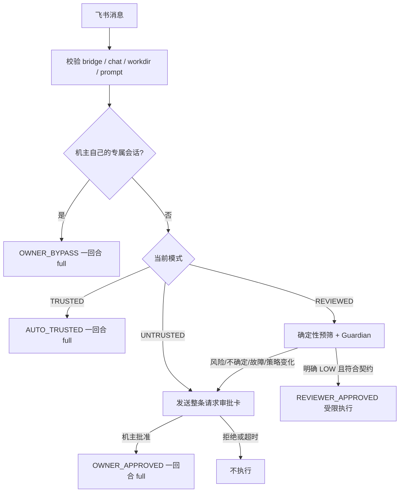

# 飞书群信任模式（Reviewed Trust）

> 状态：**当前实现规范**（2026-08-12，issue #233 修订）。
>
> 产品只有三档：`UNTRUSTED / REVIEWED / TRUSTED`。机主批准单次请求与机主设置 `TRUSTED` 都代表机器所有者
> 已确认，因此对应请求获得一回合 full 权限；`REVIEWED` 的 Guardian 只是分类器，通过后仍走项目内受限执行。
> 已部署的 v3 `FULL_AUTO` 与旧 `TRUSTED` 记录读取后都先按逐请求审批运行，直到机主看过新版风险说明并精确发送
> `/trust confirm`。`/full-auto confirm` 只显示迁移说明，不写授权。
>
> 审批领域与运行期边界以 [`APPROVAL-SYSTEM.md`](./APPROVAL-SYSTEM.md) §19 为准；本文负责飞书群的持久信任、
> Guardian 分流、兼容迁移和验收。

## 1. 产品结论

| 模式 | 谁确认 | 请求进入 Agent 前 | turn 工具权限 |
|---|---|---|---|
| `UNTRUSTED` | 机主逐请求确认 | 先发送整条请求审批卡 | 批准后为一回合 `OWNER_APPROVED` full |
| `REVIEWED` | 机主预设群用途，Guardian 逐请求分类 | 明确低风险且符合用途时自动进入；否则找机主 | 自动进入时为受限 `REVIEWER_APPROVED`；机主批准则为 full |
| `TRUSTED` | 机主对精确群 + 项目长期确认 | 不经 Guardian，不发逐请求卡 | 每条 prompt 获得一回合 `AUTO_TRUSTED` full |

这里的“长期”只描述机主是否还要逐请求确认，不表示 daemon 持有一个永久执行 token。`AUTO_TRUSTED` 仍与精确
prompt ledger 条目绑定，只在 backend 消费该 prompt 后激活，在 turn 终态、取消、发送失败、进程丢失或会话关闭时
撤销。下一条请求必须重新从仍有效的 `(chatId, workdir)` 策略签发新 Grant。

`TRUSTED` 的 full 不是 OS 沙箱：Bash、MCP、网络工具、`Task` 和子代理可能不经逐步卡片运行，也可能访问项目外
数据或向外发送数据。未来未识别的顶层工具 fail closed 回到 ASK。产品文案必须如实说明这两点。

## 2. 为什么保留 REVIEWED

机主对协作群通常有两种不同意图：

- “这个群和项目我完全信任，别再打断我”——使用 `TRUSTED`；
- “日常代码工作可以自动做，风险、越界或不确定内容仍让我确认”——使用 `REVIEWED`。

Guardian 只回答“当前提示词是否明确符合机主保存的用途，并且在受限能力上限下足够低风险”。它不输出 Grant，
不改变群模式，也不能把 `REVIEWED` 提升为 full。真正的授权映射由 daemon 固定完成。

## 3. 群命令

```text
/review
/review 这个群只用于代码评审、问题定位和运行测试
/trust
/trust confirm
/untrust
/trust-status

# 旧版本兼容
/full-auto
/full-auto confirm [旧用途参数]
```

- `/review [用途]`：机主为当前 `(chatId, workdir)` 开启智能审核；空用途使用默认 Trust Contract。
- `/trust`：只展示新版 full 权限和非沙箱边界，不写状态。
- `/trust confirm`：机主知情确认后完全信任当前 `(chatId, workdir)`；之后每条请求直接获得一回合 full。
- `/untrust`：删除信任记录，恢复逐请求审批。即使总开关关闭或群已换绑，也必须允许机主撤销旧记录。
- `/trust-status`：任何群成员可查看当前绑定项目、有效模式、REVIEWED 契约和真实权限边界；不得泄露绝对路径。
- `/full-auto`：只返回迁移说明，不改变状态。
- `/full-auto confirm [用途]`：只显示迁移说明；旧授权包含 Guardian 条件，不能静默改成 unconditional full。

升权命令只能由 bridge 配置中的 machine owner 执行，并受 `FEISHU_NO_APPROVAL` 总开关控制。飞书群主可以拥有
`/bind` 权限，但不能替机器所有者授予信任。`/untrust` 是降权命令，不受总开关或当前绑定状态阻塞。

默认 REVIEWED 契约：

> 仅允许围绕当前绑定项目进行日常开发、阅读、解释、代码评审、问题定位、修改和测试；不得读取或收集凭证，
> 不得访问项目外目录、提升系统权限、建立持久化、规避审批或向外部发送项目数据。

## 4. 请求分流



分流必须使用一个不可变 `TrustSnapshot`。Guardian 是异步操作，返回后在 `FeishuPolicyGate` 内同时复核：

1. 总开关仍开启；
2. mode、workdir、purpose、contractVersion、policyRevision 未变化；
3. routes 表仍把该 chat 绑定到同一 workdir；
4. handoff 在同一个临界区内成功签发 prompt-bound Grant。

`policyRevision` 是随机持久身份，用于阻止“撤销后以完全相同字段重建”的 ABA；时间戳不作为授权身份。

## 5. REVIEWED 的固定上限

Guardian 自动通过时只签发 `REVIEWER_APPROVED`。该 Grant 的免问集合保持关闭：

- `Read / Write / Edit / MultiEdit / NotebookEdit / Glob / Grep / TodoWrite` 等 daemon 已知工具；
- 具名文件工具必须能解析目标；
- 结构化目标必须 canonicalize 后仍在绑定 workdir 内；
- `.git`、`.claude`、`.codex`、`.opencode`、`.envrc`、`.mcp.json`、`AGENTS.md` 等会影响机主后续执行的
  持久化目标继续找机主；
- 只有机主明确 allow-list 的 Bash 可免问；classifier `ASK` 的 Bash、MCP、网络、`Task` 和未知工具继续找机主；
- `ExitPlanMode`、`AskUserQuestion` 等人类决定/答案工具始终找人。

Reviewer 输入中的 `capabilityCeiling` 必须描述这套真实上限，不能暗示它在沙箱里，也不能让模型输出工具白名单或
授权模式。Reviewer 输出只包含 decision、risk、契约匹配、置信度、原因码和解释。

自动执行必须同时满足：

- `decision == ALLOW_GUARDED`；
- `risk == LOW`；
- `matchesContract == true`；
- `confidence` 有限且不低于 `0.90`；
- `reasonCodes` 为空；
- 不处于 shadow-only；
- Guardian 完成后策略复核仍通过。

任何超时、CLI 不可用、非法 JSON、未知枚举、提示词过长、危险预筛命中或策略变化都统一退回机主审批，而不是拒绝
整个飞书功能。

## 6. TRUSTED 与逐请求批准的 full 边界

`OWNER_APPROVED` 和 `AUTO_TRUSTED` 在 `PermissionBridge` 中使用同一 broad 分支。区别只在授权事实来源和审计
basis，能力不应分叉：

- classifier `ASK` 的 Bash 可运行；已知 `DENY` 仍在 Grant 前拒绝，但只是 best-effort 防御；
- MCP、网络、`Task`、子代理和项目内持久化文件不再逐步询问；未来未识别的顶层工具仍询问；
- daemon 能识别的结构化文件目标若 canonical 越出 workdir，仍在 Grant 前拒绝；
- 结构化墙不约束 shell、MCP 或未知 schema 的真实副作用，不能称为项目沙箱；
- `neverRemember` 人类决策工具仍询问，因为答案本身必须来自人；
- 取消先原子撤销 Grant，再通知 backend 中断。

机主 `/untrust` 后，下一条请求恢复逐请求审批。已经线性化并开始的 turn 不被中途改变权限；需要停止时应显式取消
该会话。这样撤权语义确定，也避免执行到一半因策略热切换进入混合状态。

## 7. 持久化与迁移

当前文件仍为 schema v3：

```kotlin
@Serializable
enum class FeishuTrustMode {
    UNTRUSTED,
    REVIEWED,
    TRUSTED,
    FULL_AUTO, // 仅为读取旧 v3 数据保留
}

@Serializable
data class FeishuTrustRecord(
    val workdir: String,
    val mode: FeishuTrustMode,
    val purpose: String? = null,
    val fullAuthorityConfirmed: Boolean = false,
    val contractVersion: Long = 1,
    val policyRevision: String? = null,
    val updatedAtEpochMs: Long = 0,
)
```

兼容规则：

1. legacy `chatId -> workdir` map 保留为待确认 `TRUSTED` 记录，但有效模式是 `UNTRUSTED`。
2. v2 支持 `TRUSTED/REVIEWED`；v2 中出现 `FULL_AUTO` 视为伪造/错标，整表 fail closed。
3. v2/旧 v3 `TRUSTED` 缺少 `fullAuthorityConfirmed=true`，有效模式为 `UNTRUSTED`；机主需 `/trust confirm`。
4. v3 `FULL_AUTO` 归一为待确认 `TRUSTED` 并清空 `purpose`，有效模式为 `UNTRUSTED`；读取不覆盖原文件。
5. 当前 `/trust confirm` 写 `TRUSTED + fullAuthorityConfirmed=true`；`UNTRUSTED` 仍以删除记录表达。
6. 任何真实模式、用途或项目变化都递增 `contractVersion` 并生成新 `policyRevision`。
7. 成功写入使用 owner-only 临时文件 + 原子替换；写失败不得先改变内存事实。
8. 未知版本、损坏 JSON 或错误 version 类型全部 fail closed，且不得在读取失败时覆盖证据。

保留 v3 而不降回 v2，是因为 `policyRevision` 已经落盘并承担审核 TOCTOU/ABA 防护。移除枚举值会使旧文件无法解码，
所以 `FULL_AUTO` 只作为序列化兼容 spelling 存在，不是产品状态。

## 8. 审计与隐私

- `FeishuTrustLog` 记录模式变化和 TRUSTED 执行事实，不持久化 prompt 正文。
- `FeishuReviewLog` 为 REVIEWED 写一条 request review 事件，并在升级人工或 turn handoff 时写相关 outcome。
- chatId、senderOpenId、messageId 持久化前哈希；项目只记 display name，不记绝对路径。
- reason code 只允许 daemon 已知常量，防止模型自由文本把提示词带入日志。
- 日志 owner-only、有限大小并轮转；写日志失败不得改变已经确定的授权结果。
- 群内最终回复继续经过 secret redactor，避免项目内容中的明显凭证被直接转发。

## 9. 代码落点

| 职责 | 代码 |
|---|---|
| 三档持久化与 v3 兼容 | `feishu/FeishuTrust.kt` |
| `/trust`、`/review`、兼容命令与状态文案 | `feishu/FeishuRoutes.kt` |
| 请求分流、策略复核与审计 | `feishu/FeishuEngine.kt` |
| Guardian 契约与固定 REVIEWED ceiling | `feishu/FeishuPromptReviewer.kt` |
| prompt-bound pending/active lease | `conversation/Conversation.kt` |
| 一回合 Grant 枚举 | `bridge/BridgeGrant.kt` |
| 最终工具决策顺序 | `agent/PermissionBridge.kt` |

不新增 protocol frame；bridge 无 wire 路径可自称 TRUSTED、伪造 Guardian pass 或签发 Grant。只有 built-in Feishu
engine 能把经过校验的 chat identity + durable policy 兑换为 in-process handoff。

## 10. 必须覆盖的回归

### 信任与命令

- `/trust` 只读；`/trust confirm` 仅机主可用，且必须有当前绑定项目与总开关；
- `/review [purpose]` 正确持久化、裁剪和幂等；
- `/untrust` 在总开关关闭、换绑和 stale record 情况下仍可撤销；
- 所有 `/full-auto*` 命令只读，不写状态，并引导机主重新阅读 `/trust` 后显式 confirm；
- `/trust-status` 准确披露 full 风险但不泄露绝对路径；
- v3 `FULL_AUTO -> TRUSTED`、v2 FULL_AUTO fail closed、未知版本 fail closed。

### REVIEWED

- LOW + 高置信 + 契约匹配 + 空 reason codes 才自动进入；
- prescreen、timeout、invalid output、reviewer unavailable、shadow mode 全部升级机主；
- 审核期间 `/untrust`、换绑、契约编辑、撤销后同字段重建都会让旧结果失效；
- `REVIEWER_APPROVED` 对 classifier-ASK Bash、MCP、网络、Task、未知工具、持久化目标和无解析目标继续询问；
- Guardian 无法通过输出字段改变 Grant 或 capability ceiling。

### Full turn

- `OWNER_APPROVED` 与 `AUTO_TRUSTED` 对 Bash ASK、MCP、网络、Task 和项目内持久化目标行为一致；未来未识别工具均 ASK；
- known Bash DENY 与可识别结构化越界目标仍先拒绝；人类决策工具仍询问；
- pending Grant 不能授权上一 turn 的迟到工具；精确 replay 前不能消费；
- cancel、watchdog、process loss、send failure、TurnResult 和 close 都撤销 pending/active；
- 原子 claim 在取消竞态中失败后，迟到工具回到审批而不是自动运行；
- guest/share/handoff 无法调用 TRUSTED handoff 入口。

## 11. 真机验收

1. 在真实群绑定测试项目，确认默认请求产生机主审批卡；批准后该 turn 的多个普通工具不再逐步弹卡。
2. 机主 `/review 只做代码评审和测试`：低风险项目内请求自动运行；外发、凭证、项目外、持久化或模糊请求转机主。
3. 机主 `/trust` 只看到风险说明；精确 `/trust confirm` 后，请求不经 Guardian，连续 Bash/MCP/网络/子代理不逐工具弹卡。
4. turn 运行中 `/untrust`：当前 turn 按既有 Grant 完成；下一条请求恢复审批。
5. `/full-auto` 和 `/full-auto confirm 旧用途` 都只显示迁移说明，不改变授权。
6. 将旧 TRUSTED/v3 FULL_AUTO 文件放入状态目录并重启，状态显示待重新确认且实际逐请求审批；`/trust confirm` 后才 full。
7. 模拟 Guardian 不可用/超时，REVIEWED 请求自动回退到机主卡，bridge 本身继续可用。
8. 取消或触发 backend startup watchdog 后，后续迟到工具不能消费已撤销 Grant。

验收时必须分别记录“代码测试通过”和“真实飞书群行为通过”；前者不能代替后者。
