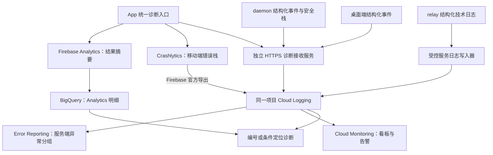

# cc-pocket 通用日志与异常追踪体系

状态：历史供应商评估，已由 [Sentry 实施方案](OBSERVABILITY.md) 替代。日期：2026-09-09。以下保留早期 Firebase/GCP 基线和比选过程，不再作为实施入口；当前方案采用 Firebase Analytics + Sentry，且不建设本文的 Cloud Run 接收器、诊断 grant 和 Cloud Logging 写入器。历史代码核查基线：`8613b3b3`。

本文是项目级主方案，覆盖移动端、桌面端、daemon、relay 及 Agent 适配边界。会话打开失败是首批应用场景之一，细节见 [会话打开场景](SESSION-OPEN-DIAGNOSTICS-EVALUATING.md)。本文替代该场景旧稿中的全局架构、上传策略和实施优先级。

## 1. 目标：从 Analytics 异常找到可解释的证据

当前反馈来自 **Firebase Analytics 中的失败、超时等事件**。需要建立的工作路径是：看到某个异常指标上升 → 找到对应版本和操作 → 查到具体失败样本 → 串起客户端、daemon 和 relay 的相关记录 → 确认修复后的变化。

体系应回答五个问题：

1. 哪类操作、哪个版本异常增多，影响了多少操作和安装实例？
2. 哪一层观察到了失败，哪一层有明确的原因证据？
3. 失败前发生了什么，重试过几次，最后是否恢复？
4. 是单次瞬断、持续故障、业务拒绝，还是代码异常？
5. 修复上线后，故障率下降了，还是仅仅上报减少了？

**Firebase/GCP 基线架构：Firebase Analytics 负责趋势，Crashlytics 负责移动端堆栈，Cloud Logging 统一日志查询，Error Reporting 聚合服务端异常，Cloud Monitoring 提供运行看板与告警。** 使用 Firebase 对应的同一个 Google Cloud 项目把它们连接起来；Analytics/Crashlytics 各自保留原来的用途。

daemon 与 relay 可以独立上报到同一分析体系。它们不需要伪装成 Android App，也不应依赖手机在线后代传全部故障。

### 1.1 供应商比选更新：优先验证 Analytics + Sentry

2026-09-09 补充调研结论：**针对当前“从失败/超时找到各层错误与日志”的目标，优先验证保留 Firebase Analytics、使用托管 Sentry 统一故障分析的组合。** 这是候选优先级调整，尚未完成项目内接入验证，也没有迁移现有采集。

| 方案 | 当前项目适配判断 | 主要投入 |
|---|---|---|
| Firebase Analytics + Sentry | 优先候选。Analytics 保留现有趋势；App、桌面、daemon、relay 使用 Sentry 错误与结构化日志，在同一组织按编号查询 | 统一埋点、SDK 平台适配、脱敏、符号与日志配额验证 |
| Firebase + Google Cloud | 可行基线。适合希望集中使用 Google Cloud 运维与数据分析能力的情况 | 本文后续描述的接收服务、上传 grant、IAM、导出和多入口查询 |
| OpenTelemetry + Grafana Cloud | 适合服务端指标、日志和性能追踪比重较大的阶段 | Collector、移动端适配、采样与看板配置；需要更多运行维护工作 |

依据：Sentry 官方 KMP SDK 支持 Android、iOS 和 Kotlin/JVM；KMP Logs 从 0.24.0 起支持，Java Logs 从 8.12.0 起支持。当前项目是 Kotlin 2.1.21，Sentry 仓库 README 标注同一 Kotlin 版本，可作为兼容性验证起点，但不能代替真实编译/运行。桌面与 daemon 使用 JVM，不能把文档里的 Linux/Windows **Kotlin Native** no-op target 误当成这些 JVM 程序不支持。[KMP 平台支持](https://docs.sentry.io/platforms/kotlin/guides/kotlin-multiplatform/features/)、[KMP Logs](https://docs.sentry.io/platforms/kotlin/guides/kotlin-multiplatform/logs/)、[Java Logs](https://docs.sentry.io/platforms/java/logs/)、[SDK 仓库](https://github.com/getsentry/sentry-kotlin-multiplatform)。

Sentry 支持 SDK 直传，首版有机会省去本方案自建 Cloud Run 接收器和诊断 grant 服务。现代 DSN 是上报配置，不提供查询管理权限；公开 DSN 也不证明上报者身份，仍要做配额、过滤、来源区分和滥用控制。若最终要求强身份验证或实际网络需要代理，再评估受控入口。[DSN 说明](https://sentry.zendesk.com/hc/en-us/articles/26741783759899-My-DSN-key-is-publicly-visible-is-this-a-security-vulnerability)。

拟采用同一 Sentry 组织下的 mobile、desktop、daemon、relay 项目，并保留通用 event_id/trace_id/relay_connection_id。错误、日志与后续性能 span 的关联由平台提供查询入口，业务 WebSocket/E2E 的上下文传播仍由我们实现。KMP 共享层未覆盖的功能要走原生适配；首版不假设 Ktor 或 WebSocket 能自动追踪完整业务链路。[KMP 功能边界](https://docs.sentry.io/platforms/kotlin/guides/kotlin-multiplatform/features/)。

切换候选不改变本文的事件字典、隐私、采样、取消/重试、统计口径及 relay 零知识边界。自动 breadcrumb/网络集成也必须过滤；不启用会话回放、截图、UI 内容采集来替代日志。Crashlytics 可在验证期保留，自动崩溃采集的长期分工需确认，避免重复计数。

冻结供应商前只需一个小范围验证：iOS/Android 原始异常与安全日志、桌面/daemon/relay JVM 上报、跨项目编号查询、断网与退出行为、真实用户网络可达性、Kotlin/Cocoa 版本与符号、每日日志量及配额。SDK 文档支持不等于本项目四端已验证通过。[Sentry 费用与配额](https://sentry.io/pricing/)。

后续第 2–10 节中的 Google 接收/存储/认证部署是 **Firebase/GCP 候选的实现细节**，供应商验证前不应整套开工；通用采集定义与现有失败事件补证据可以先做。Grafana 路线的依据见 [Application Observability](https://grafana.com/docs/grafana-cloud/observe-and-act/monitor-applications/application-observability/)。

## 2. Firebase 能连接哪些能力

| 能力 | 本项目用途 | 明确边界 |
|---|---|---|
| Firebase Analytics | 操作结果、失败/超时趋势、版本分布 | 事件数量不是堆栈，也不自动等于受影响用户数 |
| Firebase Crashlytics | iOS/Android 崩溃与有价值的非致命异常，附带安全日志和诊断编号 | 不作为普通 JVM daemon/relay 的通用日志接收 API；当前桌面 JVM 也没有同等适配 |
| Crashlytics → Cloud Logging 官方导出 | 将移动端已收到的错误与服务端日志放在同一查询环境 | 方向是导出；向 Cloud Logging 写日志不会反向生成 Firebase Crashlytics issue |
| Cloud Logging | 客户端结构化诊断、daemon/relay 日志、跨层检索 | 不会自动抓取远端用户电脑或现有香港服务器的日志，需要显式接入 |
| Error Reporting | daemon/relay 的 JVM 错误栈分组、版本回归 | 使用符合格式的错误记录；不是把所有 warn 都转成异常 |
| Cloud Monitoring | 失败率、延迟、连接健康、日志管道健康与告警 | 只用低基数维度；trace、用户、路径不能作为指标标签 |
| Analytics → BigQuery | 从 Analytics 原始事件参数定位诊断编号，做长期分析 | 标准 Analytics 报表不是逐事件追踪 UI；导出也有时效与完整性限制 |

已核查官方提供 Crashlytics 到 Cloud Logging 的连接入口：Firebase Settings → Integrations → Cloud Logging → Link。导出后的新日志通常在 **Crashlytics 收到事件之后几分钟** 可见；这不等于设备发生异常后几分钟可见。[官方导出说明](https://firebase.google.com/docs/crashlytics/cloud-logging-export)。

服务端可通过 Cloud Logging API 写入结构化日志，符合格式的栈由 Error Reporting 解析。外部服务器无需迁移到 Google Cloud 才能发送日志；凭据只能由受控服务持有。[服务端错误格式](https://docs.cloud.google.com/error-reporting/docs/formatting-error-messages)、[Java 接入](https://cloud.google.com/error-reporting/docs/setup/java)。

本次只核查代码与官方能力，未检查 Firebase 控制台当前是否已启用这些集成、计费、IAM 或 BigQuery 导出。源码指向的项目为 `cc-pocket-1b3ea`，实施前需与实际生产配置核对。

## 3. 当前缺口与首批事件

| 层 | 已有证据 | 缺口 |
|---|---|---|
| App | [Telemetry](../../mobile/composeApp/src/commonMain/kotlin/dev/ccpocket/app/telemetry/Telemetry.kt) 有 `pair_failed`、`conn_failed`、`session_open_timeout`、`prompt_turn_stalled` 等事件 | 多数只带类别，缺操作编号、上下文和终态关联 |
| Android / iOS | 已接 Firebase；`recordError` 接收字符串；Android 新建 RuntimeException，iOS 统一 NSError code 0 | 原始栈与分组信息损失；普通业务失败未系统接入 |
| 桌面 | 有 GA4 Measurement Protocol、本地崩溃日志 | 没有云端结构化栈管道；实际发送受构建配置影响 |
| daemon | [RelayClient](../../daemon/src/main/kotlin/dev/ccpocket/daemon/relay/RelayClient.kt)、业务层使用本地日志；运行时是 slf4j-simple | 远端电脑上的日志不可集中检索；异步异常和请求阶段缺统一关联 |
| relay | [RelayServer](../../relay/src/main/kotlin/dev/ccpocket/relay/RelayServer.kt) 有 auth、superseded、rate_limited、detached；stdout/journal 路径可排查 | 文本日志带账号片段/IP，不能整体上传；缺连接编号、明确关闭原因和跨版本统计 |
| 推送 | relay Firebase 相关代码是 FCM 发送链路 | FCM 接入不代表已接入 Firebase 错误分析 |

首批从现有 Analytics 事件向下补证据，顺序为：

| 现有事件 | 新增诊断 | 必须避免的误读 |
|---|---|---|
| `conn_failed` | connect/handshake/ready/close、连接编号、重试次数、后台状态、最终恢复 | 一次故障多次重试不是多个用户；客户端发现断开不证明 relay 是根因 |
| `pair_failed` | 配对步骤、稳定拒绝码、请求耗时、网络类别 | 无效码、用户取消与内部错误分开；不上传配对码/票据 |
| `session_open_timeout` | 请求、daemon 接收、历史读取/发送、客户端应用阶段 | `SessionLive` 不是历史完成；空/追平历史不是超时 |
| `prompt_turn_stalled` | 发送、daemon 接收、Agent 写入/确认、首个输出、排队状态 | 正常排队与 Agent 无响应分开；不上传 prompt 或 CLI 输出 |

`session_opened` 现有口径是打开意图，保留。不要直接改变旧事件的含义，以免历史趋势看起来突然“改善”。其他操作后续按同一个接口接入：目录/会话列表、历史分页、文件查看/传输、审批、后台任务、推送、服务启动与更新。

## 4. 总体架构



新增一个独立的 Cloud Run 诊断接收服务，用于用户设备上的 daemon、桌面和移动端主动诊断事件。它与 relay 的转发进程分离，故障上报不经过可能正在故障的 WebSocket/E2E 通道。业务消息仍走现有 E2E 通道。

relay 由我们运维，可以通过独立写入器直接调用 Cloud Logging；接入器不必与公共客户端共用鉴权入口。接收服务、写入器和 Firebase 官方导出最终进入同一日志查询范围。

E2E 返回的诊断摘要只用于界面解释和协作定位，不再是 daemon 云端上报的主通道。原生崩溃仍交给 Crashlytics；普通操作失败及时提交结构化事件，不等待下一次 App 启动。

## 5. 通用事件模型与关联规则

新增独立的纯 Kotlin `observability` 模块，包含 schema、错误字典、TraceContext、脱敏、采样、预算及 sink 接口；不依赖 Firebase、Ktor Server 或业务消息内容。App/daemon/relay 通过自己的平台适配使用它。不要把供应商实现放入现有 `protocol` 模块。

跨设备的最小 DiagnosticContext DTO 定义在 protocol，业务适配层负责转换；协议不依赖上报实现，observability 也不反向依赖完整业务协议，避免循环依赖和供应商字段泄漏到 wire。

```kotlin
interface Diagnostics {
    fun begin(operation: OperationCode, context: SafeContext): OperationTrace
    fun event(code: EventCode, context: SafeContext)
    fun exception(code: ErrorCode, error: Throwable, context: SafeContext)
}
// OperationTrace.stage / finish 必须支持并发、取消、重试与一次终态。
// SafeContext 使用允许字段；业务代码不传自由文本日志、任意 Map 或消息对象。
```

### 5.1 三种数据，三种用途

| 数据 | 例子 | 发送策略 |
|---|---|---|
| 结果摘要 | connection_failed、operation_timeout、operation_recovered | 低成本计数/结果，优先保留，用来算趋势 |
| 阶段日志 | request_queued、daemon_received、history_read、agent_ack | 本地滚动缓存；失败时随事件上传，成功按 trace 采样 |
| 错误证据 | 脱敏后的原始栈、失败阶段、有限技术指标 | 非预期错误/持续超时上传；预期拒绝不伪造代码异常 |

`severity` 与“用户操作是否失败”分开：授权拒绝可以导致操作失败，但不是服务端 ERROR；一次可恢复断网也不应等同进程崩溃。

### 5.2 固定结构

| 字段 | 规则 |
|---|---|
| `schema_version`、`event_id` | 版本整数；随机事件编号，同一观察记录重传保持不变 |
| `trace_id`、`span_id`、`parent_span_id` | 一次逻辑操作及其子阶段；没有可靠关联时留空 |
| `attempt`、`event_kind` | 重试次数；operation_result / diagnostic / process_event 等固定值 |
| `component`、`origin_component` | 谁报告、谁产生证据；app / desktop / daemon / relay / collector |
| `operation`、`stage`、`code`、`outcome` | 稳定字典；outcome=success/failure/timeout/cancelled/recovered |
| `analytics_event` | 可选，关联的现有 Analytics 事件名；服务端独立事件留空 |
| `version`、`build`、`peer_version`、`agent`、`transport` | 本组件与已知对端发布版本、构建、Agent 类别、relay/direct；未知值显式 unknown |
| `occurred_at`、`received_at`、`elapsed_ms` | 源端 UTC、接收端 UTC、源端单调耗时；接收端填写 received_at |
| `process_instance_id`、`relay_connection_id` | 每次进程/每条连接独立随机值；不能用 PID 或原始账号充当全局身份 |
| `installation_window_id` | 可选的定期轮换随机安装编号，用于估计影响安装数，不等于用户身份 |
| `coverage`、`correlation_quality` | client_only/endpoints/with_relay；exact/connection/time_window/none |
| `metrics`、`exception`、`breadcrumbs` | 固定结构、有界计数/字节/栈；禁止任意字符串扩展 |
| `sampling_rate`、`suppressed_count`、`dropped_count` | 标记证据缺失与限频，不把缺日志视为无故障 |

业务 trace 用随机 128 位值；retry 增加 attempt，不能自动创建新业务操作。流程只产生一个主终态；终态后的恢复产生 recovery 记录，不覆盖曾发生的超时。不同观察者的 `event_id` 不同，以同一 trace 关联，不把 App、daemon 的两条观察相加成两次用户失败。

栈分组依据稳定 `code + 应用顶层栈帧`，版本用于筛选，不把 trace、时间或安装编号拼进错误标题。事件 ID 只负责事件关联和重传去重，不负责业务鉴权或业务幂等。

### 5.3 在 E2E 边界内关联业务，在 relay 关联连接

- App ↔ daemon：在需要追踪的既有请求/回复中增加可选 `DiagnosticContext`；它随业务消息加密。第一批只改连接后的配对管理/打开/提示等明确路径，不一次改完所有消息。
- relay 看不到业务 trace，也看不到会话、prompt 或历史内容。不能给密文外壳增加逐业务请求 trace，以免改变零知识边界。
- relay 为 socket 创建随机 `relay_connection_id`，在 `Attached` 增加可选字段返回给该连接端；daemon/App 的诊断同时记下这个编号。
- App 和 daemon 各有独立 relay socket。relay 记录连接建立、关闭、替换和路由关系；业务追踪先连到自己的 socket，再查对应 relay 连接事件。只把共同连接和时间视为关联线索，不声称某个密文帧就是某次业务请求。
- `superseded` 记录旧、新连接编号；同一账号的活动路由组使用服务器内存中的随机、定期轮换 `routing_group_id`，不上传 accountId/设备公钥或其固定散列。借此分辨反复互踢与普通重连。
- 鉴权之前失败可能拿不到服务器连接编号；记录连接阶段并标注 `time_window/none`，不靠 IP 猜测精确匹配。直连时 relay 关联为空是正常情况。

新控制帧必须 capability 协商；新增可选字段保留默认值。`ignoreUnknownKeys` 不能让旧版本识别新 Frame 类型。每个连接重置协商状态，并保持现有 guest/bridge/collaborator 出站限制。实施涉及协议或认证边界时安排兼容性和安全专项评审。

无法解码出可靠 trace 的传输错误只能归属连接，不能猜给某个分屏。未知 Frame 类型先按兼容性记录 breadcrumb；已知结构损坏才形成解码异常，原始 JSON 不进报告。

## 6. 各层怎样采集与上报

### 6.1 App / 桌面

现有 Analytics 失败事件迁移到一个共用调用点：一次失败先冻结 `DiagnosticRecord`，再分发到 Analytics 摘要、结构化接收服务及有条件的 Crashlytics。三处来源一致，SDK 故障互不阻塞。

Analytics 保留旧事件名/口径，增加 `diag_schema`、`error_code`、`operation`、`stage` 等低基数字段。确需逐条定位时增加 `diag_event_id` 参数，但不注册为高基数报表维度；在 BigQuery 原始 `event_params` 中读取。没有 BigQuery 时，使用同一时间窗、事件名、版本和错误码到 Logs Explorer 查样本，不能承诺标准 Analytics 报表会自动出现“查看堆栈”按钮。[Analytics 原始事件 schema](https://support.google.com/analytics/answer/7029846?hl=en)、[Firebase 导出入口](https://firebase.google.com/docs/projects/bigquery-export)。

堆栈与日志参考相邻项目的封装方式：

- `iOS NonFatalReporter`（外部项目调研，未随库发布）：错误与业务 issue 分开、单次快照、限频；`LogBreadcrumbBridge`（外部项目调研，未随库发布）：有限近期日志。
- `Android FirebaseCrashUtils`（外部项目调研，未随库发布）：捕获处保留 Throwable，搭配 breadcrumb，过滤协程取消。

Android 保留安全原始栈，危险 message/cause 转为固定代码后复制栈；iOS 原生 `record(error:userInfo:)` 记录现场原生栈和单事件字段，Kotlin 异常原始栈先捕获后随事件附加。若使用 ExceptionModel 显示 Kotlin 自定义栈，要单独验证符号和上下文归属。SDK 上报线程栈、原始 throw 栈、watchdog 栈必须显式区分，不能用新建包装异常掩盖缺失。

每事件关联字段不能只放全局 custom keys，避免分屏与并发事件覆盖。自动 fatal 可能来不及生成 diag_event_id，此时以 Crashlytics 自身 eventId 为主，通过安全 breadcrumbs 关联候选操作，缺少证据就标记 partial。

桌面使用同一事件模型和 HTTPS 接收服务，错误栈在 Cloud Logging/Error Reporting 查询；不继续把自由文本塞进 GA4 `message` 当日志。Harmony 可复用上传协议，但其平台栈采集尚未核查，不纳入首批完成口径。

### 6.2 daemon：独立采集，不依赖手机

优先接入 [DaemonCore](../../daemon/src/main/kotlin/dev/ccpocket/daemon/DaemonCore.kt)、[RelayClient](../../daemon/src/main/kotlin/dev/ccpocket/daemon/relay/RelayClient.kt)、[DeviceSessions](../../daemon/src/main/kotlin/dev/ccpocket/daemon/relay/DeviceSessions.kt)、[RequestRouter](../../daemon/src/main/kotlin/dev/ccpocket/daemon/server/RequestRouter.kt) 及各 AgentBackend 边界。

采集范围：启动/正常退出、未处理异常、relay 建联/心跳/重试、请求接收与执行结果、Agent 进程退出/协议解析、文件读取与序列化错误、后台任务失败。记录退出码、耗时、字节数和结构化代码，不上传 CLI stdout/stderr、提示词或工具结果。

在真实捕获点提取 JVM 栈；异步子协程需要自己的异常边界，先透传 CancellationException。全局 uncaught handler 只补未捕获异常，必须保留原有终止/日志行为。SIGKILL/OOM 不一定能发送；启动时检查自己的轻量退出标记只能得到 `previous_exit_unclean`，不得直接标成 OOM。

写入专门的安全 JSONL 缓存，由有界异步 uploader 经独立 HTTPS 发送。不要把 slf4j-simple 的所有历史自由文本输出导入云端。SDK/网络失败只影响诊断队列，不能卡业务协程、E2E 加密锁或 Agent stdin。

Agent CLI 是第三方进程，首版只观察我们拥有的适配边界；不能声称拿到了 CLI 内部异常栈。

### 6.3 relay：服务器自身的证据

在 [RelayServer](../../relay/src/main/kotlin/dev/ccpocket/relay/RelayServer.kt)、[Broker](../../relay/src/main/kotlin/dev/ccpocket/relay/Broker.kt)、auth/pairing/net 与 push 边界生成独立安全记录。现有本地审计日志可保留，云端采集器只消费新增的诊断流。

| 类别 | 记录内容 |
|---|---|
| 建联/关闭 | role、版本、连接编号、存活时间、关闭码、固定 close_reason、正常/异常、替换关系 |
| 认证/限流 | 固定拒绝码、阶段、计数、匿名路由组；原始 IP/票据不进诊断云日志 |
| 转发 | 每连接/时间窗的帧数、总字节、最大帧、发送失败数、排队耗时；不记录逐帧正文或密文 |
| 存储/配对 | 操作类别、耗时、稳定错误码和安全 JVM 栈；不记录 SQL 参数、密钥或完整设备记录 |
| 推送 | provider、响应类别、耗时、失败码；不记录设备推送 token 或 payload |
| 进程与主机 | 启停、异常退出、资源水位、实例存活、服务健康探测 |

`detached` 不是根因。需要把 close 的主动原因、异常栈类别和是否被替换分别记录。`superseded` 偶发可以正常；在同一匿名路由组反复出现才形成故障信号。

用受控的独立写入器批量写 Cloud Logging（默认单实例随服务部署、独立队列）；仅持有日志写权限，不复用 FCM 私钥权限。优先使用受支持的工作负载身份，若部署环境暂不具备则使用服务器专用、可轮换凭据，绝不发布进 App/daemon。主机/进程整体宕机时，独立健康探测报告“不可达”，不能等待宕机进程自报。

## 7. 诊断接收服务、认证与写入

### 7.1 最小 API

`POST /v1/diagnostics/batch` 接收版本化批次。单条最大 16 KiB，单批最大 128 KiB / 20 条；同时限制压缩前后大小。返回逐事件 accepted/retryable/rejected 状态和接收时间。

接收器依次做身份校验 → 来源约束 → schema/内容/大小校验 → 配额 → Cloud Logging 写入。只有写入被后端确认后才返回 accepted；stdout 打印成功不能当作可靠接收回执。暂时失败按原 event_id 重试，永久 schema 错误不无限重试。Cloud Logging insertId 可辅助去重，但不承诺端到端 exactly-once；关键分析按 event_id 去重。

### 7.2 区分可信服务与用户设备

| 来源 | 认证方案 | 权限 |
|---|---|---|
| 官方移动 App | Firebase App Check；仍按安装/速率/字段预算限制 | 仅发送客户端来源事件，不能声明自己是 relay |
| daemon / 桌面 | 通过已有已认证控制面申请独立、短期诊断上传 grant；用于以后直连接收器 | 仅上传自身来源，不给 Cloud Logging 读写密钥 |
| 受控 relay 写入器 | 专门的服务身份与最小日志写权限 | 写指定项目/日志，不承担客户端凭据签发默认权限 |

App Check 可以在自定义后端验证；它辅助识别 App 请求，不代表用户授权，也不能取代服务端限流。[官方验证方式](https://firebase.google.com/docs/app-check/custom-resource-backend)。

诊断 grant 提案：有效期 30 分钟，允许期间主动续期；绑定随机安装主体、允许 component、audience 和字节预算，由独立签发服务签名。relay 只在已有认证成功且允许遥测时，通过服务间认证申请；向客户端返回 grant，不传签名私钥。客户端不能自填来源或扩大权限；guest/bridge 不启用此签发路径。

已有 grant 有效时，relay 断连不影响向接收器上报；首次注册失败或 grant 过期时仅本地排队，恢复认证后补发。**这仍有覆盖边界，不能宣称从未成功连接的电脑必然可实时上报。** 不以“补监控”为由复用 E2E 私钥、relay bearer 或提供无限匿名写入。签发/轮换/撤销、接收器来源约束须作为同一实现批次的安全评审项。

用户设备数据始终标记为 client-reported，即使拿到 grant 也不能视作服务端事实；记录的来源身份由接收器确认，不能接受客户端宣称的 relay 身份。网络层 IP/凭证不进入业务诊断 payload，平台访问日志另设受限权限与保留策略。

### 7.3 Cloud Logging / Error Reporting 映射

- 固定 log id：`ccpocket-diagnostics`；结构化数据放 `jsonPayload.diag`，顶层 severity、timestamp、trace/spanId 由接收器规范化。
- App/daemon 远端事件采用 `global` resource 并带项目标签；不能因 uploader 跑在 Cloud Run 就把它们冒充为接收服务内部错误。relay 同样按真实部署环境选择 resource。
- daemon/relay 的非预期异常可增加格式正确的 `serviceContext.service=ccpocket-daemon/ccpocket-relay`、版本以及安全 JVM 栈，供 Error Reporting 分组。超时若无原始异常，只使用固定错误代码/位置，不伪造“阻塞线程栈”。
- 接收服务自己的错误使用独立 log id 和 serviceContext，避免与被收集的错误混淆。客户端症状日志不自动再生成一条“daemon 崩溃”。
- 原生 Crashlytics 导出使用其官方 schema；发布验收确认事件级 `diag_event_id/trace_id` 实际落在哪个字段，再固定查询模板。没有关联字段的旧报告标为 unlinked，不拿全局最后一次 trace 做精确关联。
- 写 log 的 trace 字段提供日志关联，**不会自动生成 Cloud Trace spans**；首版不宣称已有完整分布式性能追踪图。[结构化日志字段](https://docs.cloud.google.com/logging/docs/structured-logging)、[Crashlytics 导出 schema](https://firebase.google.com/docs/crashlytics/cloud-logging-schema)。

## 8. 数量、隐私与成本控制

### 8.1 统计不能被重试和限频误导

- 客户端主 `operation_result` 是用户操作结果的统计来源。daemon/relay 错误是原因证据和服务健康统计，不叠加进用户操作分母。
- 重试和恢复分别计数。失败率按同一版本、同一口径、同一有覆盖的数据集计算；不能拿采样错误数除以全部 Analytics 操作数。
- Crashlytics、即时诊断、Firebase 导出可能描述同一事件。以 event_id / origin 标识去重；监控里的日志条数只表示观测记录数。
- `installation_window_id` 估算安装数，不等于账号数或人数；daemon 无法仅凭自己的记录推算真实用户数。
- 应用缺失终态、数据迟到、SDK 被禁用、队列被抑制都单列。看板必须展示版本覆盖率与上报管道健康。

### 8.2 建议初始预算

| 对象 | 上限/策略 |
|---|---|
| 内存 breadcrumb | 每进程 128 KiB、每 trace 32 条、每条 256 字节，所有上限同时生效 |
| 客户端/daemon 本地安全队列 | 2 MiB 或 500 条、24 小时；满时先丢成功明细，再丢最旧诊断，累计 dropped_count |
| relay 写入器队列 | 16 MiB 或 10,000 条、24 小时；批量发送，满时汇总计数、不阻塞转发 |
| 成功明细 | trace 级 5% 采样；业务结果摘要另记，不因明细采样失去分母 |
| 失败明细 | 预算内保留；相同指纹每 5 分钟最多 3 条，重复次数聚合；首次新指纹优先 |
| Crashlytics non-fatal | 单事件最多 24 个自定义字段、每值 900 字节；每进程每小时最多 6 条，避免挤掉其他错误 |
| 高频 relay 事件 | 每连接/60 秒汇总；不逐 token、逐帧、逐 ping 上报 |
| 云端日志 | 独立诊断 bucket 初始 30 天；指标和保留期另行配置，避免改动整个项目默认存储策略 |

上限是待灰度验证的初始值。错误明细限频不丢失本地总计数，按固定窗口上报 occurrence/suppressed 聚合；超出全局预算后需显示 coverage 缺失。Crashlytics 自身也有滚动容量和延迟，不能拿它的 issue 事件数当全量失败数。

费用预估以 `各来源日事件量 × 平均字节 × 保留期 + 查询/指标 + 接收器运行` 估算，先用实际样例测量，不按免费额度承诺长期零成本。部署 Cloud Run、增加导出/告警前核对计费方案、地区、配额和预算；预算告警不是硬性支出上限，因此还要配置实例上限、接收配额和降采样开关。

### 8.3 数据边界与遥测开关

禁止主动上报会话正文、标题、项目/文件绝对路径、prompt、工具输入/输出、图片、CLI 原始输出、HTTP body、账号 ID、公钥/私钥、令牌、原始 IP、密文内容。异常 message、cause 和日志插值同样受约束；仅靠正则替换 token 不足以证明脱敏。代码栈只保留安全的应用符号、源码文件名和行号。

daemon 是用户电脑，必须有独立可见、可持久化的遥测配置；原本没有云上传的 daemon 升级后不静默新增上传。建议默认本地记录，用户在设置或 CLI 明确开启 daemon 诊断共享后才申请 grant；移动 App 不能凭自己的开关自动替所有电脑授权。App 沿用已有偏好并修复 iOS 原生 SDK 透传。

关闭采集立即停止自定义记录/上传并清队列，不补传关闭期间的数据。SDK 原生自动崩溃采集、未发送报告和设置生效时机按平台 API 验证，不承诺能撤回已经发送的数据。relay 的服务运行日志由运维策略控制，与用户内容遥测分开。

诊断权限分为维护者只读、接收器只写、配置管理员；不向终端发云端查询权限。复制诊断信息只输出已脱敏编号与阶段，不直接导出原始日志。完整日志附件另行设计，本期不接入。

## 9. 查询、看板与故障处理闭环

### 9.1 从 Analytics 到证据

1. 记录事件名、时间范围/时区、App 版本、失败码及数量口径。先判断是否重试放大，是否只发生在某一版本。
2. 在 Logs Explorer 按 `analytics_event + version + code + received_at` 找样本；有 BigQuery 明细时读取 `diag_event_id` 精确定位。历史事件没有该字段不能补造关联。
3. 沿 trace 查 App 与 daemon，再沿 relay_connection_id 查服务器。区分明确异常栈、阶段未完成和仅时间相邻的连接故障。
4. 形成问题记录：稳定错误码、影响范围、可复现条件、证据编号、版本、归因置信度。修复关联到构建号；上线后在相同覆盖口径下比较。

建议把查询模板和看板配置放进仓库，由维护者手动读取或后续工具使用；当前方案不自动向任何人发送消息。

以下是**接入完成后**的 Logs Explorer 模板，不代表已查到线上记录：

```text
log_id("ccpocket-diagnostics")
jsonPayload.diag.event_id="<DIAG_EVENT_ID>"
```

```text
log_id("ccpocket-diagnostics")
jsonPayload.diag.analytics_event="conn_failed"
jsonPayload.diag.version="<APP_VERSION>"
severity>=WARNING
```

```text
log_id("ccpocket-diagnostics")
jsonPayload.diag.trace_id="<TRACE_ID>"
```

```text
log_id("ccpocket-diagnostics")
jsonPayload.diag.relay_connection_id="<CONNECTION_ID>"
```

Analytics 明细模板（需已启用导出并替换真实 dataset 与日期）：

```sql
SELECT event_timestamp, event_name,
  (SELECT value.string_value FROM UNNEST(event_params)
   WHERE key = 'diag_event_id') AS diagnostic_event_id
FROM `<PROJECT>.<ANALYTICS_DATASET>.events_*`
WHERE _TABLE_SUFFIX BETWEEN '<YYYYMMDD_START>' AND '<YYYYMMDD_END>'
  AND event_name IN ('conn_failed', 'pair_failed', 'session_open_timeout', 'prompt_turn_stalled');
```

### 9.2 第一版看板与告警

| 看板 | 指标与下钻 |
|---|---|
| 操作健康 | 连接/配对/打开/提示的主操作结果、超时、恢复率，按 App 与 daemon 版本分层 |
| daemon | Agent 退出/解析错误、请求耗时、relay 心跳失败、非正常退出，链接安全栈 |
| relay | 在线连接、替换/限流/关闭原因、转发失败、帧大小、推送失败、实例健康 |
| 诊断管道 | 接收延迟、schema 拒绝、grant 失败、队列丢弃、各平台覆盖、每日字节量 |

先收集基线，再启用告警。建议初始规则：某操作 5 分钟失败率超过 5% 且有至少 100 个已记录操作；relay 连续健康检查失败；同路由组连接持续替换；新版本出现新的异常指纹。日志型指标用于趋势，重试去重后的业务比率由规范化结果计算，不能简单把所有 ERROR 行相加。

告警必须带来源、时间窗、版本、错误码、样例 event_id、查询链接及 coverage。不要每一条 non-fatal 都告警；发布短期波动与持久故障分开。原始用户数不足时报告安装数/操作数，不编造“影响 N 人”。

### 9.3 时效目标

| 通道 | 建议验收目标/边界 |
|---|---|
| HTTPS 主动诊断 | 遥测开启、有效凭据、前台/daemon 在线且可达接收器时，P95 发生到可查询小于 60 秒；接收端确认与可查询分别测量 |
| relay 写入器 | 正常联网时同样验证秒到分钟级；转发业务不等待写日志 |
| Crashlytics → Logging | 以 Firebase 收到后几分钟为产品行为；设备未上传的报告不在此保证内 |
| Analytics / BigQuery | 用于趋势与明细关联，不当作 5 分钟故障发现的唯一来源 |

“最近 5 分钟收到的记录”与“最近 5 分钟发生的故障”分开展示，单列迟到数据与时钟不确定性。离线、挂起、SIGKILL、关闭遥测、缺凭据都可能缺报，零记录不是零故障。

## 10. 实施批次与验收

| 批次 | 交付物 | 完成依据 |
|---|---|---|
| M0：现有数据接通 | 核对生产 Firebase/GCP；Crashlytics→Logging；Analytics 失败事件与版本字典；基础查询模板；小流量 relay 结构化日志验证 | 真实移动错误可导出，真实 relay 测试事件可查询；明确现有数据的关联缺口 |
| M1：通用采集与独立上传 | observability 模块、接收服务与来源鉴权、有界队列；App 四类失败接入；daemon 配置/自主上传；relay 写入器 | App、daemon、relay 三类样例在同一查询范围，手机关闭时 daemon 仍可上报；关闭遥测/离线不影响业务 |
| M2：跨层追踪与分析闭环 | 可选 trace context、relay 连接编号、重试/终态规则；会话打开与 prompt 场景；结果口径、看板与修复追踪 | 一次注入故障可关联客户端症状、daemon 证据、relay 连接；旧版本和直连正确降级 |
| M3：覆盖与运营完善 | 文件/分页/审批/推送等接入；告警、BigQuery 精确下钻、成本与保留策略 | 新模块按同一契约接入，无需另建上报工具；能区分修复和采集减少 |

M0 可以先利用现有 Firebase 数据发现问题，但无法补回未采集的旧堆栈。M1 已包括 daemon 与 relay 独立上传，不再把它们列为远期可选项。

实施位置：通用定义在新增 `observability`；平台 sink 在现有 telemetry 相邻目录；daemon 在进程、transport、router、backend 边界；relay 在连接/鉴权/转发/推送边界；接收器与基础设施配置独立目录；查询、看板、事件字典放 `docs/observability`。名称与目录为实施提案，当前没有创建这些运行模块。

必要验收包括：

- **证据**：Android/iOS 各一条有意义的原始异常栈；daemon/relay 各一条正确分组的 JVM 错误；超时明确标注无原始阻塞栈。
- **关联**：同一逻辑操作多次重试、多分屏、换机器、多设备；终态与诊断不串，旧连接不污染新连接，业务 trace 不暴露给 relay。
- **故障模式**：手机关闭、relay 不可用、接收器不可用、凭据过期、队列满、重复投递、进程退出；不能制造新的 daemon 或使业务等待日志发送。
- **安全**：包含路径、prompt、token、HTTP body 的测试哨兵不得出现在 SDK 参数、上传 payload、服务日志和复制内容；禁止用户设备冒充 relay；拒绝超大批次、未知来源与越权 grant。
- **兼容**：旧 App/新 daemon、旧 daemon/新 App、旧 relay/新端点、直连；诊断能力不改变认证、消息顺序、权限或业务重试语义。
- **数据**：手工注入已知数量的操作与重试，核对结果数、安装数、去重和 suppressed；导出字段位置、符号文件、时效和日志查询均以实际生产配置的测试构建验证。
- **运维**：采样/上传有独立关闭开关，关闭后正常业务继续；验证成本预算、保留策略、只读/只写权限和已配置告警的恢复行为。

本次交付仅设计与文档整理；未启用任何云集成、未上传用户日志、未修改业务代码或部署服务。
