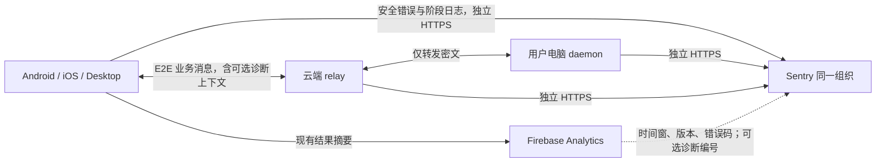

# cc-pocket 日志与故障追踪实施方案

状态：主体实现与代表性抽样已有证据，本轮进入提交收尾。更新：2026-09-11。原方案核查基线：`c6bf15ab`；开发基线：`6ca60173`。

本页保留总体设计。2026 年 9 月任务的提交范围与暂停决定见[历史收尾清单](../archive/observability-2026-09/CLOSEOUT.md)，仅适用于当时的任务；维护入口与 CI 配置见[观测文档](../observability/README.md)。未覆盖事项不因归档改记通过。

Pairlet 五组件 Sentry 接入、跨端诊断、核心结果事件及查询已有实现与代表性证据；最新事实见 [验收记录](../archive/observability-2026-09/ACCEPTANCE.md)。[历史供应商评估](OBSERVABILITY-EVALUATING.md) 和 [会话打开场景](SESSION-OPEN-DIAGNOSTICS-EVALUATING.md) 保留评估与业务背景，后续按真实问题补验证。

## 1. 方案与完成目标

**Firebase Analytics 看整体使用与失败趋势；Sentry 统一分析移动端、桌面端、daemon、relay 的错误、关键日志与执行耗时。各组件通过独立 HTTPS 直传 Sentry。**

首版完成后，维护者应能从一条 Analytics 异常线索或用户提供的诊断编号，找到失败阶段、版本、安全堆栈与相关连接证据。连接、配对、会话打开、提示发送先接入端内证据；项目扫描、协议丢弃、Agent 执行、审批、文件、存储、后台任务、协作、Git/升级和推送的关键失败路径也纳入本期，按 [核心出错路径与开发任务](../observability/ERROR-PATHS.md) 分批实施。

本期交付：统一诊断契约、各平台 Sentry 适配、EP-01–30 核心路径的分支观测、daemon 与 relay 独立上报、跨端关联、免费额度控制、诊断开关、查询手册、故障注入与正常对照验收。30 类路径由 OBS-01–10 任务承接，编号完整不代表已实现覆盖。

Firebase Analytics 继续保留原有事件名和统计口径。按用户最新确认，移动端自动崩溃继续由 Firebase Crashlytics 负责，Sentry 负责显式安全错误与日志；本期不迁移自动崩溃采集器，见第 4 节。

本期不建设 Cloud Run 接收器、诊断 grant 服务、Cloud Logging 导出或 OpenTelemetry Collector；不把 BigQuery、付费 API、Seer AI 调试、Replay、持续 Profiling 和完整日志附件设为依赖。用户现在看到的历史失败事件不能补回当时未采集的堆栈。

## 2. 部署形态与免费版约束



按用户最新命名决定使用 **Pairlet** 组织，五个项目为 `pairlet-ios`、`pairlet-android`、`pairlet-desktop`、`pairlet-daemon`、`pairlet-relay`。组织位于美国区；实际后台是 https://pairlet.sentry.io/ 。仓库和应用本体的改名另行实施，当前命令/配置键仍按已有代码使用。移动端拆项目便于独立管理原生符号与错误；相同字段支持跨项目查询。免费账户的跨项目 UI 能力先在 P0 验证，缺少统一视图时按相同编号逐项目查询，基础排障不依赖付费集成。

每个项目使用自己的 DSN，环境使用 `production` / `staging` / `development`；本地开发默认不上报，验证构建显式打开。环境和项目都不带来额外免费额度。

截至 2026-09-09，Developer 提供 1 位后台成员、无限项目，每月 5,000 条错误事件、5 GB Logs、5M spans。**同一组织共用额度，不是每个项目各有一份。** 免费版不提供按量付费预算，额度耗尽将缺失相应新数据。建组织后核对实际订阅，验收须在 Developer 能力下完成，不能依赖新账户临时付费试用特性。[官方价格](https://sentry.io/pricing/)、[配额](https://docs.sentry.io/pricing/quotas/)、[按量付费边界](https://www.sentry.help/en/articles/13964878-how-does-pay-as-you-go-work)。

DSN 是写入配置，不是读取后台的凭据，也不能证明上报者身份。App/desktop/daemon 的记录标为客户端报告，不能作为可信服务端事实。relay 使用独立项目与服务配置；管理及符号上传 token 仅保留在维护者环境/CI，不进入安装包。客户端不能选择项目或覆盖 component。来源隔离减轻误混淆，不承诺抵抗泄露 DSN 后的伪造事件。[DSN 边界](https://sentry.zendesk.com/hc/en-us/articles/26741783759899-My-DSN-key-is-publicly-visible-is-this-a-security-vulnerability)。

## 3. 代码结构与公共契约

新增小型 KMP `:observability` 模块，只包含允许字段、事件字典、操作状态机、限频、脱敏和 sink 接口。模块不依赖 Firebase、Sentry、Ktor 或业务正文。Java/Android 共用适配集中在 `:observability-sentry`，iOS 适配在 Swift，初始化仍由各应用控制，避免供应商 SDK 进入 `:protocol`。

| 位置 | 实施内容 |
|---|---|
| `observability/`（新增） | DiagnosticRecord、SafeContext、OperationTrace、PrivacyFilter、ReportBudget、DiagnosticSink；内存有界缓冲 |
| `mobile/composeApp/.../telemetry/` | 保留 Analytics 接口，增加 Diagnostics 入口和 KMP/平台 Sentry sink；迁移字符串 recordError 调用 |
| `iosApp/iosApp/iOSApp.swift`、Xcode 配置 | 原生初始化与开关桥接、SDK 唯一初始化、Cocoa 依赖和符号上传 |
| `daemon/.../DaemonCore.kt`、`server/RequestRouter.kt`、`relay/`、AgentBackend 边界 | 独立 JVM sink、诊断配置、进程/连接/请求/Agent 错误 |
| `relay/.../RelayServer.kt`、`Broker.kt`、auth/pairing/net/push 边界 | 独立 JVM sink、结构化关闭原因、限流/替换聚合、发送失败 |
| `protocol/.../Messages.kt` | P2 才增加可选 DiagnosticContext、连接编号与必要 capability；不引用 SDK 类型 |
| `docs/observability/` | 已有核心出错路径和开发任务；开发时补事件字典、排障查询、配置说明、符号与逐分支验收记录 |

接口形状如下，名称可随实现微调，约束保持一致：

```kotlin
interface Diagnostics {
    fun begin(operation: OperationCode, context: SafeContext): OperationTrace
    fun event(code: EventCode, context: SafeContext)
    fun exception(code: ErrorCode, error: Throwable, context: SafeContext)
}
// trace.stage(...), trace.finish(outcome, code)；并发安全，一次逻辑操作只有一个主终态。
// SafeContext 只接受类型化允许字段；不接受自由文本、任意 Map 或完整业务对象。
```

一份冻结后的诊断记录分别送到 Analytics 摘要适配器、Sentry 错误/日志适配器。业务操作不等待任何 SDK 网络结果。Analytics 不导入错误栈；也不能由每个阶段日志反向重复生成业务失败事件。

方案基线发现的接缝（首批已修复）：Android `recordError(message)` 新建 RuntimeException，iOS 桥接统一 NSError code 0，均会丢失捕获处的错误信息；iOS `Telemetry.setEnabled` 原来只改 Kotlin sink 的布尔值；现已同步原生 SDK；desktop 的 GA4 是否实际发送取决于构建配置。以上是源码证据，不代表当前所有已发布安装包的状态。

参考有限 breadcrumb、单次快照、限频和 CancellationException 过滤模式；保留原始 Throwable 的栈，不复制其他项目的账号、网络或业务内容字段。原调研引用的外部项目实现未随本仓库发布，不作为新 clone 的依赖。

## 4. 平台接入与崩溃采集职责

首批实现使用 Java SDK 8.41.0（Android/desktop/daemon/relay）和 Cocoa SDK 8.58.2（iOS），两者对应所核查的 KMP SDK 0.27.0 版本组合。公共诊断契约仍是 KMP；因为包装层的公开异常模型不能填入经过过滤的原始栈，平台出口直接构造 Java/Cocoa 的安全事件，未引入 KMP SDK 包装依赖。项目 Kotlin 2.1.21、JVM 17、Ktor 3.1.3 的本地编译与 SDK 最终 envelope 测试已通过，云端、Android 真机和原生符号仍需 P0/P3 验证。版本升级必须重复出口与兼容验证。[KMP 源码版本](https://github.com/getsentry/sentry-kotlin-multiplatform/tree/0.27.0)、[Java Logs](https://docs.sentry.io/platforms/java/logs/)。

每进程只初始化一个 Sentry 诊断 SDK 实例。Java 使用独立 SentryClient，清空自动 processors/integrations，业务不使用全局 scope；iOS 沿用 Swift Package Manager，固定 Cocoa 8.58.2，用受控 Swift 桥接连接 KMP 契约。Cocoa 最终事件按原始安全记录重新构造，Logs 采用字段白名单过滤；测试会主动污染 SDK scope 并检查真正发送的 envelope。

移动端维持以下职责，不将供应商迁移作为完成条件：

1. Crashlytics 继续负责自动 fatal；Sentry 只开启明确调用的 handled errors、日志及受控测试链路。按实际平台关闭 Sentry 自动 fatal、ANR/hang 等重复采集源，并验证最终 envelope。Firebase Analytics/FCM 继续运行。
2. 本批不抽验未改动的 Crashlytics，不制造原生崩溃；未来改动该链路时再针对性验证回执、符号与开关。Sentry 的 iOS 安全错误栈可定位性独立验收。Sentry handled 事件或 dSYM 上传成功不能替代 Crashlytics 崩溃回执，也不将两处计数相加。

自动初始化的 Android provider、Manifest 和 iOS 启动配置也要纳入控制，开关必须早于 SDK 自动采集生效；检查关闭/重开和待发报告处理，避免重复上传或违背采集偏好。真实崩溃的隐私与符号检查针对实际使用的 Crashlytics 通道执行，不能由 Sentry 出口测试代替。Sentry Cocoa 自动 fatal 的历史限制保存在 RELEASE.md，不再列作本期迁移阻塞。

Android 发布构建验证混淆 mapping；iOS 验证 App 与 Kotlin framework 的 dSYM/UUID 和实际栈；JVM 保留行号与版本标识。release 建议 `cc-pocket-<component>@<version>+<build>`，peer_version 单独记录。只有拿到符号化报告才算通过，不能用“上传命令成功”替代。

## 5. 数据分类、字段与归因

### 5.1 什么进入错误列表

| 类型 | Analytics | Sentry |
|---|---|---|
| 用户取消、切后台、正常关闭、预期无效配对码 | 保留对应业务结果 | 安全 breadcrumb/限频日志；不产生错误 issue |
| 短暂断网、自动重试后恢复 | 原有连接事件；主操作结果独立 | 聚合日志、重试次数、恢复时间；不每次重连报 exception |
| 持续超时、业务无法完成且需要排查 | failure/timeout 摘要 | 固定 code 的 handled issue，加阶段与安全 breadcrumb；不伪造原始异常栈 |
| 捕获到的非预期异常 | 对应结果摘要 | 捕获处原始栈经脱敏，保留异常类型及安全栈帧 |
| 未捕获崩溃 | 不依赖退出前成功发 Analytics | 单一自动崩溃采集器；SIGKILL、主机宕机等仍可能无法报告 |

Sentry Logs 中的 `error` 级别不自动等价于错误 issue；仅在明确捕获点调用错误接口。栈优先使用 SDK 默认分组，必要时加入稳定 error_code；无真实异常的超时按 `component + operation + stage + code` 分组。版本、trace、时间、安装编号不进入 fingerprint。

### 5.2 字段字典

| 字段组 | 内容及规则 |
|---|---|
| 记录身份 | `schema_version=1`、随机 `diag_event_id`；同一记录重试保持编号。SDK 返回的 `sentry_event_id` 单独保存，不代表服务端已接收 |
| 操作关联 | `diag_trace_id`：一次逻辑操作的随机 128 位值；`attempt`：现有重试次数；`parent_diag_event_id` 可选 |
| 业务分类 | `error_path`、`operation`、`stage`、`code`、`outcome`、可选 `analytics_event`；固定词表。`result_quality=complete/partial/fallback/unknown` 区分完整、部分、后备结果；不将降级一律当作成功或崩溃 |
| 来源 | `component`、`origin_component`、`release`、`environment`、`peer_version`、`agent`、`transport` |
| 连接 | `process_instance_id`、可选 `relay_connection_id`；每进程/连接随机，不用 PID、账号或公钥代替 |
| 证据 | 单调 `elapsed_ms`；发生 UTC `occurred_at`；有限字节数/行数/重试次数；脱敏 exception/breadcrumbs |
| 覆盖 | `coverage=client_only/endpoints/with_relay`、`correlation_quality=exact/connection/time_window/none` |
| 采集健康 | `sampling_rate`、`suppressed_count`、`dropped_count`、`late_delivery`；本地持久计数有界 |

可选 `installation_window_id` 为按 30 天轮换的随机值，只估计参与诊断的安装数，不等于人数；开关关闭时清除。不采用永久设备指纹，也不跨组件拼接用户身份。

Sentry error tags 放分类字段及必需的 `diag_event_id` / `diag_trace_id` / `relay_connection_id` 检索键，其他数值与细节放事件 context；Logs 使用同名 attributes。这些高基数编号只用于检索，不做指标分组。每条事件显式携带上下文，不通过全局“当前会话/当前 trace”可变标签传递，避免分屏和协程互相覆盖。

`finish` 只记录一个主结果。取消不是失败；已有业务重试复用 diag_trace_id、递增 attempt；超时后迟到成功另报 recovered，不覆盖旧超时。App、daemon 分别报告的两条证据不等于两次用户失败。不能拿采样的 Sentry 错误数除以全部 Analytics 操作数当失败率。

## 6. 跨端关联与零知识边界

App → daemon 的 DiagnosticContext 随原有业务消息 E2E 加密，包含有界 `traceId`、`attempt`，后续可选 span 上下文。daemon 回复仅回给该请求者，保留原有身份/权限校验。trace 不参与授权、路由、新建会话或业务幂等。无效的可选诊断字段降级丢弃，不使原本合法的业务请求失败。

首版 `diag_trace_id` 是稳定排障编号，**不是仅靠设置 tag 就生成的 Sentry 分布式 trace**。P2 在 SDK 能力验证后为明确操作创建手工 spans，通过受控 E2E DTO 传播对应原生 trace 上下文；不透传任意 HTTP baggage。缺少原生 trace 的平台仍能按诊断编号查日志。

relay 无法读取业务 trace。它为每条 socket 分配随机 `relay_connection_id`，在既有 `Attached` 增加可选字段；客户端将自己 socket 的编号加入诊断。relay 记录两侧连接关系和替换原因，在进程内使用随机、定期轮换的 `routing_group_id`，不上传 accountId、IP 或其固定散列。

App 和 daemon 各自对应一条 socket。同一连接和相邻时间只能证明连接层关联，不能证明某条密文对应某次业务请求。鉴权前失败可能没有服务器编号，标 `time_window/none`；直连的 relay 编号为空是正常情况。

新增可选字段必须有默认值；新消息类型必须在同一连接完成 capability 协商后发送。`ignoreUnknownKeys` 不能使旧版本认识新 Frame 子类型。重连/切电脑清掉上次协商；guest、bridge、共享会话的限制默认保留，首版只为已有完整权限的自有配对客户端发送新增业务诊断帧。实现协议或认证相关变更时执行 wire 兼容性与安全专项评审。

不在密文外壳增加逐业务 trace，不上传密文，不让日志上报占用业务 outbox、加密锁或 Agent stdin。第三方 Agent CLI 只记录我们拥有的调用边界，不能声称获得 CLI 内部堆栈。

## 7. 业务覆盖与核心出错路径

下表保留最先接入的 Analytics/运行入口；完整范围以 [EP-01–30 目录](../observability/ERROR-PATHS.md) 和对应开发任务为准。每条路径明确源码入口、故障分支、最小诊断字段、错误分类与正常对照，避免只接现有失败事件而漏掉无异常、无响应和静默回退。

| 范围 | 现有入口/事件 | 补充证据与完成标准 |
|---|---|---|
| 连接 | `conn_failed`、RelayClient、RelayServer/Broker | 建联/握手/ready/关闭、固定原因、替换关系、重试和恢复；区分本地观察与服务端原因 |
| 配对 | `pair_failed`、配对请求边界 | 阶段、稳定拒绝码、耗时；正常错误码/取消不报内部异常 |
| 打开会话 | `session_open_timeout`、RequestRouter、SessionRegistry、Conversation、SplitPanes | 请求/接收/live/历史读取/编码发送/应用完成；实际字节、行数和耗时；live 不等于首屏完成 |
| 发送提示 | `prompt_turn_stalled`、SendPrompt/PromptAck、AgentBackend | 发出/daemon 接收/Agent stdin 写入/首个输出/排队；正常排队不是 Agent 卡死，不上报 prompt/输出 |
| daemon 基础运行 | DaemonCore、异步子协程、进程退出边界 | 启动、受控退出、未捕获异常、Agent 退出码与协议错误；手机关闭仍能发送 |
| relay 基础运行 | auth/pairing/net/push、转发边界 | 拒绝/限流/关闭分类、异常 JVM 栈、帧大小聚合、发送失败、推送失败码；不导入现有整份 stdout/journal |

会话打开新增 `session_open_result` 完整口径，保留现有 `session_opened` 的打开意图和 `session_open_timeout` 的旧语义。新双方可以验证历史完成；新客户端连接旧 daemon 时标 client_only，不因合法空历史误报失败。具体阶段、15 秒初始历史诊断阈值、冷/热/观察路径及混合版本条件见场景附录。

所有捕获边界先透传 CancellationException。超时报告描述最后成功阶段，不把上报线程栈称为阻塞线程栈。daemon 上次未正常退出只记 `previous_exit_unclean`，没有证据不能归因为 OOM。

本期补充重点包括：项目/会话列表部分扫描失败；解码丢弃与 outbox 写入失败；历史读取/分页/编码/应用和展示降级；Agent 启动、管道、协议与 turn 终态；审批裁决送达和应用；上传/下载缺片和落盘；存储回退；调度派发与实际执行结果；协作 ACK/撤销；升级重启确认；推送接收边界及诊断自身缺报。正常空结果、取消、排队、旧回复和安全拒绝均有对照，不机械地把所有 catch 转为错误上报。

## 8. 预算、缓冲和失联行为

### 8.1 免费额度内的初始目标

| 类别 | 初始策略 | 组织月度工作目标，含所有项目和环境 |
|---|---|---|
| 错误 | 真正异常与持续故障优先；handled error 按指纹限频；正常拒绝/重试用日志 | ≤3,000 条，给突发崩溃与新指纹留余量 |
| Logs | 固定模板和有限 attributes；成功明细按整个操作 1% 采样；失败保留有界阶段摘要 | ≤2 GB，约 50 MB/日作为观察线 |
| Tracing | P0/P1 关闭；P2 仅四类操作手工 spans，初始 1%，单次最多 16 个 span | ≤500,000 spans |
| Replay / Profiling / 附件 | 关闭 | 0 |

错误额度更容易被重复上报耗尽。客户端/desktop/daemon 的 handled error 初始同指纹每 6 小时最多 2 条、每安装每日总计 10 条；relay handled error 每进程每日 20 条。自动 fatal 优先保留并另测 SDK 原生通道，不能假设上述 handled 限频覆盖所有崩溃。重复次数通过有界汇总日志记录，后台 issue 数不当作真实发生总数。

这些是防止单实例刷量的初始护栏，不构成整个安装群的全局额度保证。P0/P1 通过真实 envelope 大小和使用量校正。每日观察使用量，按 `已用量 / 本账期已过天数 × 本账期总天数` 预估；达到月度目标先降低成功日志/spans，再收紧重复故障。全局控制以后台实际支持的功能为准，不假设免费版有高级项目配额或即时远程开关。

首版控制入口为 App 构建/本地设置、daemon 持久配置、relay 环境配置；服务端可以及时调整，已发出的客户端需要配置/版本更新。SDK 遵守 Sentry 限流与配额响应，不无限重试。超额导致的缺失必须记录为 coverage 限制，不能将“没有日志”解释成“没有故障”。

举例说明量级：全组织每天保留 80 条错误约为每 30 天 2,400 条；每天 30 MB 日志约为 0.9 GB。这只是预算示例，不是现有用户量或线上日志量测算。

### 8.2 有界异步处理

- 操作 breadcrumb 每 trace 最多 32 条、单条最多 256 字节；每进程总内存最多 128 KiB，按 LRU 淘汰并计数。失败报告携带该操作自己的快照；不把所有会话的全局 breadcrumb 当作同一次操作。
- 单条自定义诊断总量不超过 16 KiB；预算包含字段、栈和 breadcrumbs，原生 fatal 体积单独测量。客户端/daemon 自定义日志初始最多 1 MiB/日；relay 每进程最多 20 MiB/日，均不逐 token/帧/ping 上报。
- 高频 relay 事件按固定错误类别和进程时间窗聚合，保留有限连接样本；不为每条正常连接每分钟生成一条云日志。聚合键与指纹表有容量上限，避免错误风暴制造无限内存。
- 直接使用 SDK 自带批量、退避、缓存和刷新能力，不再开发一套通用 HTTP uploader。Java 明确设置专用 cacheDirPath/缓存条目上限；各平台实际支持的缓存参数由 P0 记录。条目上限不等于字节上限。
- 自有待提交缓冲最多 256 KiB/128 条，满时优先丢成功明细；不负责无限重试。已交给 SDK 的事件不再由自有队列重复补发。
- P0 分别测量 errors、logs、spans 是否落盘、多久刷新、退出/断网是否丢失，以及 SDK 磁盘占用。**不预设 Logs 与错误 envelope 有相同的离线保证。** 首版允许离线明细缺失，以错误报告中的安全快照和本地计数辅助；若产品要求断网后完整补传，再单列持久 spool 任务。
- 正常退出仅在生命周期边界给 SDK 最多 2 秒 flush；不能在每次业务请求调用。强杀/挂起/主机宕机无送达保证。遥测内部错误只做本地固定码计数，不能递归上报自己。

Logs 1% 成功采样与错误保留独立。被 head sampling 丢掉的原生 trace 不能在失败后凭空恢复；故障的阶段快照仍随 error 发送，所以首版不依赖“失败请求一定有完整性能瀑布图”。

## 9. 数据边界与采集开关

采用允许字段，不上传正文、会话标题、项目/文件绝对路径、prompt、工具输入输出、图片、CLI stdout/stderr、HTTP body、账号、IP、公钥私钥、令牌、配对码或密文。栈保留安全应用符号、源码文件名与行号；异常 message、cause、动态异常类型和自动 breadcrumbs 也经过过滤。

设置 `sendDefaultPii=false`，同时关闭/过滤自动网络、控制台、UI 内容采集、请求 headers/body、URL query、设备名/服务器主机名；仅该布尔开关不足以证明安全。明确设置 `beforeSend`、日志回调、breadcrumb 与 transaction/span 过滤；iOS 原生崩溃必须覆盖相同出口。构建工件只上传必要符号，不开启用户项目源码/任意附件采集。[KMP 配置](https://docs.sentry.io/platforms/kotlin/guides/kotlin-multiplatform/configuration/options/)、[Java 配置](https://docs.sentry.io/platforms/java/configuration/options/)。

Sentry 的网络入口仍能看到上传连接来源；“payload 不包含原始 IP”不等于供应商网络层完全不可见。上线前核对平台 IP 保存/脱敏配置，并在产品诊断共享说明中说明接收方和数据类型。

App/desktop 使用持久化诊断共享设置，初始化 SDK 前读取，现有关闭遥测的用户不能被重新打开；iOS 要把开关落实到原生采集器。daemon 原来没有云端诊断，新增独立的 `diagnostics.enabled`，默认关闭，由用户在设置或 CLI 开启，App 的开关不自动替其他电脑授权。relay 的安全运维诊断由服务配置控制。

关闭时停止新采集与上传，清自有队列和诊断身份，并按平台 API 删除/隔离待发 SDK 报告，避免重新开启后补发关闭期间内容。清缓存不能与 SDK 文件写入竞争；若 SDK 无可靠删除 API，应停止实例并轮换专用缓存目录、启动前清理，P0 必须验证。已经发出的数据不承诺撤回。

安全验收使用带固定哨兵的模拟 prompt、路径、token 和异常 cause，检查**序列化后的最终 envelope、磁盘缓存和后台事件**，覆盖手工 error、自动 fatal、Logs 和 spans。只测我们自己的 SafeContext 不足以证明 SDK 自动补充字段已过滤。

## 10. 查询、看板与验收时效

从 Analytics 排障：记录事件名、版本、时间窗/时区、失败码 → 到 Sentry 找相同条件的样本 → 按 diag_trace_id 查 App/daemon → 按各自 relay_connection_id 查连接层记录 → 区分已证实原因、未完成阶段和时间相邻线索。

Analytics 只增加 `diag_schema`、`error_code`、`operation`、`stage` 等低基数字段。可选 `diag_event_id` 仅为原始事件关联参数，不注册高基数报表维度；只有以后启用可用的明细导出，才提供逐事件精确下钻。标准 Analytics 报表不会自动出现 Sentry 链接。无需 BigQuery 也能按时间/版本/错误码查样本，用户可复制安全诊断编号帮助精确定位。

以下为拟建立的查询模板，P0 用真实存入的字段核对语法，届时固定到 `docs/observability/queries.md`：

```text
# Issues / error events：选择对应项目与时间范围
environment:production analytics_event:session_open_timeout
environment:production diag_trace_id:<TRACE_ID>

# Logs：以实际建成的同名 attributes 查询
diag_trace_id:<TRACE_ID>
relay_connection_id:<CONNECTION_ID>
```

首版保存四组查询/看板：四类操作失败样本与阶段、daemon Agent/请求故障、relay 替换/限流/关闭原因、诊断使用量与丢弃。失败率分母继续使用有相同统计口径的 Analytics 数据；Sentry 样本只能辅助定位。安装数注明覆盖，不能报成实际用户数。

告警先配置到维护者本人：新版本新错误/回归、relay 持续异常，按 issue 和时间窗口合并；使用免费版可用的邮件能力，具体次数阈值在首轮基线后设置。基础交付不依赖 Slack/飞书集成。主机完全宕机另用独立健康探测；若现有健康端点适用，可验证套餐包含的单个 Uptime Monitor，不能把 SDK 能发日志当作服务存活证明。

时效验收以在线、采集开启、Sentry 可达的测试条件为前提：主动错误/Logs 的“发生到后台可查询”P95 目标小于 60 秒；各目标至少 20 个标记样本分别测量。SDK 返回事件 ID、flush 返回和后台可查询是不同证据。移动端挂起/离线及原生 fatal 的下次启动上传单独报告，不在 60 秒承诺内。

因此接入后可以检查“最近 5 分钟收到哪些失败证据”，同时展示发生时间和迟到情况；不能保证所有用户最近 5 分钟的故障都已上传。Analytics/导出延迟不应阻塞 Sentry 直接检索。

## 11. 开发批次与明确验收

| 批次 | 交付 | 通过标准 |
|---|---|---|
| P0：SDK 与云端小范围验证 | 五项目配置清单、兼容版本锁定、每平台最小集成、开关/脱敏/缓存/符号记录 | Android、iOS、desktop、daemon、relay 各有真实安全错误和日志可查询；捕获栈可定位；免费能力查询、网络、关闭与离线边界验证 |
| P1：通用基础与核心端内故障 | OBS-01–04：公共 SDK/预算、启动/连接/协议/outbox、项目扫描与会话历史、Agent 运行；现有四类 Analytics 失败补证据 | 对应 EP 故障分支和正常对照通过；静默丢弃/回退有原因；手机关闭 daemon 仍上传；不开新协议也能按组件诊断 |
| P2：跨端与其余核心路径 | OBS-02–04 关联增强及 OBS-05–09：DiagnosticContext、连接编号、完成标记、审批、文件/展示/生命周期、存储/后台、协作/推送、Git/升级 | EP-01–30 按任务完成适用分支；症状与原因可关联，relay 只标连接关系；新旧版本、正常等待/回退/拒绝不误报；专项评审通过 |
| P3：发布与运行闭环 | OBS-10：Sentry 安全出口与开关验收、发布符号检查、路径验收索引、查询/邮件规则、7 天用量观察、回滚说明 | 真机与实际发行 JVM 包完成验收；每条路径有分支证据和正常对照，标出平台/后端未覆盖项；实际用量预测及缺报/迟到边界可解释 |

P0/P1 可以先实现本地代码和测试，不依赖业务协议变更。真实云端联调需要组织及 DSN、符号上传凭据和测试设备/网络；这些是实施依赖，不妨碍先完成公共契约。云端联调具体是“本项目实际构建触发测试故障，后台找到对应记录并核对字段/栈/关联”，不是只看 SDK 文档或本地输出。

各批次必须覆盖的测试：

- **路径追踪**：按 [开发任务 OBS-01–10](../observability/ERROR-PATHS.md) 维护源码入口 → 故障用例 → 预期分类 → 实际事件/日志定位条件；不能用“30 个 ID 齐全”或仅有日志截图判定完成。

- **语义**：成功、失败、超时、取消、排队、重试、迟到恢复；并发分屏不串上下文；一个操作一个主终态。
- **安全**：最终 payload/缓存哨兵检查，关闭前/后/重开，SDK 自动字段、cause、原生 fatal 均覆盖；relay 不可见业务 trace。
- **兼容**：旧 App/新 daemon、新 App/旧 daemon、新双方、旧 relay、重连/换设备、guest/bridge 默认限制；用旧序列化 fixtures，不只做新版自测。
- **可靠性**：断网、DNS/服务不可达、429、队列满、正常退出/强杀、进程重启；业务路径无等待与重试放大；丢弃有计数。
- **故障证据**：历史读取错误、大历史编码/应用错误、superseded、限流、Agent 退出；构造的故障有明确预期，不把日志出现等同正确归因。

代码验证按变更运行模块测试与编译：公共契约/状态机/脱敏/预算测试；protocol fixtures；daemon/relay 聚焦测试；移动端 desktop 编译；Android 发布构建与 iOS 真机构建/符号检查。通过后仅因新变更或未解决风险扩大测试。

本机 daemon 验证只能用仓库规定的 `update-local-daemon.sh`，daemon 驱动任务使用 detached 版本；禁止 `:daemon:run` 制造第二实例。用户已授权并完成首批 relay、iOS/桌面端和本机 daemon 部署，具体证据见 [部署记录](../archive/observability-2026-09/PAIRLET.md)；全平台正式发版仍待验收。回滚按组件关闭诊断、恢复上一构建；后续新增协议字段与能力须保留兼容降级，不能通过诊断失败改变业务会话。

## 12. 实施记录与恢复入口

最新范围决定（2026-09-11）：用户确认不迁移，也不抽验未改动的 Crashlytics；本批验证 iOS Sentry 安全栈与出口。文中自动 fatal 的完整要求仅在将来改动该通道时适用，不是本批强制测试；以下早期实施状态以 FOLLOW-UP-PLAN.md 和 ACCEPTANCE.md 的最新记录为准。

当前检查点：**首批采集已可用，完整方案未完成。P0/P1 已有实现与验证，P2 跨端关联及多类核心路径、P3 完整发布验收仍待推进。** iOS 与 relay 有实际部署日志；不能以这两条链路替代全部平台、错误路径与可靠性验收。

后续工作先核实当前源码与 Git 状态，再参考[历史实施记录](../archive/observability-2026-09/IMPLEMENTATION.md)中相关的证据和缺口。新运行回执先放本地，必要的脱敏结论再更新到维护文档；不向归档追加新任务指令。记录日期、Git SHA、平台、验证范围及限制，不写凭据，失败项不改写为通过。

- 2026-09-09：用户选择按免费版制定 Sentry 方案；复核当前代码与官方平台/Logs/配额文档，明确直传、单一崩溃采集、关联边界和验收。仅文档变更。Brain 路由目录在当前环境不存在，方案保存在当前仓库，未写入知识库。
- 2026-09-09：用户要求扩大核心出错路径。新增 EP-01–30 与 OBS-01–10，扩充 P1/P2 和逐分支验收；核查了解码丢弃、扫描跳过、存储回退、分片重置、Agent 管道、调度等实际入口。仅文档补充，全部开发任务仍待开始。
- 2026-09-10：首批实现、Pairlet 云端配置和实际部署已完成相应验证；iOS staging 与 relay production 收到真实日志。当前仍有跨端关联、未接入路径、持久预算/离线边界、iOS 符号及全平台实际事件等缺口；以实施记录逐项验收，不将首批部署标为整体完成。
