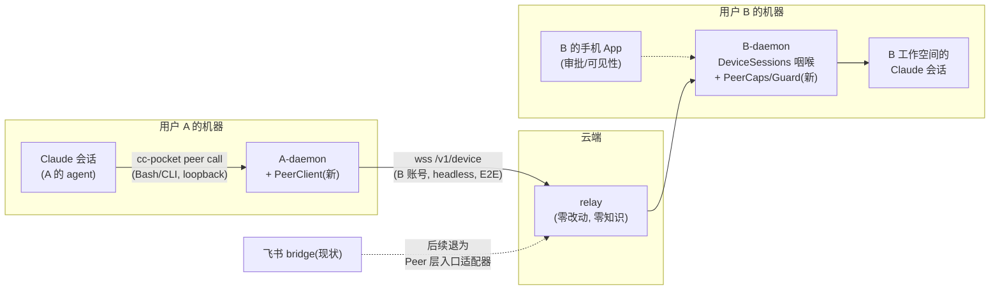
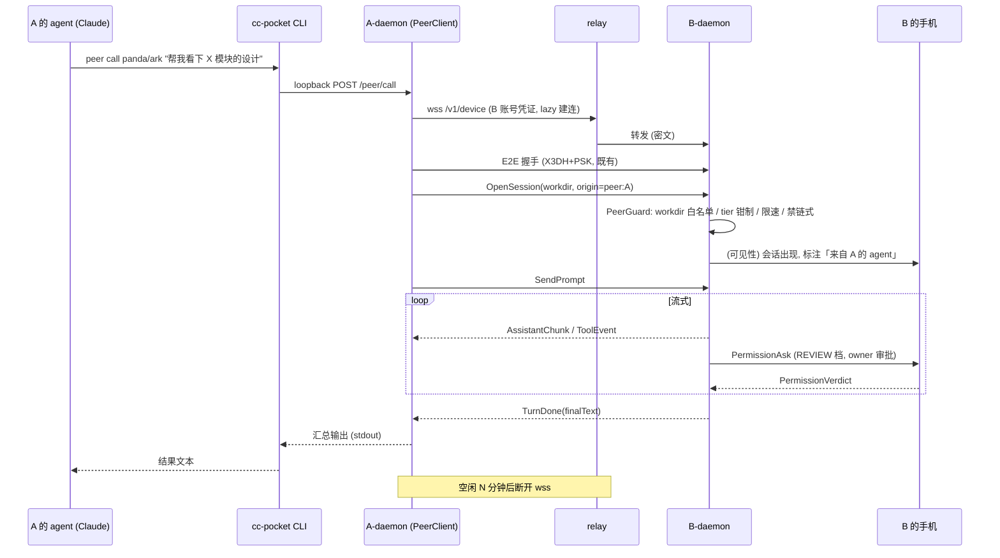

# Peer Call —— agent 互调抽象层设计方案

> 对应 issue [#197](https://github.com/heypandax/cc-pocket/issues/197)。
> 状态：**已暂停，不作为当前实现依据。**
>
> 2026-08-01 产品方向已收敛为“用户把当前 Session 临时交给同事接续”，不再优先建设
> daemon-to-daemon Agent 互调、长期 Peer Grant 或 AgentSpace。已确认的实现规格见
> [`SESSION-HANDOFF.md`](./SESSION-HANDOFF.md)。本文仅保留为历史技术探索；除非新的用户证据证明
> 必须在接收者电脑执行任务，否则不要按本文 M1–M4 开发。

---

## 1. 背景与命题

今天跨用户借用工作空间上下文的唯一路径是飞书 bridge：群里 @bot，bot 以 owner 铸造的
headless 受限凭证连到 owner 的 daemon。飞书同时承担了「入口」和「调用通道」两个角色。

本方案把「agent 互相调用」抽象成独立一层能力（下称 **Peer 层**），跑在自有链路
（relay + E2E 配对信任链）上，不经过任何 IM；飞书 bridge 退化为这层能力之上的一个入口适配器。

### 现状关键事实（设计的地基）

摸底代码后确认三个结构性事实：

1. **relay 只在单账号内转发**。`relay/Broker.kt` 的路由全部以认证过的 `account` 为 key
   （`daemons[account]` 单活跃 daemon、`devices[account]` 多 device），数据面是不透明密文，
   relay 零知识。跨账号路由在结构上不存在。
2. **「受限凭证」已经是一个完整的非 owner principal 机制**。`daemon/bridge/` 下的
   `CredentialKind{BRIDGE, GUEST}` + `BridgeCaps`／`GuestCaps`（ingress/egress 白名单）+
   `BridgeGuard`／`GuestGuard`（workdir 白名单、tier 钳制、限速）+ `BridgeGrant`
   （NONE / OWNER_APPROVED / AUTO_TRUSTED）+ 即时 revoke，全部走既有 E2E 配对信任链
   （ticket-PSK 绑定，`BridgeRegistry.finalize`）。执法收口在唯一咽喉
   `daemon/relay/DeviceSessions.kt` 的 `transport`。
3. **飞书 bridge 只是受限凭证的一个消费者**。它以 headless device 身份配对进 owner 账号，
   `/bind` 只是 `chat_id → workdir` 的入口侧路由表（`daemon/feishu/FeishuRoutes.kt`）。
   「跨用户」能力完全来自 owner 铸了一张凭证给 bot，而非任何账号层互通。

结论：issue 里说的「基于现有 relay 与 E2E 配对信任链扩展，复用现有账号与授权骨架」
在代码上有一条现成的缝——**受限凭证模型再加一种 kind**，relay 可以零改动。

---

## 2. 目标与非目标

### 目标

- 用户 A 的 agent（跑在 A 机器的 Claude Code 会话里）可以直接调用已授权用户 B 的
  工作空间，链路为 A-daemon → relay → B-daemon，全程 E2E，不经过 IM。
- 授权先行：互调关系必须由 B（被调方 owner）显式建立，默认拒绝，可随时撤销，
  撤销即刻终止在途会话（复用 `onDeviceRevoked` 语义）。
- **每个调用方有真实身份**：B 侧能看到「是 A 的 agent 在调我」，而不是 bridge 今天的
  「群里某个人」匿名态——这是对现有 bridge 模型的一个净提升。
- 飞书 bridge 的全部语义可以映射到 Peer 层概念上（见 §10），证明抽象层完备；
  但本期**不迁移** bridge。

### 非目标（继承 issue 边界）

- 不重构、不替换现有飞书 bridge；bridge 现有行为原样保持。
- 不兼容外部 agent 协议（A2A／MCP 联邦等）。
- 不做「免授权直连」——任何跨空间调用都以显式授权为前提，硬边界。
- 不改 relay 的零知识属性（见 D1）。

---

## 3. 关键决策

### D1：复用受限凭证模型，不给 relay 加跨账号路由 ✅（方案主干）

两条路线：

| | A. 受限凭证复用（选定） | B. relay 跨账号路由 |
|---|---|---|
| 原理 | B 铸一张 `PEER` 凭证，A 的 daemon 以 headless device 身份配对进 B 的账号 | relay 增加账号间 authz 表 + 转发规则 |
| relay 改动 | 零（至多调 headless 容量参数） | Broker/RelayServer/Store 全动 |
| 零知识 | 保持——relay 仍只见密文与账号内路由 | 破坏——relay 成为授权裁决方 |
| 复用 | E2E、caps、guard、tier、revoke、审批全套白嫖 | 全部另起 |
| 爆炸半径 | daemon 内新增模块 | 云端信任模型重写 |

选 A。B 路线唯一的理论优势是「关系存在云端、双方 daemon 不必各持状态」，
不值得用零知识属性去换。

### D2：caller 身份 = A 的 daemon Ed25519 指纹（accountId）

现有 bridge 凭证的身份就是「持有凭证者」，群成员匿名。Peer 层调用方本身是一个
cc-pocket daemon，天然有 Ed25519 身份（`Identity`，指纹即 accountId）。redeem 时
caller 附上自己的 accountId 并用 Ed25519 签名证明持有（域分隔，新 label），B 侧
`PeerRegistry` 落盘绑定；后续每次连接重新证明。若 B 铸造时未预填 caller 账号，
首次 redeem TOFU 绑定（与 relay 账号 TOFU 同哲学）。

### D3：v1 禁止链式调用（A→B→C），防环从简

peer 发起的会话在 B 侧带 `origin=peer:*`；该会话内再发起 peer call 一律拒绝。
环路、深度、call-chain 透传等留给后续版本（届时在 `OpenSession` 加 additive 的
`callChain` 字段）。规则简单、可解释、无环。

### D4：v1 调用入口 = 本机 CLI（走既有 loopback），MCP/App 内入口后置

A 的 agent 通过 `cc-pocket peer …` 子命令发起调用（Claude 的 Bash 工具即可用，
无需教 agent 新协议）。CLI 走 daemon 既有的 127.0.0.1 loopback HTTP
（`PairLoopback` 已服务 `/pair`、`/bridges`、`/share` 等，新增 `/peer/*`）。
MCP server、App 内直连入口、飞书入口适配都是 Peer 层之上的后续适配器。

### D5：caller 侧连接按需建立（lazy），空闲即断

relay 对 headless device 有容量约束（`MAX_LIVE_HEADLESS=5`/账号，且 headless
presence 不可见）。A-daemon 的 peer 连接在有调用时建立、空闲 N 分钟后断开，
不常驻占用 B 账号的 headless 槽位。

---

## 4. 概念模型

三个名词（对外文案候选见 §12 开放问题，先用工程名）：

- **Peer Grant（互调授权）**：B 铸造的一份定向授权 = `PEER` 类受限凭证 + 作用域
  （项目白名单、tier、限速、有效期）+ 绑定的 caller 账号。存活在 B 侧
  `PeerRegistry`，可枚举、可撤销。
- **Peer Link（互调链路）**：A 侧持有的凭证与密钥材料，指向 B 的账号。A 的
  daemon 用它以 headless device 身份连 B 的账号。一条 Grant 对应一条 Link。
- **Peer Call（一次互调）**：A 的 agent 经 Link 在 B 的某个白名单项目里
  `OpenSession + SendPrompt`，流式收回结果，`TurnDone` 后可关闭或续聊。

互调关系是**有向**的：A 调 B 与 B 调 A 是两条独立的 Grant，无对称性假设。

---

## 5. 建链流程（授权先行）

复用 GUEST 的 invite 血统（`ShareInvite` → `ccpocket://share#…`），新增 peer 变体：

1. **铸造**（B 侧）：B 在 App/桌面（或 CLI）上发起「新建互调授权」，选择：
   项目白名单（basename 展示，不泄绝对路径——沿用 `/bind` 的讲究）、tier
   （默认 REVIEW，最严）、限速、有效期、可选预填 caller 账号指纹。
   daemon 走 owner 控制面新帧 `CreatePeerGrant` → 经 `PairBegin` 拿 relay
   一次性 ticket（TTL 120s 既有机制）→ 生成邀请串 `ccpocket://peer#<b64url(json)>`。
2. **传递**：邀请串带外交给 A（任何渠道：飞书私聊、二维码、口头念 6 位码……
   渠道只承担传递，不承担信任——信任锚在 ticket-PSK）。
3. **兑换**（A 侧）：`cc-pocket peer add "<邀请串>"` → A-daemon 生成该 Link 专用
   X25519 密钥对，POST `/v1/pair/redeem`（既有端点），并按 D2 附 accountId +
   Ed25519 签名 → 拿到 `PairCredential`，落盘 `peer-links.json`。
4. **绑定确认**（B 侧）：首次 E2E 握手把 ticket 折入 PSK（既有 `E2ESession`
   机制），`PeerRegistry.finalize` 落定绑定；B 的 App 收到「A 已接受互调授权」通知。
5. **撤销**：B 侧 `RevokePeerGrant` → 既有 `RevokeDevice`/`DeviceRevoked` 链路
   → 在途会话即刻终止，A 侧下次调用报「授权已撤销」。

---

## 6. 调用生命周期

要点：

- **审批走 B 的 owner 设备**，与 bridge 一致（`PeerCaps` egress 不下发
  `PermissionAsk` 给 caller）。REVIEW 档逐条审批；B 可对该 Grant 开
  AUTO_TRUSTED 闭集（沿用 `BridgeGrant.autoRunnable`，Bash 永不自动放行）
  或提 tier；`bypassPermissions` 在任何 tier 不可达（既有 `TierClamp` 铁律）。
- **会话所有权**：peer 只能看见/续聊自己开的会话（沿用 GUEST 的
  `ownedSessions` 台账思路，`peer-sessions.json`）。
- **同步/异步**：CLI 默认阻塞流式打印到 `TurnDone`；提供
  `--async` 返回 call id + `peer wait <id>`，规避 agent 侧 Bash 工具超时。
- **对端离线**：relay 无 B-daemon 连接时快速失败，CLI 明确报「对方 daemon 离线」。

---

## 7. B 侧执法：新增 `CredentialKind.PEER`

完全嵌入既有绑定链与咽喉，不另起执法点：

| 组件 | 内容 | 蓝本 |
|---|---|---|
| `CredentialKind.PEER` | `BridgeStore` 新枚举值，`peers.json` 落盘 | BRIDGE/GUEST |
| `PeerCaps` | ingress 白名单：`OpenSession / SendPrompt / CancelTurn / CloseSession / FetchHistoryPage`；egress 不含 `PermissionAsk` 与一切管理帧 | `BridgeCaps` |
| `PeerGuard` | workdir 白名单、tier 钳制、resume 归属、限速（opens/min、prompts/min、maxSessions）、有效期、**拒绝 peer-origin 会话的链式调用**（D3） | `BridgeGuard`+`GuestGuard` |
| `PeerScope` | roots、tier、expiresAt、`callerAccountId`（D2 新增） | `GuestScope` |
| `PeerRegistry` | 铸造/finalize/枚举/撤销；凭证不入 `devices.json`（沿用隔离原则） | `BridgeRegistry` |

`DeviceSessions.transport` 在 `isBridge / isGuest` 分支旁加 `isPeer` 分支，
路由帧打 `origin=peer:<callerAccountId>`。

---

## 8. A 侧新组件：`PeerClient`

daemon 目前只有「daemon 腿」（`RelayClient`）；Peer 层需要它长出「device 腿」——
以 device 身份连**别人的账号**。协议上无新东西：`examples/feishu-bridge/` 的
python client 已证明 device 侧全流程（凭证 hello、E2E initiator、帧收发）可独立
实现；`PeerClient` 是它的 Kotlin 内嵌版，直接复用 `protocol/e2e/E2ESession`
（initiator 侧）与 `protocol/` 帧定义。

- 每条 Link 一个连接位，lazy 建连 + 空闲断开（D5）。
- 落盘 `~/.cc-pocket/peer-links.json`（0600）：alias、calleeAccountId、
  deviceId、credential secret、Link 专用 X25519 私钥、对端 E2E 静态公钥。
- loopback 新端点：`GET /peer/links`、`POST /peer/call`、`GET /peer/call/<id>`、
  `POST /peer/add`、`POST /peer/remove`。
- CLI 子命令：`peer add / list / call / wait / remove`。

---

## 9. wire 变更清单（全部 additive-with-defaults）

daemon 与 App 独立发版，一切新帧/新字段必须向后兼容（`protocol-wire-compat-reviewer`
检查单约束）：

- **owner 控制面新帧**（`ToDaemon`，仿 `CreateBridge` 族）：
  `CreatePeerGrant / ListPeerGrants / RevokePeerGrant`（+ 对应 result 帧）。
- **redeem 请求 additive 字段**：callerAccountId + Ed25519 签名（旧客户端不填，
  兑换为「无身份绑定」凭证——但 PEER kind 的 grant 可要求必填）。
- **`SessionLive.origin` 语义扩展**：新增 `peer:<accountId>` 前缀值（字段已存在，
  纯值域扩展）。
- **relay：零帧变更**。至多运维参数（headless 容量）评估。

---

## 10. 飞书 bridge 语义映射（验证抽象完备性，本期不迁移）

| bridge 现状概念 | Peer 层对应物 |
|---|---|
| `pair --headless` / `CreateBridge` 铸凭证 | `CreatePeerGrant`（caller = 外部 adapter 而非 daemon） |
| bot 持凭证连 owner 账号 | Peer Link（headless device 腿） |
| `/bind chat_id→workdir` | 入口适配器自己的路由表（Peer 层不感知 IM 概念） |
| 群成员发消息 → prompt | 入口适配器把 IM 事件翻译成 Peer Call |
| `/trust` 免审批 | Grant 上的 AUTO_TRUSTED 配置 |
| `BridgeGuard` 白名单/限速 | `PeerGuard`（同族） |

差异点：bridge 的 caller 是「非 daemon 的外部进程」，没有 Ed25519 身份——映射时
`callerAccountId` 为空、退回「持凭证即身份」。这说明 D2 的身份绑定应设计成
**可选强化**而非硬前提，抽象层才能同时罩住两类入口。未来迁移 = `FeishuEngine`
改为消费 Peer 层接口，行为不变。

---

## 11. 阶段拆分

| 阶段 | 内容 | 验收 |
|---|---|---|
| **M1 授权骨架** | `CredentialKind.PEER` + Caps/Guard/Scope/Registry + 铸造/兑换/撤销帧 + 落盘 | 用 python 示例 client 手持 PEER 凭证调通 B 侧，白名单/tier/revoke 生效 |
| **M2 调用链路** | `PeerClient`（device 腿 + E2E initiator）+ loopback `/peer/*` + CLI 子命令 + lazy 连接 | A 机器上 `cc-pocket peer call` 端到端跑通，A 的 Claude 会话内可用 |
| **M3 可见性与 UI** | B 侧 App：授权管理页（铸造/枚举/撤销）、会话 origin 标注、通知；A 侧 `peer list` | 双端真机走完整流程，B 手机上完成一次逐条审批 |
| **M4 入口适配（后置）** | bridge 映射文档落地为实验开关，`FeishuEngine` 试消费 Peer 层 | bridge 行为无回归 |

M1+M2 为最小闭环（无 UI 也可用 CLI 完成铸造与调用）。

---

## 12. 风险与开放问题

**风险**

- headless 容量：`MAX_LIVE_HEADLESS=5`/账号，被多人授权的热门用户可能碰顶；
  D5 lazy 连接缓解，必要时上调该参数（relay 一行运维改动）。
- 长任务与 caller 超时：agent 的 Bash 工具默认 10 分钟上限；`--async/wait`
  兜底，M2 必做。
- E2E 会话与 daemon 重连的重叠期（#146/#161 同族问题）在 `PeerClient` 侧重演，
  实现时按既有 `DeviceSessions` 的处理方式对齐。
- 资源公平性：peer call 消耗 B 的机器与 Claude 配额，限速默认值要保守
  （建议 opens 2/min、prompts 10/min、maxSessions 2 起步）。

**开放问题（需拍板）**

1. **对外名词**：`Peer Grant / Link / Call` 的中文 UI 文案候选——
   「互调授权／互调链路／互调」vs「协作授权」vs「工作空间借用」。
2. B 侧对 peer call 的**通知强度**：静默出现在会话列表即可，还是每次
   `OpenSession` 推送提醒？（建议默认推送、Grant 上可关。）
3. 邀请串有效期沿用 ticket 120s 是否太短（带外传递常超 2 分钟）——
   peer 变体是否放宽到 10 分钟？
4. `FetchHistoryPage` 是否进 v1 ingress 白名单（caller 续聊体验 vs 最小暴露面）。
