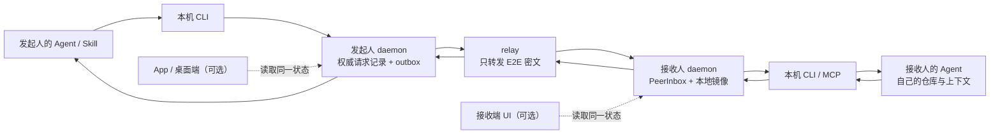

# ReviewRequest —— 任务上下文的异步协作评审

> 状态：**M1 daemon + CLI + 内置 Skill 已实现；等待双机实网验收**
>
> 决策日期：2026-08-02
>
> 能力定位：发送任务上下文，由接收者使用自己电脑上的 Agent 和本地上下文完成评审
>
> 硬性约束：核心闭环必须在双方 App、桌面端均未打开时，仅依靠 daemon + CLI / Skill 完成
>
> 并列能力：[`SESSION-HANDOFF.md`](./SESSION-HANDOFF.md) 负责运行时上下文交接；两者保留且互不替代

---

## 0. 最终结论

cc-pocket 的跨用户协作需要同时保留两类能力，并明确分工：

1. **运行时上下文交接：Session Handoff。** 把原机器上的进程、未提交状态、终端和 Agent Session
   临时交给同事接续；现有实现继续保留。
2. **任务上下文交接：ReviewRequest。** 把目标、材料、约束和完成标准交给同事，由他自己的 Agent
   在自己的环境中处理；这是本设计新增的能力。

ReviewRequest 解决的是第二类需求：

> **把一个明确的评审任务交给同事；同事使用自己的电脑、仓库、账号、Agent、Skills 和历史上下文处理，再把结构化结果返回。**

新的一等实体命名为 **ReviewRequest**。它围绕 MR、commit range、设计文档或文件快照组织，不转移原
Session 的控制权，不让接收者进入发起人的电脑，也不要求任何一方打开 cc-pocket App 或桌面端。

这不是对 Session Handoff 的替换。用户需要原机器的精确运行状态时继续使用 Session Handoff；能够通过
MR、文档或任务说明独立完成时使用 ReviewRequest。

App 和桌面端提供可视化收件箱、联系人管理、请求草稿和结果卡片，是**一等控制面**；但它们只是 daemon
状态的客户端，不能成为发送、接收或完成 ReviewRequest 的必经路径。

**「UI-optional」指的是运行期可选，不是产品里没有。** 正常路径是：用 App / 桌面端建立一次评审联系人
并操作评审，然后把两个 UI 都关掉几天——投递、重试、去重、持久化和历史仍由 daemon 完整承担。CLI 与
Skill（随仓库分发在 `packaging/skills/review-request/SKILL.md`，用户自行拷到 `~/.claude/skills/review-request/`；
daemon 不代写用户磁盘）是 UI 的**对等**入口，走同一套 daemon service 和同一个状态机。

> 当前代码已经提供 `cc-pocket-daemon collaborator ...`、`cc-pocket-daemon review ...`、领域模型、
> additive wire frame、持久化收件箱、仓库内置 Skill，以及 App / 桌面端的 Review Center（收件箱、
> 我发出的、评审联系人、新建请求、结果回复、建联扫码/粘贴）。自动 Agent 启动、附件/文件快照、
> Campaign、MCP 和通知正文仍未实现；上线前还必须完成两台真实 daemon 的 E2E/休眠/断网验收。

## 1. 双能力定位与选择

需要区分两类“上下文”：

| 上下文 | 用户真正要交付的内容 | 合适的产品形态 |
|---|---|---|
| 任务上下文 | 目标、材料、约束、已完成工作、重点问题、完成标准 | ReviewRequest |
| 运行时上下文 | 原机器上的进程、未提交状态、终端、原始 Agent Session | Session Handoff |

代码评审和文档评审通常需要前者。对方自己的模块知识、仓库配置、项目说明、Skills 和历史经验，恰恰是
邀请他评审的原因。此时应使用 ReviewRequest；只有评审必须依赖发起人机器上的精确现场时，才选择
Session Handoff。

产品入口可以先问一个问题完成分流：

> 对方是否必须使用我电脑上“此刻的运行状态”？是 → Session Handoff；否 → ReviewRequest。

相邻产品也呈现同样分界：

- [Claude Code Remote Control](https://code.claude.com/docs/en/remote-control)解决的是同一用户跨设备继续同一个本机 Session；
- [GitHub Copilot 的 PR 工作流](https://docs.github.com/en/copilot/how-tos/github-copilot-app/managing-issues-and-pull-requests)围绕 PR 启动新的评审 Session；
- [VS Code Live Share](https://code.visualstudio.com/blogs/2018/05/07/live-share-public-preview)这类共享原机器环境的能力，主要服务同步远程协助和联合调试。

这不是市场规模证明，但足以说明两种产品形态都有清晰边界：运行时上下文适合现场接续，任务上下文适合
异步评审。两者可以共享联系人和 E2E 基础设施，但不能共享状态机和权限语义。

## 2. 首发用户场景

### 2.1 不熟悉模块的 MR 评审

Panda 修改了一个自己不常维护的模块，希望 Frank 评审：

1. Panda 在当前 Agent 中说“把这个 MR 发给 Frank 评审，重点看 relay ACK 和重试竞态”；
2. 内置 Skill 读取当前仓库、分支、MR、diff 摘要和验证结果，生成请求草稿；
3. Panda 确认接收者和发送内容后，Skill 调用本机 daemon；
4. Frank 的 daemon 收到并持久化请求，即使 cc-pocket App 和桌面端均未运行；
5. Frank 在自己的 Agent 中说“查看待处理评审”，选择该请求；
6. Frank 的 Agent 在 Frank 自己的仓库、配置和上下文中检查 MR；
7. 评审结果通过 Frank 的 daemon 返回，Panda 可以在原 Agent、CLI 或 App 中查看并继续处理。

### 2.2 多人设计文档评审

Panda 完成一个较大项目的模块设计文档，希望多位同事并行评审：

1. Panda 选择文档链接或本地文件快照，填写评审目标；
2. 系统创建一个 `ReviewCampaign`，为每位接收者生成独立 `ReviewRequest`；
3. 每位同事在自己的 Agent 和工作上下文中独立评审；
4. 每条请求独立接受、拒绝、过期和返回，不互相阻塞；
5. Panda 的 Agent 汇总相同意见、冲突意见、待决问题和建议修改。

### 2.3 应切换到 Session Handoff 的情况

以下场景不使用 ReviewRequest，直接使用现有 Session Handoff：

- 问题只能在发起人的设备或硬件上复现；
- 运行状态难以重新构造；
- 事故处理中必须查看原机器现场；
- 双方明确进入同步结对调试。

这些是 Session Handoff 继续保留的价值。两类能力通过产品分流解决，不把运行时权限反向加入
ReviewRequest。

## 3. 产品原则

### 3.1 Artifact-first，而不是 Session-first

ReviewRequest 的主对象是 MR、文档、commit range 或文件快照。来源 Session 只允许作为发起人本地的历史
关联，用于收到结果后继续工作；它不是共享载体，也不是授权边界。

默认不发送：

- 完整 Agent transcript；
- 发起人电脑上的 Session ID、绝对目录和环境变量；
- 模型账号、终端状态或未声明的本地文件；
- 发起人电脑的任何远程执行权限。

### 3.2 Recipient-context-first

接收者在自己的环境中工作：

- 自己的代码仓库和分支；
- 自己的 Agent 与模型账号；
- 自己的 `AGENTS.md`、`CLAUDE.md`、Skills、MCP 和工具配置；
- 自己的 Git、MR 平台和文档权限；
- 自己的审批与危险操作策略。

发送方提供任务材料，不替接收方指定本机权限。

### 3.3 Daemon-first，UI-optional

ReviewRequest 的状态、投递、重试、身份验证和历史均由 daemon 负责。支持面排序为：

1. **daemon Local Control API**：唯一的本机业务入口；
2. **CLI**：稳定、可测试、Agent 无关的基础交互；
3. **内置 Skill**：把自然语言转成 CLI 的结构化调用；
4. **App / 桌面端**：一等可视化控制面，不拥有独立业务逻辑——只发帧、只渲染 daemon 的回帧和快照；
5. **本地 MCP tools（可选）**：为支持 MCP 的 Agent 提供更强类型的调用。

这个排序是**依赖顺序，不是重要性顺序**。UI 排在 CLI 之后，意思是「UI 建立在同一套 daemon service
之上，且删掉 UI 功能依然完整」；不是「UI 可以缺席」。大多数人第一次建联和日常查看待办都在 UI 里，
只是 daemon 在两个 UI 都关掉之后仍然是那台一直在跑的引擎。

Skill 和 UI 都不能自己实现联系人、网络协议或状态机，否则 Claude、Codex、OpenCode 和 App 会出现四套
不一致行为。代码上的落点：`ReviewOwnerService` 是 owner 侧的唯一实现，Local Control API（CLI/Skill）
与 `pocket/review.*` owner 帧（App/桌面端）都只是它的传输层。

### 3.4 默认异步，不锁定任何人的工作

发送 ReviewRequest 后：

- 发起人的原 Session 继续可用；
- 接收者可以稍后处理；
- 多位接收者可以并行工作；
- 没有 Controller Lease、Source Session 锁定、旁观或收回控制权；
- 返回结果是一个新事件，不修改双方既有 Agent transcript。

## 4. 无 App / 无桌面端完整流程

### 4.1 首次建立联系人

首次连接仍需明确的人工信任确认，后续不重复扫码。除了 App 扫码，还必须支持纯终端流程。目标 CLI 为：

```bash
# A：让正在运行的 daemon 创建一次性邀请，不启动第二个 daemon
cc-pocket-daemon collaborator invite --label Frank

# B：将邀请导入自己正在运行的 daemon，并核对指纹
cc-pocket-daemon collaborator join '<invite-uri>'

# 查看已连接联系人
cc-pocket-daemon collaborator list
```

邀请只建立受限的协作收件连接，不授予目录、Session、prompt、文件或终端权限。解除联系人后，新的请求和
未完成请求均不能继续同步；历史记录保留。

这条 CLI 与 App / 桌面端 Review Center 里的「邀请同事 / 添加同事」是**同一条路径**：两者都铸
`purpose = review` 的联系人（§9.1），都由 daemon 兑换和持有凭证，任一侧建立的联系人在另一侧立刻可见。
UI 侧多的只是二维码和指纹确认屏——扫码/粘贴**不会自动兑换**，必须人工确认指纹后才发 join。

**指纹核对是双向的。** 邀请方和加入方都要看到同一组词，否则这个动作检测不到任何东西：只有一侧能读的
值，另一侧无从比对。所以三处都显示它，且都从**同一份密钥字节**推导——邀请 URI 里的 `daemonPub`：

- `collaborator invite` 的人类输出打印 `fingerprint:`（`--json` 里是 `fingerprint` 字段，非机密派生值）；
- App / 桌面端的「邀请同事」屏在二维码下方渲染同一组词；
- 加入方的确认屏照旧渲染它，并且必须显式确认才会 join。

邀请里的 `daemonPub` 在兑换或落盘之前会被当作**真实 P-256 公钥**校验（65 字节、`0x04` 前缀，且用握手
自己的原语验证曲线上性）。理由不是洁癖：指纹会把任意字节散列成同样可信的词组，一把永远握不上手的密钥
会被人「核对通过」，然后留下一条只会不断重连失败的链接。

> **凭证落在 daemon，不落在手机。** 这正是「关掉 App 也照收」成立的原因，也是它和 Session Handoff 的
> Collaborator Link 兑换（把受限绑定存在**手机**上）不能互相顶替的地方。

### 4.2 发起人通过 Skill 发送

用户可以直接对当前 Agent 说：

```text
把当前 MR 发给 Frank 评审，重点检查协议兼容性和重试竞态，明天下午前给结论。
```

Skill 的职责：

1. 用确定性命令识别 Git remote、当前分支、base/head SHA 和 MR URL；
2. 根据当前对话生成简短 `ReviewBrief`，不复制完整 transcript；
3. 调用 daemon 创建草稿；
4. 向用户展示接收者、产物、共享内容、截止时间和期望输出；
5. 得到明确发送意图后调用 `send`；
6. 返回稳定的 `reviewRequestId`，供后续查询。

CLI 等价入口：

```bash
cc-pocket-daemon review send \
  --to Frank \
  --artifact 'mr:https://git.example.com/team/repo/-/merge_requests/42' \
  --request '评审协议兼容性和重试竞态' \
  --due '2026-08-03T17:00:00-07:00'
```

若联系人、MR 或共享附件存在歧义，必须停在草稿状态要求用户选择；不能由 Agent 猜测接收者或扩大共享
范围。用户明确说“发送给 Frank”可视为发送意图，但最终 CLI 仍应回显精简收据。

### 4.3 接收者仅通过 daemon + Agent 处理

接收者 daemon 收到新请求后：

1. 先原子持久化，再发送 delivery ACK；
2. 通过系统原生通知提示“收到一条评审请求”，锁屏默认不显示正文、路径或附件名；
3. 不自动启动 Agent，不自动拉代码，不自动执行请求中的命令；
4. App、桌面端均未运行也不影响收件、重连和历史保存。

接收者可以在自己的 Agent 中说：

```text
查看 cc-pocket 里待我处理的评审。
```

Skill 调用：

```bash
cc-pocket-daemon review inbox --status pending --json
cc-pocket-daemon review show rr_01J... --json
cc-pocket-daemon review prepare rr_01J... --json
```

`prepare` 返回 `ReviewExecutionBundle`，包含已验证的请求字段、产物引用、本地仓库匹配结果和建议提示词。
Skill 将提示词带入**当前 Agent Session**，因此能保留接收者已有上下文；如果用户没有合适的 Session，
CLI 也可以显式启动一个新的本地 Agent：

```bash
cc-pocket-daemon review run rr_01J... --agent codex
```

启动新 Agent 是便利功能，不是 ReviewRequest 状态机的一部分。所有模型成本、工具权限和审批仍归接收者
自己的环境。

### 4.4 返回结果

接收者 Agent 生成结构化结果后，Skill 先展示结论，再调用：

```bash
cc-pocket-daemon review respond rr_01J... --result ./review-result.json
```

结果至少包含：

- 总体结论；
- findings（严重度、说明、文件/位置）；
- 已做验证；
- 未确认事项；
- 建议下一步。

发起人无需打开 App，可以在原 Agent 中说“查看 Frank 返回的评审”，或直接执行：

```bash
cc-pocket-daemon review show rr_01J... --json
cc-pocket-daemon review campaign rc_01J... --summary --json
```

若请求带有本地 `originSessionRef`，Skill 可以把结果构造成一段继续提示词；daemon 不得静默向正在运行的
Agent 注入消息。

## 5. 总体架构



### 5.1 daemon 职责

- 管理联系人身份、方向和撤销；
- 持久化请求、结果、状态版本和审计历史；
- 维护 E2E 协作连接、outbox、重试、去重和 ACK；
- 提供受保护的本机控制接口；
- 解析 ArtifactRef 的确定性元数据，但不替 Agent 做语义评审；
- 发送无敏感正文的系统通知；
- 为 App、CLI、Skill、MCP 提供同一份状态。

### 5.2 Skill 职责

- 从用户意图生成 ReviewBrief 草稿；
- 调用 CLI 查询联系人、请求和本地项目匹配；
- 构造适合当前 Agent 的评审提示词；
- 将 Agent 产出整理成 ReviewResult 草稿；
- 在发送或返回前让用户看到关键内容。

Skill 不是安全边界。它不能伪造身份、改变请求状态、扩大附件范围或绕过接收者本机审批。

### 5.3 为什么 CLI 是基础、Skill 是体验层

CLI 可以在没有图形界面、没有特定 Agent、自动化测试和故障排查时稳定工作。Skill 让用户不需要记命令，
但其所有动作最终落到同一组 daemon 操作。未来提供 MCP tools 时，也应调用同一 service，而不是复制逻辑。

## 6. 本机控制接口

当前 `127.0.0.1:8799` 主要服务配对和少量管理操作。ReviewRequest 会承载同事输入、文档内容和评审结果，
不应直接新增到“能访问 localhost 即有权限”的无认证 HTTP 面。

实现 `LocalControlServer`：

- macOS/Linux 优先 Unix Domain Socket，Windows 优先 Named Pipe；
- 若使用 loopback HTTP 回退，必须要求随机 local control token；
- token 存在仅当前 OS 用户可读的文件中，CLI 自动读取；
- 拒绝浏览器 Origin、跨站表单和无 Content-Type 请求；
- 响应不得包含联系人密钥或 relay credential；
- CLI 只连接已运行的 daemon，**绝不能为了执行命令再启动第二个 daemon**。

建议 service API：

```text
CollaboratorService.invite / join / list / remove
ReviewRequestService.draft / send / list / get / acknowledge
ReviewRequestService.decline / prepare / markInProgress
ReviewRequestService.respond / cancel / close
ReviewCampaignService.get / summarize
```

CLI `--json` 输出必须稳定，Skill 和 MCP 只依赖结构化字段，不解析人类文案。

**owner 侧只有一份实现。** 落地时这些 service 收敛为 `ReviewOwnerService`（联系人、本机收件箱、
prepare、代排队的接收方动作），它有两个传输层，而不是两份逻辑：

- HTTP `/v1/local/*`（CLI、Skill）——0600 token ＋ 拒 Origin ＋ 强制 `application/json`；
- `pocket/review.*` owner 帧（App、桌面端）——E2E 传输认证，且必须是完整 owner 凭证。

联系人解析、`prepare` 的拒绝码、以及「排队 ≠ 送达」的语义因此只写一次。两条路都不重复校验，也就无从
漂移；`statusFor()` 那张码→HTTP 状态表是纯粹的传输礼貌，`code` 才是两边共同的契约。

## 7. 领域模型

### 7.1 ReviewRequest

```kotlin
data class ReviewRequest(
    val id: String,
    val campaignId: String? = null,
    val senderPeerId: String,
    val recipientPeerId: String,
    val title: String,
    val brief: ReviewBrief,
    val artifacts: List<ArtifactRef>,
    val attachments: List<AttachmentRef> = emptyList(),
    val desiredOutput: DesiredOutput = DesiredOutput.REVIEW,
    val status: ReviewStatus,
    val revision: Long,
    val createdAt: Long,
    val dueAt: Long? = null,
    val expiresAt: Long? = null,
    val response: ReviewResult? = null,
)
```

`originSessionRef` 和发起人的本地草稿信息单独存于 sender daemon，不进入跨用户 wire model。

### 7.2 ArtifactRef

首发支持：

| 类型 | 必要字段 | 说明 |
|---|---|---|
| `MERGE_REQUEST` | provider、canonical URL、repo identity、base/head SHA | 代码评审首选 |
| `COMMIT_RANGE` | repo identity、base/head SHA | 没有 MR 时使用 |
| `DOCUMENT_URL` | canonical URL、可选 revision/hash | 接收者使用自己的访问凭证读取 |
| `FILE_SNAPSHOT` | attachment id、文件名、content hash | 本地设计文档或不可访问链接 |

`repo identity` 使用规范化 remote fingerprint，不传接收者路径。接收者 daemon 在自己的 project index 中匹配；
找不到或匹配多个时由用户选择，不自动 clone 到任意目录。

### 7.3 ReviewBrief

```text
request             必填：希望对方做什么
background          为什么需要评审
completedWork       已完成内容
focusAreas          重点问题
knownRisks          已知风险
verification        已执行验证
constraints         约束
definitionOfDone    何时算完成
```

Brief 是导航，不是 prompt 权限，也不能覆盖接收者仓库中的安全规则。

### 7.4 ReviewResult

沿用结构化评审结果思想，但与 Session Handoff 类型分离：

```text
verdict              approve | comment | request_changes | unable_to_review
summary
findings[]           severity、title、detail、artifact、file、line
verification[]
openQuestions[]
recommendedNextSteps[]
attachments[]
respondedBy / respondedAt（由 daemon 盖章）
```

### 7.5 ReviewCampaign

Campaign 是发起人 daemon 上的聚合实体：

- 每个接收者对应一个独立 ReviewRequest 和状态机；
- 取消或过期某一条不影响其他人；
- 汇总由发起人 Agent 按需生成，原始结果始终可追溯；
- v1 不让评审者默认看到其他人的意见，避免锚定偏差。

## 8. 状态机

```text
DRAFT ──send──> QUEUED ──durable ack──> DELIVERED
                    │                       │
                    │ cancel                ├──acknowledge──> ACKNOWLEDGED
                    │                       │                    │
                    │                       │                    └──start──> IN_PROGRESS
                    │                       │                                  │
                    │                       └────────respond────────────────────┴──> RESPONDED ──close──> CLOSED
                    │
                    └──expiry──> EXPIRED

DELIVERED / ACKNOWLEDGED / IN_PROGRESS ──decline──> DECLINED
QUEUED / DELIVERED / ACKNOWLEDGED ──sender cancel──> CANCELLED
```

规则：

- `QUEUED` 表示 sender daemon 已持久化但 recipient daemon 尚未确认落盘；
- `DELIVERED` 必须来自接收端落盘后的 ACK，relay 写成功不算送达；
- 接收者可以不显式 `IN_PROGRESS` 直接返回结果，支持轻量评审；
- 状态更新使用 `id + revision` 比较，所有命令携带 idempotency key；
- 任何状态都不锁定 Source Session；
- 断网、休眠和 daemon 重启后从持久化 outbox 自动恢复。

## 9. 协作连接与投递

为降低实现复杂度，v1 复用现有 Collaborator Link 的“受限收件凭证”思路，但把收件主体从 App 提升为
recipient daemon：

1. A daemon 创建只具备 ReviewRequest 收件/回复 capability 的邀请；
2. B daemon 兑换并保存该连接；
3. B daemon 作为 `PeerInboxClient` 连接 A daemon，不进入 A 的普通设备列表；
4. A 是该方向 ReviewRequest 的权威存储，B 保存本地镜像；
5. B 断线期间请求保留在 A；B 重连后拉取有界完整快照，并按每条请求的 revision 合并；
6. B 的回复在本地 outbox 保留，直到 A 持久化确认。

这样 v1 不要求 relay 建设跨账号明文业务数据库或离线消息存储；relay 仍只做认证后的密文转发。双向发送
需要双向受限连接，但用户界面和 CLI 可以把它呈现为一个联系人——**前提是匹配是确定性的；绝不能只按标签
合并两条不同凭证。**

### 9.1 评审联系人 ≠ Session Handoff 联系人

两个能力共用 Collaborator Link 这条传输，但收件主体不同：Session Handoff 把**运行时上下文**交给某个
人的 **App**，ReviewRequest 把**任务**交给同事的 **daemon**。把一边的联系人当另一边的收件人用，就是
「一条评审联系人拿到了 Session 驾驶权」这类事故的来源。

所以 `Collaborator` 上有一个尾部追加、带默认值的 `purpose`（`CollaboratorPurpose`）：

| purpose | 谁会得到它 | 可否作为 Session Handoff 收件人 | 可否收评审请求 |
| --- | --- | --- | --- |
| `session_handoff`（默认） | App 的 `pocket/collaborator.ticket` 邀请；以及**所有在这个字段存在之前建立的联系人** | 可以 | **不可以** |
| `review` | Review Center 的 `pocket/review.contact_invite`，以及 CLI 的 `collaborator invite`（它本来就是 ReviewRequest 的建联命令） | **不可以** | 可以 |
| `unknown` | 只可能来自更新版本 peer 的取值 | 不可以 | 不可以（fail closed） |

**两个 purpose 严格互斥**，没有「一条链接两用」的中间态。旧联系人是某个人的 **App**、为接收运行时租约
而建立的；把它顺手当成任务收件人，等于替 owner 做了一个他从没做过的决定——这和「升级不得悄悄改变既有
链接含义」是同一条原则的两面。**要和某人用 ReviewRequest，就和他建一条 Review 链接**，这条迁移路径是
刻意显式的。

四条推论：

- 旧联系人**不会**因为升级而变成评审联系人，也不会失去它原有的 Session Handoff 含义——JSON 里没有
  `purpose` 就按历史含义解码；
- `purpose` 由 owner 在**铸票时**决定，写在凭证自己的 `BridgeSpec` 上，兑换方无权自报；
- 执法点是 `CollaboratorDirectory.acceptsHandoff` / `acceptsReview` 两个谓词，不是调用方各自判断。
  UI 里 `ReviewContact.canSend` 直接是 daemon 的答案，客户端不重新推导；
- **邀请本身要写明用途，而且分两层写**。铸票的**帧**是新的，但真正跨机器的**产物**是
  `CollaboratorInvite`——两个功能共用同一个编解码器，字节上只差一个字段。所以隔离要落在两处：

  - **内层**：`CollaboratorInvite` 上一个尾部追加、默认 `session_handoff` 的 `purpose`，兑换方
    **在烧掉一次性票之前**就能分辨。这一层管的是「前缀被人手工剥掉后裸粘贴 base64」的情形；
  - **外层**：两个功能各走各的 URI 门——Session Handoff 保持 `ccpocket://collab#`（**冻结**，已印出去
    的二维码/链接必须继续可用），评审建联走 `ccpocket://review-contact#`。

  外层不是冗余：`purpose` 是尾部字段，**旧版 App 读不到它**，会按默认值把评审票当 Session Handoff
  兑换掉——票被消耗，对方 daemon 再也兑不到，而 owner 这边多出一位「永远不会回复评审」的收件人。换成
  旧版不认识的 host，旧版只会当作「看不懂的链接」放过去，而不是消耗它。

  新版 App 两道门都在：解码器**按门校验 purpose**（`unknown` 两边都拒），评审链接的深链路由进 Review
  Center 的建联确认页——落在指纹步骤上，**绝不自动兑换**；真正兑换的是 daemon，不是手机。
- **隔离是分层的，不止一个判断点**：
  - 遗留帧族只承载 `session_handoff` 行——`pocket/collaborator.listing` / `.connected` / `.updated`
    都过滤，`RemoveCollaborator` 对非 handoff 行按「查无此人」拒绝且**不撤销任何凭证**。旧版 App 读不懂
    `purpose`，会把推来的行直接放进它的收件人选择器；
  - 评审侧走自己的 `pocket/review.*` 帧和 purpose 化的内部读写路径（`contacts(purpose)` /
    `remove(deviceId, purpose)`），不复用遗留帧；
  - 能力墙 `CollaboratorCaps.ingressAllowed/egressAllowed` **两个方向都带 purpose**：handoff 链接发不出
    评审变更，也收不到评审 listing / update，反之亦然；`unknown` 两边都拒。

若后续联系人规模证明“一位 daemon 为每个 peer 维护受限连接”成本过高，再评估 relay 原生 peer routing；
不要在需求未验证前建设企业消息总线。

## 10. 协议设计

ReviewRequest 使用全新的 additive wire family，不修改或复用 `SessionHandoff` 的状态语义：

```text
pocket/review.list
pocket/review.listing
pocket/review.create
pocket/review.created
pocket/review.get
pocket/review.delivered
pocket/review.acknowledge
pocket/review.decline
pocket/review.start
pocket/review.respond
pocket/review.cancel
pocket/review.close
pocket/review.updated
```

以上是两台 daemon 围绕**一份发送方权威账本**的对话。owner 自己的 App / 桌面端要驱动本机的
`PeerInboxService`（联系人、本机收件箱、prepare、代为排队的接收方动作）时，用的是另一族帧：

```text
pocket/review.contacts          pocket/review.contacts_listing
pocket/review.contact_invite    pocket/review.contact_invited
pocket/review.contact_join      pocket/review.contact_updated
pocket/review.contact_remove
pocket/review.inbox             pocket/review.inbox_listing
pocket/review.prepare           pocket/review.prepared
pocket/review.inbox_act         pocket/review.inbox_acted
```

为什么另起一族而不是复用上面那些：接收方平面是以**远端发送者的绑定 collaborator 身份**认证的，owner
设备不是那个 peer；让它复用那些帧，就正好是 §11.1 要防的冒充路径。所以 owner 是请求**自己的 daemon**
以接收方身份行动，daemon 照实回 `queued`。

这一族全部 **owner-only**：bridge、guest、collaborator 在 `CollaboratorCaps` 白名单（结构性拒绝）和
router 的 `isOwner` 三判（纵深防御）两道关口都过不去——它们暴露的是本机**所有**同事的收件箱，而不是
调用者自己那一条。回帧不含任何 credential、ticket、私钥或 local-control token；唯一的建立材料是
`pocket/review.contact_invited` 里那个一次性 URI。

兼容规则：

- 新 enum 必须容忍未知值并 fail closed；
- 新字段只能尾部追加且有默认值；
- 旧 peer 不认识消息时，发送端超时后显示“对方 daemon 需要升级”；
- wire 身份来自 E2E transport，禁止相信 payload 自报的 sender/recipient；
- M1 依靠 E2E AEAD 保证传输完整性，并用 revision + idempotency key 保证重放安全；附件内容 hash
  随 M3 附件能力一起加入，不为当前纯引用模型制造无消费者字段；
- `ListReviewRequests` 在 M1 重连时返回有界的完整可见快照，不依赖在线瞬时推送；线上的
  `sinceRevision` 字段暂时保留但不作为游标，因为 `revision` 是单请求版本而不是全局序号。

## 11. 安全边界

ReviewRequest 的安全性主要来自“不共享执行权”，而不是靠熟人自律补偿远程控制风险。

### 11.1 Capability 最小化

PeerInbox credential 仅允许：

- 列出发给自己的 ReviewRequest；
- 更新自己的 acknowledge / decline / in-progress 状态；
- 提交自己的 ReviewResult；
- 读取该请求明确包含的附件。

它不能列目录、列 Session、打开 Source Session、发送 prompt、回答审批或执行发起人电脑上的命令。

### 11.2 把请求和产物视为不可信输入

- daemon 收件后不自动执行请求正文、代码块或附件；
- Skill 在提示词中明确标注“来自同事的材料”，不能把正文当系统指令；
- 接收者 Agent 仍受本机审批、目录作用域和危险命令策略控制；
- URL 只在接收者确认处理后用其自己的权限访问；
- MR、文档或附件中的 prompt injection 不能获得额外 capability。

### 11.3 附件

- v1 设置单文件、单请求和单联系人配额；
- 以随机 ID 存储，验证长度和 hash；
- 禁止归档自动解压；需要解压时拒绝绝对路径、`..` 和 symlink escape；
- 默认不把附件写入仓库；先进入 daemon-managed inbox，再由用户选择导出位置；
- 删除联系人不自动删除历史附件，按明确保留策略清理。

### 11.4 隐私与留痕

- relay 只看到路由、大小和时间，不看到请求正文；
- 系统通知默认不显示项目路径、文档标题和评审内容；
- 双方记录创建、送达、查看、响应、取消及操作者身份；
- 历史用于追溯，不宣称能阻止恶意行为；
- 返回结果可能包含私有代码片段，发送前应允许 Agent 和用户检查。

## 12. UI 的角色

App 与桌面端共享同一套 Compose 界面（`mobile/composeApp/src/commonMain/.../ui/review/`），入口分别是
手机项目页顶栏的评审图标（有待办时带小圆点）＋设置里的一行，以及桌面侧栏的「评审」行（带待办计数）
和 `⌘⇧R`。桌面端把同一套界面放进 Settings / Changes / Skills 那种居中浮层里，不另做一套。

### 12.1 已实现的界面

Review Center 三个去处：

- **待我评审**：待办在前、历史在后；每行显示对方标签、状态和「已排队但对方还没确认」的本地动作；
- **我发出的**：状态、进度、结构化结果，以及显眼的「发起评审」；
- **评审联系人**：方向、安全指纹、邀请 / 兑换 / 断开。

详情与表单：

- 收到的请求：对方身份＋已核对指纹、**不可关闭的「来自他人的材料」提示**、artifact、brief、
  acknowledge / start / decline（可填原因）/ 结构化回复；
- 「用我的 Agent 评审」调 daemon 的 `prepare`，展示并复制**它**给出的提示词——不启动 Agent、不自动
  打开 URL、不自动执行任何命令、不改本机审批策略；
- 发出的请求：状态、artifact、brief、对方结果；daemon 允许时才显示撤回，responded 之后才显示关闭；
- 新建请求在发送前有一屏「将会分享的内容」：收件人、artifact、完整 brief，并写明不含 Session、
  绝对路径和对话记录。

### 12.2 UI 必须遵守的约束

- **只有 daemon 是事实来源。** UI 只发帧、只渲染回帧与快照，不在 Compose state 里重新实现状态机、
  收件人鉴权、重试、幂等或持久化。列表回帧整体替换，单行推送按 revision 合并且**不接受更旧的
  revision**；重连时靠一份有界完整快照自愈。
- **「已排队」不等于「同事看到了」。** `queued` 一律照实渲染。
- **owner-only。** 暴露本机 peer 收件箱、建联/断联、prepare 和排队接收方动作的新帧，只接受完整
  owner 凭证；guest、bridge、collaborator 一律 fail closed（`ReviewOwnerPlaneTest` 钉死）。
- **不回传密钥。** 一次性邀请 URI 只在邀请界面出现一次，其余任何回帧都不含 credential、ticket、
  私钥或 local-control token。
- **旧 daemon 有界超时。** 每个 `pocket/review.*` 帧对旧 daemon 都是未知类型会被静默丢弃，所以客户端
  等 `REVIEW_REPLY_TIMEOUT_MS` 之后显示「需要升级这台电脑的 daemon」，而不是转圈到天荒地老。
- **列表按字节设上限，不是按条数。** 收件箱行数上限 × 单条 128 KiB 上限 ≈ 28 MiB，远超 relay 的
  4 MiB `MAX_FRAME`——而超限不是一个干净的报错：连接被踢、客户端重连、再问一次，就是掉线循环。
  `ReviewOwnerService.inbox()` 和 `ReviewRegistry.list()` 用同一个 3.5 MB 预算裁剪，并且**先发未完成的**，
  这样有界回放永远不会把「还等着你」的那条挤掉。
- **切机器即换账本。** 显示的永远是当前活跃 daemon 的评审记录；fleet 切换会清空并重新拉取。

### 12.3 无 UI 红线（不变）

关闭两个 UI 后，以下能力仍完整可用：建联、发送、收件和断线重试、查看/接受/拒绝、在本地 Agent 中开始
评审、返回和查看结果、取消/关闭/查看历史。§15.1 的验收标准原样保留。

## 13. 与现有 Session Handoff 代码的关系

### 13.1 可以共享的基础设施

- Collaborator Link 的首次建联、联系人标签、指纹和撤销体验；
- E2E Noise 通道、relay 附着和受限 credential；
- daemon 持久化、状态 fan-out、重连 replay 和历史记录模式；
- `HandoffBrief` / `HandoffResult` 的结构化思想；
- App 中已有的联系人选择器、通知入口和结果卡片视觉组件。

### 13.2 必须保持分离的运行时能力

- `SessionControllerLease`；
- Source Session 输入锁；
- collaborator 打开发起人 Session 的 Grant；
- Initiator 旁观、Recall 和 hot-to-cold Session rebuild；
- `PermissionBridge` 中为远程 Session 控制增加的 handoff 权限分支；
- “接收者无需自己的 daemon”的产品假设。

这些能力继续由 Session Handoff 使用，只是不进入 ReviewRequest 的模型和 capability。

### 13.3 并列保留方式

1. 保留 Session Handoff 的现有入口、使用说明和运行时上下文交接能力；
2. 保持 Session Handoff wire 类型兼容，避免独立更新的旧客户端崩溃；
3. 新增 ReviewRequest 类型和 service，不原地改变旧 Handoff 状态含义；
4. 抽取并共享联系人、E2E 投递、通知和历史等基础设施；
5. 保留 Controller Lease、Recall、Source Session Grant 等 Session Handoff 专属代码，并继续做安全回归；
6. 在入口文案中明确“使用我的现场”与“使用对方的上下文”，由用户按任务选择。

## 14. 分阶段实现

### M0：能力边界确认与需求验证

- 保留现有 Session Handoff，不改变其用户入口和权限边界；
- 用 MR 评审和文档评审各完成至少若干次人工流程；
- 验证用户是否愿意从 Agent 内发送、接收和返回；
- 记录用户在什么情况下选择 ReviewRequest 或 Session Handoff，用于优化入口分流。

### M1：daemon + CLI 最小闭环

- ReviewRequest / ReviewResult / ReviewStatus；
- daemon 本地存储和 Local Control API；
- 受限 daemon-to-daemon PeerInboxClient；
- CLI 建联、发送、inbox、show、respond、cancel；
- 断线重试、delivery ACK、去重和历史；
- 不实现 App 页面也必须通过验收。

### M2：内置 Skill（基础版已实现）

- 自动识别当前 MR / commit range；
- 生成 ReviewBrief 草稿；
- `prepare` 当前 Agent 评审提示词；
- 结构化 ReviewResult；
- Claude / Codex / OpenCode 共用同一 CLI contract。

### M3：多人评审与附件

- FILE_SNAPSHOT（DOCUMENT_URL 已在 M1 支持）；
- ReviewCampaign fan-out；
- 结果汇总；
- 附件配额和清理策略。

### M4：MCP 与通知跳转

- 本地 MCP tools；
- OS 通知跳转 CLI、Agent 或 UI 的平台适配；
- 多人进度和结果汇总卡片（依赖 M3 的 Campaign）。

> **App / 桌面端 Review Center 已随 owner-local 控制面一起落地，不再是 M4 项。** 见 §12。它是
> M1 daemon 的第二个传输层（`pocket/review.*` owner 帧 → `ReviewOwnerService`），不是新引擎；
> §15.1 的无 UI 红线因此完全不受影响。

## 15. MVP 验收标准

### 15.1 无 UI 红线

在两台电脑上关闭 cc-pocket App 和桌面端，仅保留已安装的 daemon：

1. A 能从 Agent Skill 或 CLI 向已连接的 B 发送 MR ReviewRequest；
2. B daemon 能在 B 的 App 未运行时持久化请求并产生系统通知；
3. B 能从自己的 Agent 查看请求并在自己的仓库中处理；
4. B 能返回结构化结果；
5. A 能从原 Agent 或 CLI 查看结果；
6. 任一电脑休眠、断网、daemon 重启后，未确认消息不会丢失或重复产生副作用。

任何一步要求打开 App 或桌面端，M1 即不通过。

### 15.2 权限红线

- B 不能凭 ReviewRequest credential 读取 A 的目录或 Session；
- B 不能在 A 的电脑上发 prompt、执行命令或回答审批；
- A 不能通过请求正文改变 B 的本机权限模式；
- localhost 网页不能调用 Local Control API；
- 撤销联系人后不能接收新请求或提交新结果；
- 重放 offer / response 不产生重复请求或覆盖更新结果。

### 15.3 产品验证指标

优先观察：

- 从“我想找同事评审”到发送成功的时间；
- 有效送达率和响应率；
- 一周内重复使用人数；
- 接收者是否选择在自己的现有 Agent Session 中处理；
- 用户补充背景的次数和原因；
- 真实请求中需要原机器现场的比例。

这些指标用于决定两个入口的默认排序和后续投入，不作为删除已有 Session Handoff 的依据。

## 16. 一句话产品表达

> **需要现场时交接 Session；需要同事经验时发送任务。ReviewRequest 让他的 Agent 用他的本地上下文完成评审，App 可以不打开。**
