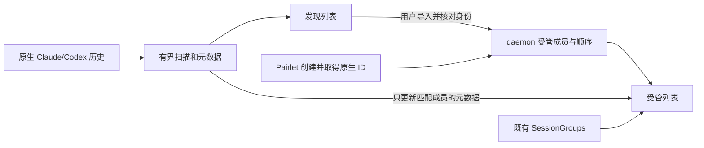

# #360 阶段二：稳定清单与显式导入

需求：[Issue #360](https://github.com/heypandax/pairlet/issues/360)。基线 `d7f06c17`。困难／L／高风险，建议在第一批完成后由 Claude Code 实施。以下是阶段二方案；阶段一 `51072d7d` 的非当前项目分组快照已经在 main，不重新实现。

## 目标与取舍

用户整理过的会话和分组不因外部 Claude／Codex 产生新会话而改变成员和排序。需要接续外部会话时，用户通过“从本机历史导入…”搜索、选择，然后把该会话加入 Pairlet 的管理清单。

采用**daemon 持有受管成员和顺序，扫描只提供元数据／发现结果**的结构。导入仅登记引用，不复制／删除／改写原生转录，不等于启动、接管或获得新的文件权限。首次启用保留现有可见清单，之后新增外部会话只出现在发现入口。

第一版只改变 Claude／Codex 的受管会话展示；其他后端继续现有路径，并在能力中明确支持范围。现有项目置顶／会话置顶不改。是否将其他后端纳入受管模式可以后续扩展，不能误过滤 DSH/Kimi/OpenCode/ZCode。

## 已核验事实与不能复用的“捷径”

- [SessionRegistry.listSessions](../../../daemon/src/main/kotlin/dev/ccpocket/daemon/session/SessionRegistry.kt) 合并全部 backend 的扫描结果，补 group 后按 lastModified 倒序；扫描异常会被转为空列表，并记录诊断。
- [RequestRouter.emitSessions](../../../daemon/src/main/kotlin/dev/ccpocket/daemon/server/RequestRouter.kt) 再过滤 guest 的 ownedSessions、归档会话和不支持的 Agent，并附带 SessionGroups。不能在它之前绕过这些过滤新建发现通道。
- [SessionGroups](../../../daemon/src/main/kotlin/dev/ccpocket/daemon/disk/SessionGroups.kt) 已持久化分组顺序和成员；assign 键是 sessionId，没有 Agent 维度。不能把所有历史 ID 直接猜成 Claude，也不应借这次改造大迁移整个分组库。
- [SpawnedSessions](../../../daemon/src/main/kotlin/dev/ccpocket/daemon/disk/SpawnedSessions.kt) 是 Claude 转录解隐藏的临时日志，有上限并在 sweep 后删除，**不是长期受管会话清单**。不能拿它作迁移真相，也不能改掉其清理职责。
- 前一批 [RepoDesktopModel.kt](../../../mobile/composeApp/src/desktopMain/kotlin/dev/ccpocket/app/desktop/RepoDesktopModel.kt)／[Sidebar.kt](../../../mobile/composeApp/src/desktopMain/kotlin/dev/ccpocket/app/desktop/Sidebar.kt) 只修显示快照；未证明外部扫描曾删除磁盘分组。

## 数据模型（建议新增，非现有类型）

`ManagedSessionStore` 保存以下内容，位于 daemon 的私有应用目录，测试必须注入临时路径：

```text
ProjectState:
  schemaVersion, revision
  canonicalWorkdir
  perAgentMigration: UNINITIALIZED | READY
  members: SessionKey -> {origin, createdAt, lastKnownSummary}
  order: [SessionKey]

SessionKey = (AgentKind, canonicalWorkdir, nativeSessionId)
origin = CREATED_HERE | EXPLICIT_IMPORT | LEGACY_ADOPTED
```

规范路径使用当前 daemon 的现有验证／canonical 逻辑，拒绝客户端拼出的越界工作目录。一个 daemon 一份 store，不按客户端另存真相。lastKnownSummary 是显示降级，不可作为可执行路径或授权依据。

`order` 是持久显示顺序，不由转录 mtime 反复重算。组的顺序仍以 SessionGroups 为准；组内按受管 order 投影。新建或新导入的会话默认插到未分组顶部；归组操作沿现有入口，加入目标组时保留确定的成员顺序。运行点、标题和活跃状态可更新，不重排用户清单。

原生文件消失时保留登记项和“原始记录暂不可用”，不把一次扫描失败解释为删除。用户主动移出受管清单只删登记，保留原生数据；归档与“移出清单”是不同操作，不借用归档作过滤标记。

## 新建登记与崩溃边界

在受支持 backend 报出可信 native session ID 后登记，而不是只在点击新建时猜 ID。需要一个可持久关联的创建意图，绑定已有 convo/创建请求和 workdir/Agent；取得原生 ID 后幂等完成登记。不能只在 ClaudeBackend 的 SpawnedSessions.note 旁补一行而漏掉 Codex。

如果原生会话已创建但登记落盘失败，保留当前活会话与明显的登记失败信息，不静默藏掉、不重新创建来“修复”。恢复时只根据可证实的创建关联补登记；无证据的原生会话仍留在发现入口。单测覆盖 ID 到达前退出、登记后崩溃、重复 init 和旧代际晚到。

## 首次迁移

默认新建 store 不立即过滤旧清单。由支持的新客户端在项目入口说明一次“保留当前会话，后续外部会话由你导入”，用户启用后按下面流程迁移：

1. 对该项目、该支持 Agent 取得**完整且成功**的当前扫描，保留已有可见行顺序和可证实的分组关联，登记为 LEGACY_ADOPTED。这保留了过去已出现的外部会话；第一版不尝试追溯哪些曾被用户真正点击。
2. 现有 listSessions 吞异常的空列表不能作“扫描成功”证据。增加内部扫描结果的完整性信息：错误／截断／权限不足与确实无结果分开。每个 Agent 独立迁移；一个 Agent 未完成时继续其旧显示方式，不把部分扫描固化成完整清单。
3. 在同一原子写中提交成员、顺序和该 Agent 的 READY 状态。写失败保持未迁移；不得先置 READY 后慢慢补数据。
4. 重复执行迁移幂等，已经 READY 的 Agent 不重新吸收后续扫描结果。原 store 损坏或 schema 未知时保留文件、只读降级并报告，不把空状态自动写回。
5. 不改写旧 SessionGroups／SessionArchive 文件。历史同 sessionId 多 Agent 冲突时保留已知展示并标明无法唯一归属，不猜迁移到其他 Agent。

旧客户端继续走旧列表，不保证享有新“受管清单”体验。必须在新端说明旧端兼容限制；不能为了让所有旧端自动享有新体验而突然隐藏它们的原生历史。降级旧 daemon 时保留新 store，旧程序不会读它；后续升级不重新迁移 READY 数据。

## wire 与路由建议

建议新增 capability（默认 false，并可声明 managedAgents），以及独立的 `ListManagedSessions`、`DiscoverSessions`、`ImportSession`、`RemoveManagedSession` 请求／响应。名称可按仓库规范调整，旧 `ListSessions`／`Sessions` 的行为保持兼容。

- 客户端收到明确 capability 后才发送新帧；服务端只向支持客户端发送新响应。老端未知字段可忽略，新枚举／新消息不能无条件广播。
- 查询和变更都携带 requestId、workdir、Agent；响应绑定请求与连接代际。切电脑／切目录后晚回包不覆盖新页面。
- 发现查询限定已验证项目目录与支持 Agent，按标题／ID 搜索；有页数、结果数和文本长度上限，返回 nextCursor、complete／diagnostic。只读元数据，不在搜索时打开会话或读取任意文件。
- 导入时重新扫描／核对 `(Agent, workdir, nativeId)`，不信客户端发来的路径或标题；重复导入返回同一成员，不复制转录或重复建会话。
- 受管 store 的变更持久成功后才 ACK；失败返回明确 code。先导入未分组，再由现有操作归组，避免把两个 store 的独立写入伪装为一个原子事务。
- 新发现／管理接口第一版 owner-only。guest、bridge、review collaborator 明确拒绝；已有 scoped guest 列表语义不变。不得因为是“搜索”就泄露主机目录或会话标题。
- 连接广播／cache 更新只发给相应 workdir、电脑和能力匹配的订阅方。`Directories` 的扫描不能自动登记 Session，也不能让外部活跃状态改变受管顺序。



## UI 范围

桌面会话／项目操作菜单和手机项目会话页提供“从本机历史导入…”入口。独立的发现列表有搜索、Agent 过滤、已导入标记、导入按钮和空／加载／失败状态；导入成功在受管列表定位该会话，**不自动发送 Prompt 或抢占原生写入者**。打开已导入且原生仍活跃的会话继续走当前 observe／fork／takeover 契约。

非当前项目分组快照仍只读；从其他项目发起导入必须用显式 workdir，不能误用 Repository 当前目录。首版不增加新的拖动排序系统，优先保留固定顺序和已有分组操作。

## 实施切片与文件所有权

1. 新 store、身份／顺序、原子迁移、扫描完整性和失败回归。
2. SessionRegistry 可信创建关联、新 owner-only 路由／capability／wire 测试；先完成 fixture 的“扫描→导入→重启仍在”。
3. Repository／DesktopModel 适配和两端导入 UI，再接固定顺序。保留 #373/#374/#360 阶段一回归。

文件域：daemon `session/SessionRegistry.kt`、`server/RequestRouter.kt`、必要 scanner seam 与新 store；protocol 新 DTO／capability；mobile Repository、桌面 Model／Sidebar、共享会话入口和新增导入视图。#362 的项目置顶 store 不在改写范围。

## 必须通过的验收

- 第一次启用后旧可见会话和组不丢；后来外部新建只出现在发现页，既有受管会话的外部更新只改状态／标题，不改成员／顺序。
- 新建、显式导入、重复导入、取消导入、移出／再导入、归档互不混淆；原生转录始终未被此功能改写。
- 扫描错误／截断／空目录分开，部分失败不把旧会话藏掉；迁移与写入中断后结果可恢复，不能 ACK 未落盘状态。
- 多 Agent 相同 sessionId、路径别名、跨电脑同路径、符号链接／越界、外部忙会话均按现有安全身份处理。
- 新端新 daemon、新端旧 daemon、旧端新 daemon，以及 guest／bridge／collaborator 的拒绝矩阵通过。
- 新旧请求交错、切项目晚回包、重连、App 重启，快照不污染当前项目；#373 最近项目和 #374 首会话不回退。

独立 wire 和安全评审必须覆盖迁移 fail-open／fail-closed 取舍及 owner 边界。仍保留人工验收：外部终端创建／更新原生会话，真实两端观察稳定性。仅列表 fixture 成功不够宣布原反馈已闭环。
