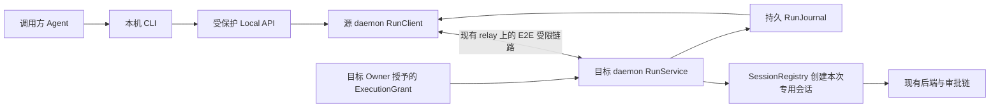

# #367：面向 Agent 的跨设备执行 CLI

需求：[Issue #367](https://github.com/heypandax/pairlet/issues/367)，已读唯一评论。困难／L／高风险；建议第三批。本文提供推荐架构与实施关卡，**授权握手及失败恢复尚无本轮原型证据，不能标为已验证可直接上线的方案**。实施、调整和独立安全评审均由 Claude Code 完成。

## 先纠正一个重要前提

Issue 用“同账号名下的电脑”表达“自己的已授权电脑”，但当前实现没有一个可直接复用的统一用户账号。

- [Identity.kt](../../../daemon/src/main/kotlin/dev/ccpocket/daemon/identity/Identity.kt) 写明每台 daemon 自生成身份就是 tenant，accountId 来自该机公钥；[DaemonHello](../../../protocol/src/commonMain/kotlin/dev/ccpocket/protocol/Messages.kt) 也要求 accountId 等于相应公钥摘要。
- 手机配对多台电脑，不意味着 A daemon 自动持有访问 B daemon 的凭据。不能比较 accountId 是否相同来判断“同一人的电脑”，也不能从手机导出全部 owner 凭据给 CLI。
- [LocalControlApi](../../../daemon/src/main/kotlin/dev/ccpocket/daemon/control/LocalControlApi.kt) 已有 token、JSON、拒绝 Origin 的本地控制面，但其 deps 刻意**不能触达 Session／目录／shell**；现有本地 token 不是远程执行授权。
- [CollaboratorCaps](../../../daemon/src/main/kotlin/dev/ccpocket/daemon/handoff/CollaboratorCaps.kt) 的 REVIEW 联系人明确无会话发现／执行权。SESSION_HANDOFF 也必须有绑定具体会话的 IN_PROGRESS grant。现成联系人不能自动升级为执行者。
- [PeerTransport](../../../daemon/src/main/kotlin/dev/ccpocket/daemon/review/PeerTransport.kt) 可参考 daemon 作为受限设备连另一 daemon 的传输结构，但其 PSK 注释记录了握手中断／重启边界：不能通过“失败后改用空 PSK”绕过限制。

因此 MVP 的定义应是：**用户在目标电脑显式授权源电脑的一条受限调用关系**。双方可由同一人管理，但软件依据实际授权，不依据未经证明的统一账号归属。

## 最小产品范围

优先解决“A 机的 Agent 让 B 机执行一段任务，之后取回结果”。每次新建一个由该调用拥有的会话；MVP 不任意接续用户已有会话、不自动 fork、不抢占写入者，不做跨用户协作产品入口、批量工作流、任意 shell 或全盘文件浏览。

建议命令如下，名称属于新增设计，不是当前可用命令：

```text
pairlet agent targets --json
pairlet agent run --target <approved-handle> --workspace <allowed-alias> --agent claude --prompt-file <file> --request-id <id> --json
pairlet agent status <run-id> --json
pairlet agent result <run-id> --json
pairlet agent cancel <run-id> --json
```

用 request-id 支持客户端重试，用 run-id 查询结果。prompt-file 避免把长提示词暴露在进程参数列表。stdout 仅机器可读数据，进展写 stderr。`targets` 只返回已建立授权的目标与允许的 workspace alias，不列公网机器，也不枚举目标全盘目录。

同机目标可以走同一应用服务，但同样验证工作区／调用权限；它不应成为绕过限制的快路。CLI 只连接本机受保护控制面，不自己持有 relay bearer、E2E 私钥或远端 owner 凭据。

## 授权关系建议

新增独立的“远程任务执行”用途与 `ExecutionGrant`，与 REVIEW／SESSION_HANDOFF 明确隔离。以下字段是建议契约：

```text
ExecutionGrant:
  grantId, revision, state, expiresAt
  sourceDaemonFingerprint, targetDaemonFingerprint
  allowedWorkspaceAliases -> canonicalRoot/pathScope
  allowedAgents
  approvalCeiling
  maxConcurrentRuns, maxQueuedRuns, runTimeout
  perGrantRequestBudget
```

1. 用户在目标电脑的 owner 控制面批准源电脑、工作区、后端和权限上限；双方核验指纹。复用已有一次性邀请与加密通道的机制，不复制整个 owner credential，也不在 CLI 普通输出／日志返回密钥。
2. 新用途在协议／配对中是独立 capability；未知或旧端明确拒绝。不能用 REVIEW purpose 建链，再在业务路由中偷偷允许 OpenSession。
3. 目标端将用途、源 key、grant 与握手依据可靠持久化；第一次连接、ticket 消耗、重启和断线均不能退成 owner。删除／过期／撤销后，新请求拒绝；在途取消且切断后续输出，终态回执按可授权范围返回。
4. 权限 ceiling 由目标 owner 决定。远程调用方不能提交 BYPASS_PERMISSIONS 来提权，也不能替 owner 批准被调用会话的 PermissionAsk。等待审批的状态返回 CLI，实际决策仍由目标已有 owner 审批链完成。
5. workspace alias 解析和路径授权在目标机进行。客户端绝对路径、symlink 或相邻前缀不能越过 pathScope。允许的路径、Agent、grant revision 在执行前再次检查，排队时通过不等于永久有效。

真正创建持久远程执行授权时，需要用户确认具体两台电脑与范围。这是新增执行权限，不是普通实现步骤；不因本目录存在就自动为本机或某个联系人发授权。

## 运行架构



Local API 使用独立的执行 deps／服务接口，不直接把整个 DaemonCore 塞进现有 review deps。可复用 loopback 的认证、Origin 拒绝与 body size 限制实现；新增能力不能改变旧 review 路由的权限集合。

源／目标采用显式协议请求和 typed result，不传任意内部 Frame 供远端盲转。建议新 RunSubmit／RunStatus／RunCancel／RunResult 类型，带 requestId、runId、grantId/revision；只有对应新用途和 capability 才可收发。具体序列化命名由实现者按项目规范确定，独立 wire 评审后冻结。

## 可靠任务与重试

目标端 `RunJournal` 是执行结果权威；建议状态：

```text
ACCEPTED -> STARTING -> RUNNING <-> WAITING_APPROVAL
                       -> COMPLETED | FAILED | CANCELLED | EXPIRED
STARTING/RUNNING 在恢复后无法确认执行归属 -> INTERRUPTED_UNKNOWN
```

- 先持久化接受记录和幂等键，再 ACK。幂等键绑定 `(grantId, requestId)`；相同键、不同 prompt/workspace/Agent 等负载返回冲突，不能悄悄变更原任务。
- 进入 STARTING 前持久化状态，获得可信 native session/convo 关联后继续记录。**不承诺任意命令副作用的 exactly-once。** 崩溃发生在 spawn 与记录之间，无法证明未执行时进入 INTERRUPTED_UNKNOWN，不自动再跑一次。
- 重试提交返回原 run-id；断线不重新冷启动 Agent。等待超时只是 CLI 停止等待，不默认取消目标执行；显式 cancel 才进入取消流程，并清楚报告“请求已接收”与“进程确已结束”的区别。
- 终态单调：旧 RUNNING 包不能覆盖 COMPLETED；重复 cancel／result 幂等。source 只保存镜像与游标，不能覆盖目标真相。
- 输出有序列游标、大小上限和截断标记；只返回本次调用的文本结果与声明过的产物引用。MVP 不下载任意绝对路径文件，结果文字中的路径本身不构成读取授权。
- RunJournal／结果内容是私有任务数据，限制权限、大小和保留时间；诊断日志只含可用的 code／阶段／计数，不记录完整提示词、密钥或带签名的 URL。

## 循环、并发与成本

默认一跳：接收到远程任务的运行上下文没有继续委派的执行授权；目标只允许自己的新专用会话。调用链 lineage 由服务端生成／验证，不信 CLI 自报的 depth。

同时施加**每 grant、每目标的全局并发／队列／请求预算和时限**；不能只依赖 depth，因为同一 OS 用户下拿到本地 master token 的进程可能发起新的 root 请求。0600 不是同一用户进程之间的强隔离，必须在威胁模型中说清楚这一限制，不能宣称仅靠环境变量就阻止任意恶意 Agent 循环。

若所选后端支持可靠的 max-turns／预算设置可以额外使用，但不把本地估算伪装成精确费用上限。超时取消不能撤销已发生的文件修改，结果须保留这一状态。

## Claude Code 实施关卡

| 阶段 | 产物与通过条件 | 失败时 |
|---|---|---|
| G0 授权原型 | fixture 中两个独立 daemon 身份建立受限用途；旧 purpose 不升权；首次握手、丢回包、重启、撤销均 fail closed | 修订授权方案，远程执行开关保持关闭 |
| G1 持久任务 | submit/status/result/cancel 的应用服务与 journal；duplicate、crash window、乱序、过期、写失败用例通过 | 不接真实 backend |
| G2 后端接线 | 专用 SessionRegistry 会话；等待审批、拒绝、失败、取消、并发上限；无任意 resume 或 owner 接口旁路 | 保留服务候选，不扩大到完整 CLI 能力集 |
| G3 两台真实电脑 | 经用户批准的受限关系执行小任务；断线重连不重复执行；审批由 owner 完成；撤销后无法继续操作 | 记录设备／链路缺口，不用同进程 fixture 代替 |

先以 fake PeerTransport／临时 store 完成 G0/G1。协议与安全评审由未参与该切片代码的 Claude Code 上下文执行；评审对象包含当前受限用途矩阵和重启场景，不只审 happy path。

文件域：新增 daemon `execution/` 服务、Local API/CLI 接线；必要的 protocol 类型／capability／purpose；配对用途与权限 guard 的最小修改；PeerTransport 仅复用可靠部分。relay 若确需识别新的 credential class，再单独修改和验证；不能为了少改文件把新用途伪装成旧角色。禁止导入新的 A2A/MCP 编排平台。

## 结束条件

G0–G2 通过只称“本地候选可审”。G3 和独立 wire／安全评审都通过后，才称“受限跨设备任务 MVP 已验收”。发版、跨用户能力、任意历史接续、产物文件下载和复杂 DAG 都不在本次 MVP。发现本文授权契约与实际配对机制矛盾时，由 Claude Code 更新方案并解决；不需要 Codex 接管。
