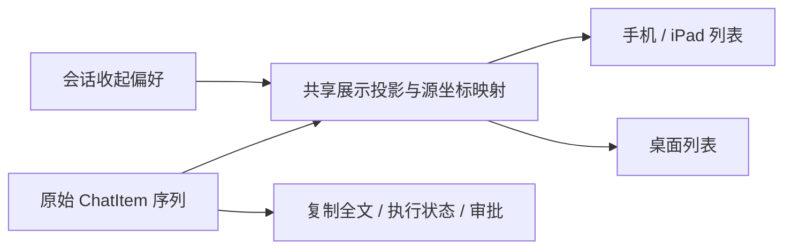

# #380：会话中的工具过程收起

需求：[Issue #380](https://github.com/heypandax/pairlet/issues/380)。基线 `d7f06c17`，2026-09-14 核验，暂无评论或活动 PR。分类：困难／M／中风险；拟由 Claude Code 独立实施与评审。

## 本次交付行为

在手机／iPad 和桌面的当前会话菜单提供“收起工具过程”开关，用户开启后，将**连续、已明确完成的普通工具／思考记录**变成可展开的一行，例如“执行过程 · 8 项工具 · 2 段思考”。用户与 Assistant 正文保持原顺序、完整可读；失败、运行中任务和需要处理的卡片仍独立可见。

这是第一版的完整范围：降低工具过程密度，同时保留全部正文。默认保留现有展开方式；开关按本机、配对电脑、Agent、稳定会话 ID 保存，重连仍沿用。单个过程段的临时展开状态只在当前历史代际内保留。没有稳定 sessionId 的新会话先用 convoId 临时状态，拿到 sessionId 后迁移；不能跨电脑或不同 Agent 串用。

**不根据文本位置推测“唯一最终回复”。** 基线没有跨所有后端与历史通用的 final 标记，第一版不隐藏中间 Assistant 文本，也不生成 AI 摘要。需要更强的按轮聚合时，另做可兼容的边界证据方案，不能把最后一条 Assistant 武断当作最终结论。

## 已核验代码事实

- [ChatItem](../../../mobile/composeApp/src/commonMain/kotlin/dev/ccpocket/app/data/PocketRepository.kt) 区分 User、Assistant、Thinking、Tool、Sys、AutoRun、多类 Questions 和 TurnEnded。`Assistant` 只有 text；`TurnEnded` 注释明确只存在于 live，不在历史回放中。
- [ChatTranscript.kt](../../../mobile/composeApp/src/commonMain/kotlin/dev/ccpocket/app/data/ChatTranscript.kt) 负责 live 工具更新及 `historyItem` 转换，Tool 的 `ok` 可以为 null，taskId 在历史中也不可靠地存在。
- 手机 [App.kt](../../../mobile/composeApp/src/commonMain/kotlin/dev/ccpocket/app/ui/App.kt) 与桌面 [ChatPane.kt](../../../mobile/composeApp/src/desktopMain/kotlin/dev/ccpocket/app/desktop/ChatPane.kt) 都直接 `itemsIndexed(messages)`。历史内容可见性、最后可见输出、prepend 修正和滚动跟随依赖原始行下标。
- 已有单条工具／Thinking 展开交互；不能只把这些默认值设成 false 就宣布满足会话级需求。#177 的历史工具解析是另一条已交付问题。

## 展示契约

| 行类型／状态 | 收起模式 |
|---|---|
| User、Assistant | 原样可见；复制正文仍得到完整原文 |
| 普通 Tool，`ok == true` | 可参加连续过程段；展开后复用现有工具渲染器 |
| Tool `ok == false`、null 或当前仍运行 | 独立可见；null 不能当作成功或已结束 |
| Thinking 已结束且非当前流式内容 | 可参加过程段；现有原文仍可展开 |
| 当前流式 Thinking | 保留运行反馈，不在读者眼前自动消失 |
| 审批、问题／未回答记录、撤回记录、AutoRun、RuleChip | 可见，现有按钮与权限审计入口照常工作 |
| Workflow、Task／Agent 等有独立任务入口的工具 | 第一版保持现有卡片；不要被普通 Tool 分类吞掉 |
| Sys（含错误）、TurnEnded | 可见，且切断过程段 |
| 工具结果图片 | 收起行显示图片数量／截断提示；展开后仍能打开原图 |

“可参加过程段”仅用于当前连续区间；不能跨 User、Assistant、错误或待办行把不相邻事件挪到一起。历史缺少 ok 时保留单行展示，这是明确兼容降级，不反写历史为成功。

## 技术设计

新增共享的纯展示投影（建议名 `ChatPresentation.kt`），输出两类行：`Original(sourceKey, sourceIndex)`、`ProcessGroup(groupKey, sourceKeys, sourceIndices, summary)`。类名可调整，以下不变量不可丢失：

1. 原始 `messages` 不删、不重排、不重新合成；执行、审批、转录、搜索和复制全文继续消费原数据。
2. 投影同时给出 `displayIndex -> sourceIndices` 和 `sourceKey -> displayIndex`。两端共用这一算法，不各写一套过滤器。
3. 行身份不能只用文本哈希、当前数组下标或 nullable taskId：相同命令重复执行是不同记录，流式文本和 prepend 都会变。使用仅客户端的 occurrence identity，在首次生成记录时分配，后续工具／文本更新保留；可给 ChatItem 增加非 wire 的本地标识，或在现有转录模型外保持等价身份层。先核对所有 copy／replay 路径再选择改动最小的方式。
4. prepend 为新历史分配新身份，已有记录身份保持；完整历史替换开启新 generation，并清理旧展开缓存。折叠开关偏好不因 generation 改变。
5. groupKey 绑定当前 generation 和首条成员的稳定身份；不能因尾部新增一条工具就让用户已展开的组重新收起。
6. 折叠开关、展开／收起及分页前，记录视口第一条可见源记录和像素偏移；投影变化后映射到包含它的显示行，保留阅读位置。仅在原先 pinned-to-bottom 时跟随尾部。
7. 更新 `onHistoryLaidOut` 的映射：折叠组可证明“有内容已布局”，但不能把其中隐藏的输出当作“用户已看到全文”。将可见的 Original 行映射回原始下标；对组内隐藏输出不虚报已读。若现有函数把两种语义耦合，拆成内容落地与可见输出两个证据，保持诊断口径真实。
8. 分页 seam、加载更早记录、rewind 定位均以源坐标完成映射；不要继续用“旧显示下标 + prepend 条数”。不要在每个流式字符变化时重新解析所有工具内容；摘要只读现成字段、增量更新或按结构变化重算。

## 文件域与顺序

实现者负责 `data/ChatTranscript.kt`、必要的 ChatItem 本地身份字段、新增共享投影／状态、两端聊天菜单与列表、相关 strings 和测试。保持 [WideLayout.kt](../../../mobile/composeApp/src/commonMain/kotlin/dev/ccpocket/app/ui/WideLayout.kt) 已修复的稳定父容器，不重新用 if 切走聊天实例。

建议先纯投影与映射，再手机，再桌面，最后接偏好持久化与原生界面核验。#320-A 会触及同一 ChatPane，须在本项整合后开展。第一版不修改 protocol、daemon、relay，也不改变任何权限策略。

## 可判定验收

- 构造 User → 普通工具连续段 → Assistant：收起后少占多行，全部 Assistant 原文仍可复制；展开恢复所有工具顺序和结果。
- 工具失败、无最终回复、运行中工具、问题和审批混合时，关键行与按钮始终可见且可用。
- 同名相同参数工具重复出现不合并身份；工具 RESULT 更新原卡，不生成重复段。
- 历史分页 prepend、完整回放替换、切会话、重连、切电脑、双窗口各自展开，不串状态、不跳到错误行。
- 读者停在中部时切开关不跳到底部；原先在底部时新输出继续跟随；折叠段出现不自触发无限历史加载。
- 复制全文和 rewind 仍使用原始记录／原生锚点；隐藏工具不虚报为已读输出。
- 以至少千条混合记录检查布局／投影成本，没有随流式字符反复全量工具解析；不为测试机械追求条数。
- 两端 UI 用例覆盖收起、展开、分页和审批；实际 iPad／桌面观察一轮长任务。记录模拟器与真机的边界。

评审重点：源下标与显示下标混用、同名工具身份碰撞、历史代际泄漏、隐藏失败／审批、#334 状态保持回退。完成这些用例后才能称“工具过程收起 MVP 可审”，不能称“所有后端仅显示最终回复”。
